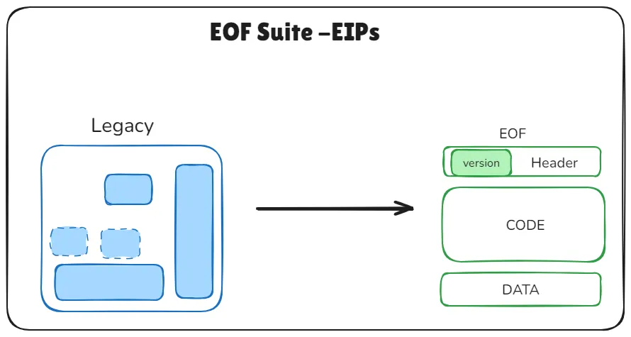

# What is EOF(EVM Object Format)?

EOF는 EVM 바이트코드에 확장 가능하고 버전이 지정된 컨테이너 형식을 도입하며, 스마트 컨트랙트의 배포 시점에 코드를 한 번만 검증할 수 있도록 설계되었습니다. 이를 통해 코드와 데이터를 분리하고, 코드 검증을 강화하고, 전반적인 실행 효율성을 높이는 것을 목표로 합니다. 이러한 EOF는 일련의 EIP들로 구성되며, 이더리움의 실행 환경을 구조적으로 개선하고자 합니다.([EIP-7692](https://eips.ethereum.org/EIPS/eip-7692) 참고)

*Source: [Ethereum Object Format (EOF): A Comprehensive Guide](https://medium.com/@ankitacode11/ethereum-object-format-eof-a-comprehensive-guide-3431ae9a05de)*

특히 EOF는 컴파일러 및 정적 분석 단순화, 바이트코드 크기 감소 및 성능 개선, EVM 업그레이드 용이성, ZK 친화성 등의 이점을 얻을 수 있습니다.

하지만, EOF를 도입하려면 기존 EVM 바이트 코드를 처리하던 컴파일러, 디버거 등이 EOF 형식에 맞게 변경해야 하는 복잡성이 추가되며, 이러한 복잡성으로 인해 재진입 공격과 관련된 버그가 최근에 발견되어 수정한 적이 있습니다. 즉, 과도한 기능 결합으로 인해 거의 모든 라이브러리가 재작성 되어야 하며, 이때 높은 비용이 발생합니다. 따라서 복잡성 대비 이점이 크지 않다고 생각하는 분위기인 것 같습니다.
