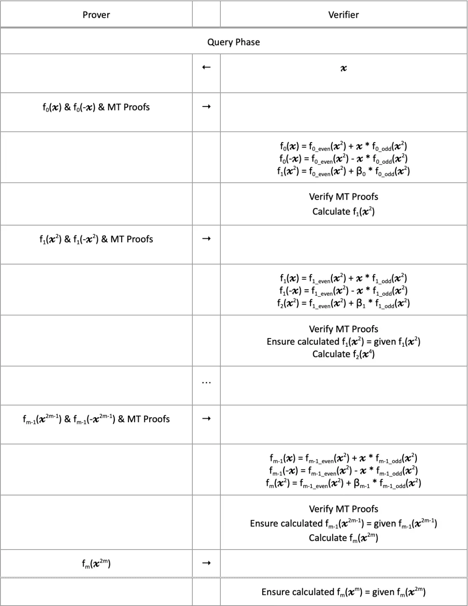

# FRI (Fast Reed-Solomon Interactive Oracle Proof of Proximity)

FRI is a protocol between Prover and Verifier that proves whether a given codeword is **an evaluation of a low-degree polynomial**.

### Core Concepts

#### 1. Low-Degree Polynomial

A polynomial $p(x)$ of degree $k - 1$ has the following form:

$$
p(x) = a_0 + a_1x + a_2x^2 + \dots + a_{k-1}x^{k-1}
$$

To interpolate such a polynomial exactly, we need **at least $k$ distinct evaluation points**.

#### 2. Reed-Solomon Code

Given a function $f: D \rightarrow \mathbb{F}$,  
Reed-Solomon code is defined as:

$$
RS_k[\mathbb{F}, D_0] = \{p(x)|_{x \in D_0} : p(x) \in \mathbb{F}[X],\ \deg(p) \leq k-1\}
$$

That is, it's the set of evaluations of polynomials of degree at most $k-1$ over $D_0$.

**Example:**
- In $\mathbb{F}_7$ with $D_0 = \{1,2,3,4,5\}, k = 3$
- Possible polynomials are $p(x) = a_0 + a_1x + a_2x^2$, with coefficients chosen from $\mathbb{F}_7$
- Evaluating each $p(x)$ over $D_0$ gives the result $\{p(1), ..., p(5)\}$ as one codeword

#### 3. Blowup Factor

The Blowup Factor is defined as:

$$
\text{Blowup Factor} = \frac{1}{\rho}, \quad \text{where } |D_0| = \rho^{-1}k
$$

It indicates how many times the evaluation domain size is compared to the polynomial degree.  
Higher Blowup Factor increases security but also increases computational cost.

#### 4. Roots of Unity

If $\omega \in \mathbb{F}_p$ is an **$n$-th root of unity**, then $\omega^n = 1$, and $\omega^i$ creates $n$ distinct values.

$$
\Omega = \{1, \omega, \omega^2, ..., \omega^{n-1}\}
$$

- $\Omega$ is a multiplicative subgroup of $\mathbb{F}_p^\times$.
- FRI typically operates over finite fields where $p - 1$ is divisible by $2^n$.  
  (e.g., $p = 2^{64} + 2^{32} + 1$)

#### 5. Even-Odd Decomposition and Folding

FRI uses even-odd decomposition in the process of recursively reducing polynomial degree:

$$
p(x) = p_E(x^2) + x \cdot p_O(x^2)
$$

- Even terms: $p_E(x^2) = a_0 + a_2x^2 + a_4x^4 + \dots$
- Odd terms: $p_O(x^2) = a_1 + a_3x^2 + a_5x^4 + \dots$

This can be computed using symmetry as follows:

$$
p_E(x^2) = \frac{p(x) + p(-x)}{2}, \quad p_O(x^2) = \frac{p(x) - p(-x)}{2x}
$$

##### Folding Process

The Verifier chooses a random field element $r$, and the Prover constructs the following folding polynomial:

$$
p_{\text{fold}}(Z) = p_E(Z) + r \cdot p_O(Z)
$$

→ The degree of this polynomial becomes half of $p(x)$.

## FRI Protocol Overview

FRI consists of two phases:

### 1. Commit Phase

The Prover gradually reduces the degree and commits the polynomial evaluation values at each stage using Merkle Trees.

- For the initial $f_0(X)$ over domain $L_0$:
$$
f_0(X) = f_{0,E}(X^2) + X \cdot f_{0,O}(X^2)
$$
- Generate the next layer's polynomial using random $\beta_0$:
$$
f_1(Z) = f_{0,E}(Z) + \beta_0 \cdot f_{0,O}(Z)
$$

→ The degree is halved, and the domain also shrinks to $L_1 = \{x^2 \mid x \in L_0\}$  
→ Repeat this for $\log(L)$ stages

### 2. Query Phase

The Verifier selects random points $v, -v$ and verifies the following:

1. Calculate even-odd terms:
$$
f_{0,E}(v^2) = \frac{f_0(v) + f_0(-v)}{2}, \quad f_{0,O}(v^2) = \frac{f_0(v) - f_0(-v)}{2v}
$$

2. Verify the next layer value after folding:
$$
f_1(v^2) = f_{0,E}(v^2) + \beta_0 \cdot f_{0,O}(v^2)
$$

3. Continue verification to deeper layers in the same manner

→ Through this process, verify that the Prover performed folding honestly at each stage

### FRI Cost Analysis

#### Prover Time

The largest cost is polynomial evaluation over the initial domain (using FFT):

$$
O(|L_0| \log |L_0|) = O(\rho^{-1}k \log(\rho^{-1}k))
$$

As the Blowup Factor increases, the computation amount also increases.

#### Proof Length

- Since Merkle paths must be provided for each query point, proof length increases with the number of queries
- Merkle path length: $O(\log^2 |L_0|)$