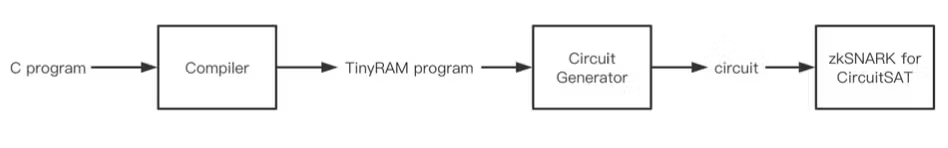

# TinyRAM

TinyRAM은 ZKP 시스템에서 범용 프로그램을 효율적으로 증명하기 위해 설계된 RISC(Reduced Instruction Set Computer)기반 RAM 아키텍처입니다. 즉, TinyRAM은 실제 컴퓨터처럼 동작하는 간단한 명령어 기반의 가상머신을 도입해, C나 C++과 같은 고수준 언어로 작성된 프로그램을 효율적으로 실행하고 그 실행 과정을 증명할 수 있도록 설계되었습니다. 이를 통해 반복문이나 메모리 접근 같은 복잡한 연산도 효율적으로 처리할 수 있고, 증명 생성에 필요한 회로 크기와 계산량을 크게 줄일 수 있습니다. 즉, TinyRAM은 복잡한 프로그램의 실행을 간단한 명령어 트레이스로 바꿔서, 증명 시스템이 더 적은 자원으로 빠르게 영지식증명을 생성할 수 있게 해줍니다.

*Source: [libsnark](https://github.com/scipr-lab/libsnark?ref=hackernoon.com)*

즉, C 프로그램을 TinyRAM 프로그램으로 컴파일한 후, 회로 생성기를 통해 회로를 생성하고, 최종적으로 zkSNARK 회로를 얻습니다. 이렇게 TinyRAM 기반 zk-SNARK 시스템은 프로그램의 실행 과정을 산술 회로로 변환해, 해당 프로그램이 주어진 입력에서 올바르게 실행되었음을 ZKP로 증명할 수 있습니다.

*Source: [TinyRAM Paper](https://eprint.iacr.org/2013/507.pd)*

이 그림은 TinyRAM 프로그램의 실행을 ZKP에서 어떻게 증명 가능한 형태로 변환하는지 보여줍니다.

먼저 반복문, 조건문, 메모리 접근 등 실제 프로그램의 명령어들이 나열되어 있는 TinyRAM 어셈블리 코드를 제약 충족 문제(constraint satisfaction problem)로 변환합니다. 

각 노드는 프로그램 실행의 상태(예: 레지스터 값, 메모리 상태 등)를 나타내고, 화살표는 명령어 실행에 따른 상태 변화를 의미합니다. 즉, 프로그램이 올바르게 실행되었는지를 확인하기 위한 논리적 제약 조건들이 네트워크 형태로 표현된 것입니다. 

가장 오른쪽 그림은 이를 산술 회로(arithmetic circuit)로 변환하는 과정으로, 각 제약 조건을 수학적으로 표현하여, 실제 입력(assignment)이 주어졌을 때 모든 제약 조건이 만족되는지 빠르게 검증할 수 있도록 합니다.

**한계**

TinyRAM 아키텍처는 기존 회로 기반 방식보다 효율적이지만, 여전히 실제 대규모 프로그램이나 복잡한 연산(특히 메모리 접근이 많은 경우)에서는 증명 생성 시간이 매우 길어질 수 있습니다. 또한, TinyRAM은 범용성을 위해 설계된 만큼, 특정 연산(예: 해시 함수, 암호 연산 등)에 대해 특화된 회로 방식에 비해 비효율적일 수 있습니다. 그리고 zkDSL과 비슷하게 제약 조건이 충분하지 않으면 잘못된 실행도 증명될 수 있다는 위험이 존재합니다.

