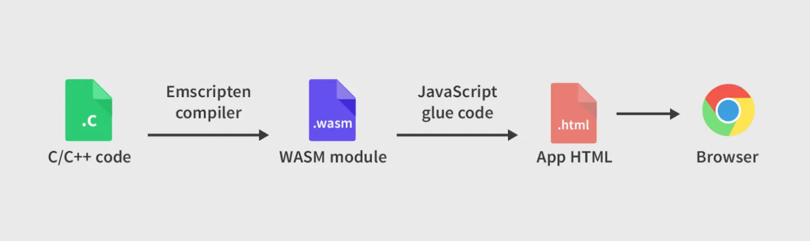
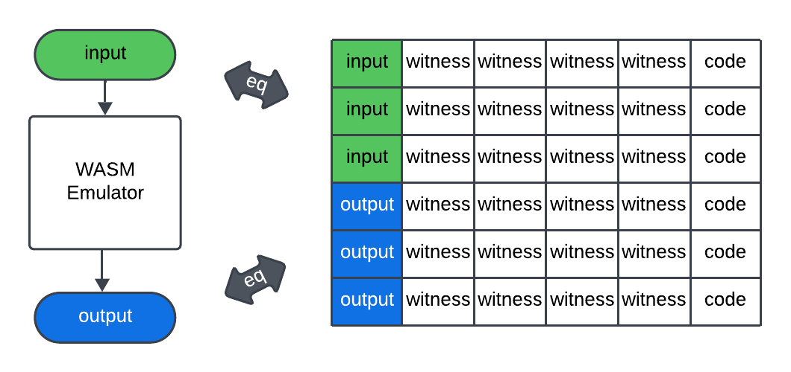

# WASM(WebAssembly)

[WASM](https://webassembly.org/) is a binary instruction format for a stack-based virtual machine. It is designed to work well across various operating systems and browsers without modification, enabling deployment of client and server applications in web environments.

- **Efficient and fast:** It is designed to be encoded in a binary format to enable fast loading and execution, aiming to deliver native-level performance across diverse hardware platforms.

- **Safe**: WASM guarantees memory safety and execution within a sandboxed environment. It can also be implemented inside existing JavaScript virtual machines.

- **Open and debuggable:** WASM is designed to be pretty-printed into a human-readable textual format to support debugging, testing, experimentation, optimization, learning, teaching, and manual programming.

- **Part of the open web platform:** WASM modules can interoperate with the JavaScript environment and access Web APIs used by browsers. Additionally, WASM supports embeddings beyond the web environment.

Process: A program written in C/C++ is converted to WASM and can be executed in the browser through a JavaScript engine.

However, because WASM uses a stack-based machine architecture, the number of constraints required to handle operations in the proof circuit increases, thereby raising the complexity of ZK circuits compared to register-based architectures. Additionally, since there are many instructions, secure execution of all instructions must be verified in zk-SNARKs and similar systems, making circuit design and verification more challenging. In particular, floating-point operations are difficult to handle efficiently in zero-knowledge proofs or require separate treatment, resulting in low ZK-friendliness.

## eWASM(Ethereum WebAssembly)

eWASM is an Ethereum-specific WebAssembly execution environment designed to replace the EVM. Rather than using standard WASM as-is, it is a specialized profile that adds constraints and extensions necessary for smart contract execution. It was included in the Ethereum 2.0 Phase 2 roadmap at Devcon3 in 2017 and is recently being utilized in zkWASM projects as well.

eWASM promises faster execution speeds compared to the existing EVM and allows developers to write smart contracts in familiar languages such as Rust and C++ and compile them to WASM. It also enables reuse of existing libraries built in various languages and benefits from the active global community supporting the WASM ecosystem.

However, eWASM was not adopted on Ethereum L1 due to the high complexity and ecosystem transition costs involved in replacing the entire network, the uncertain and limited actual performance improvements or advantages over the existing EVM, and the burden of having to rebuild all development tools and infrastructure from scratch. Furthermore, Ethereum prioritized more urgent scalability and security challenges, pushing eWASM adoption lower on the agenda, and the stability and trustworthiness of the existing EVM, which have already been well-proven, was also a significant factor.

## ZK-WASM

ZK-WASM is a virtual machine that compiles programs written in Rust into WebAssembly (WASM) and then combines this with a ZKP system to generate zk-SNARK proofs for the execution results. It enables interaction within HTML environments via a JavaScript bridge and is designed to perform zk-SNARK–based trustworthy computations without requiring modifications to existing programs. Traditionally, applying ZKP required using arithmetic circuit–based languages or specialized frameworks like Pinocchio, TinyRAM, or ZoKrates. However, ZK-WASM overcomes these barriers by reconstructing the entire WASM at the bytecode level into a zk-SNARK circuit, allowing existing WASM applications to run as-is. This enables cloud service providers to offer environments that guarantee both the correctness of computation results and protection of user privacy.

*Source: [Delphinus ZK-WASM Documentation](https://zkwasmdoc.gitbook.io/delphinus-zkwasm/c3_circuits)*

Generally, zk-SNARK systems are expressed as arithmetic circuits with polynomial constraints. Therefore, the entire imperative logic of the WASM virtual machine must be systematically abstracted and reimplemented as an arithmetic circuit with constraints, which is then used to generate proofs within zk-SNARK. In other words, if a zk-SNARK proof made from the circuit exists, it mathematically proves that the WASM program was executed correctly.

However, compared to zkEVM or RISC-V–based zkVMs, zkWASM may exhibit slower proof generation speed and lower efficiency. Most current zkWASM implementations depend on specific proof systems such as Halo2, which might not be sufficiently fast in large-scale client environments. Additionally, due to WASM’s design involving dynamic memory, function calls, and other complex structures, its zk-circuit transformation is less optimized in comparison.