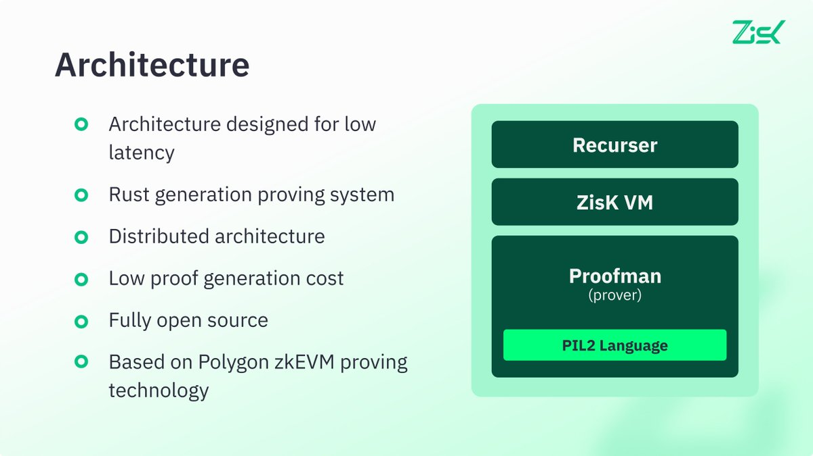
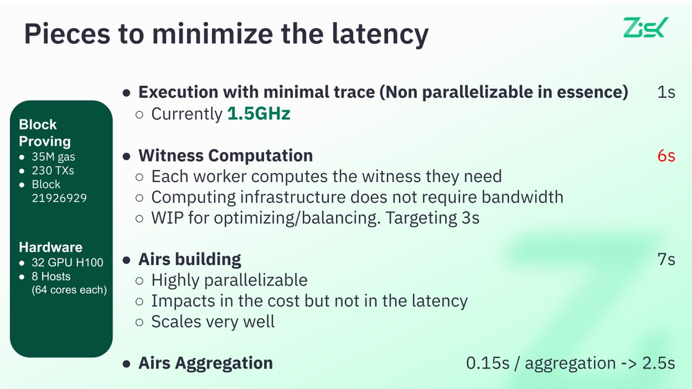

# Zisk

* X: [https://x.com/ziskvm/status/1935307212282593503](https://x.com/ziskvm/status/1935307212282593503)

* blog: [https://zisk.technology/](https://zisk.technology/)

**ZisK** is an open-source ZKP toolstack equipped with a zkVM that enables verifiable execution of programs written in high-level languages such as Rust (with Go and C# planned for future release).

It is built on RISC-V 64 and designed for speed, scalability, and integration.

- ZisK is **low-latency** by design, **distributed** by nature.

- ZisK **controls the entire in-house full stack**, enabling numerous **optimizations** that enhance the overall architecture.

- Targeting **128 bits security**.

- ZisK is the **Fully Open Source** (including GPU code) project. You can integrate in your own infrastructure.

- **RiscV 64 bit** architecture. Rust, golang, C#, etc.

- ZisK stack is **modular** and can allow other VMs like wasm or native LLVM

*Source: [Twitter](https://x.com/0xAbix/status/1935323355911250275)*

ZisK is modularly designed. It is built upon a general zkProver based on PIL2 and includes all recursive techniques that flexibly and efficiently combine proofs. ZisK can operate as a library or standalone software to construct proofs independently.

*Source: [Twitter](https://x.com/0xAbix/status/1935323355911250275)*

The ZisK team has achieved 1.5GHz trace generation, which is 10 times faster than other RISC-V zkVMs.

Using Ahead-Of-Time(AOT) compilation, ZisK employs custom x86 assembly. For each RISC-V/ZisK instruction, 3 or 4 x86 instructions are used, along with 2 additional x86 instructions to split the trace into appropriately sized chunks.

In the short term, ultra-fast RISC-V trace generation will significantly reduce the number of GPUs required for real-time proving. In the long term, ASIC trace generation speeds are expected to match native execution speeds, ultimately achieving the ultimate goal of real-time proving.
