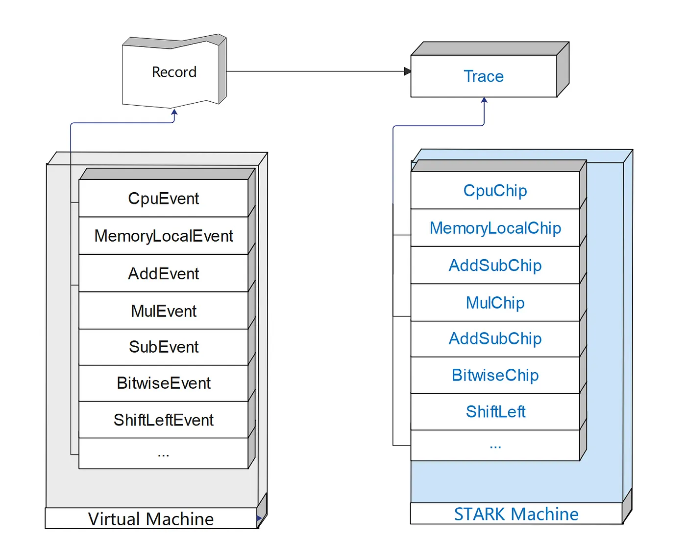
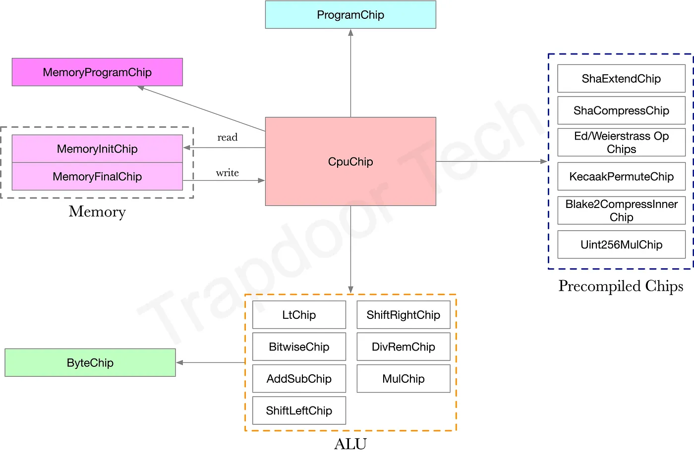
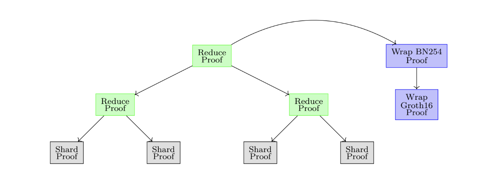

# SP1 One-Pager

_This is a summary of the [SP1 Technical Whitepaper](https://drive.google.com/file/d/1aTCELr2b2Kc1NS-wZ0YYLKdw1Y2HcLTr/view)._

## Key Summary

A Rust program is converted into a RISC-V based Execution Trace (one large Table), which is then divided and represented as multiple Tables each suited for specific purposes. The connections between each Table and memory are satisfied through LogUp. When Tables become large, they are split into Shards for proving due to overhead issues (memory problems) during the proving process, and then aggregated using SP1's custom Recursive VM to create a single small proof. (If needed, this can be wrapped with Groth16 to make it even smaller)

## Overview

SP1 is a RISC-V based zkVM that generates STARK-based ZK-Proofs for the execution of general Rust programs. Developers only need to write Rust code without designing complex zk Circuits - SP1 compiles it to RISC-V, executes it, and **proves that the output was correctly calculated for the given input**.

The SP1 zkVM Circuit is implemented through the Plonky3 open-source library, and uses Plonky3 implementations for various required Circuits (e.g., keccak256).

SP1 uses a "Multi-Table structure" that divides program execution information by function into separate Tables, with operational consistency between Tables connected through a lookup protocol called "LogUp". Memory state changes are proven using a "Memory in the Head" approach without separate Tables, and SP1 uses a Sharding mechanism to efficiently process large-scale programs.

## From RISC-V Execution Trace to STARK

The abstracted Execution Representation of a RISC-V program is called `ExecutionRecord`. Things that need to be proven are recorded here as Events (e.g., CpuEvent, AluEvent, etc.). The Trace (= Table) is generated through the `ExecutionRecord`. As shown below, each instruction type has a corresponding Chip (e.g., AddSubChip). Think of a Chip as the constraints (AIR Constraint) that a Table must follow.

*SP1 ExecutionRecord and Chip structure (Source: [Medium](https://medium.com/@gavin.ygy/mastering-sp1-zkvm-design-part-2-air-constraints-for-core-proof-1565ff5aed8f))*

Since the BabyBear Field used by SP1 has a size of $2^{31}$, to represent RISC-V 32-bit values, u32 is divided into 4 bytes (32 bits) and each byte is encoded as a BabyBear Field. (Range Checks are performed to ensure these actually come from bytes) → This has the advantage of making the byte Table described in 'Preprocessed Table' below smaller.

:::tip
Assume the CPU clock is at 7 and runtime encounters an ADD instruction (with inputs 2 and 3)

**In AluEvent**:
- a: 5 (output)
- b: 2
- c: 3
- clk: 7

**In CpuEvent**:
- instruction: ADD
- a_record: memory access for a
- b_record, c_record similarly
- pc: current program counter value

When `generate_trace()` (record → trace) is called, CpuChip and AddSubChip each add a row to their respective Tables based on this data. (Each entry in this row is an element of the BabyBear field)

AddSubChip has a Constraint that enforces $5 = 2 + 3$, and CpuChip has a memory access Constraint that enforces the value of register 0 is 5 at clock 7.

Value consistency between Cpu table ↔ Add table is ensured through LogUp. (This process is necessary as each Table is independent)
:::

## The "Beams" (Multi-Table Trace)

SP1 has a Multi-Table structure where multiple Tables cooperate to generate proofs for program execution.

At the center of this structure is the **CPU Table**, where all instructions included in the execution record appear.

There are **CPU Table, ALU Tables, Memory Tables, Precompiled Tables, and Other Tables**.

*Here, you can think of Chip as Table. This is a visualization of the Tables described in the paper. (Source: [Medium](https://trapdoortech.medium.com/zero-knowledge-proof-introduction-to-sp1-zkvm-source-code-d26f88f90ce4))*

### Preprocessed Table

These are Tables that the Prover pre-commits as a kind of setup. Other Tables can lookup from them, but these Tables have no Constraints. Notable examples are Byte Table and Program Table.

* **Byte Table**: For u8 arithmetic operations and range check
* **Program Table**: Stores PC and instructions

### Precompiled Table

Dedicated Tables that handle complex operations like SHA and Keccak. The CPU Table delegates to them like syscalls, and these Tables verify the operations independently.

## Joint (Cross-Table Communication)

Table ↔ Table lookup and memory lookup are all handled by LogUp. LogUp's role is to prove that values match exactly when different Tables exchange data.

**Example**

* When CPU Table wants to lookup (a, b, c) values from AddSub Table
* CPU Table "sends" the (a, b, c) values
* AddSub Table "receives" the same (a, b, c) values
* Each row is converted to a fingerprint and added to the LogUp bus
* Finally, verify that total send fingerprint sum = total receive fingerprint sum (Running Sum)

## Sharding (and Recursion)

If the Execution Trace is too large, memory issues and other problems can arise. Therefore, the Execution Trace is divided into multiple shards and proven separately. Connections between Shards also use LogUp.

(Example: Tendermint light client verification takes 30 million cycles. The paper specifies using a Shard size of $2^{22}$.)

*[SP1 Technical Whitepaper](https://drive.google.com/file/d/1aTCELr2b2Kc1NS-wZ0YYLKdw1Y2HcLTr/view)*

The process of generating two Shard Proofs into one higher-level proof, or wrapping with a SNARK like Groth16 at the end, is called Recursion. SP1 uses a dedicated custom ISA zkVM (different from SP1 itself) for this recursion.

:::info
1. trace ↔ table are used with the same meaning
2. bus ↔ accumulator ↔ running sum are used with the same meaning
:::