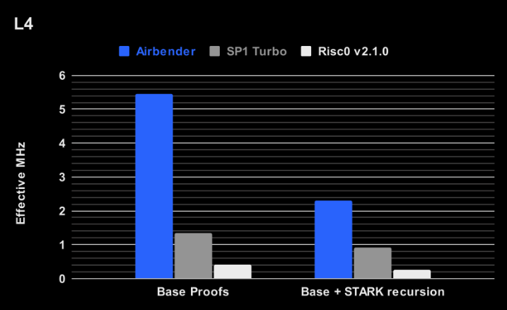
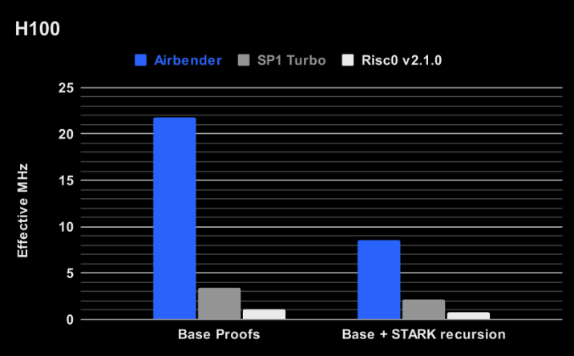

# ZKsync

## Airbender 출시

* X: [https://x.com/zksync/status/1937587716453204009](https://x.com/zksync/status/1937587716453204009)

* blog: [https://zksync.mirror.xyz/ZgRmbYA_EE3wfGcXWv81m-xcED-ppNKkRzkleS6YZRc](https://zksync.mirror.xyz/ZgRmbYA_EE3wfGcXWv81m-xcED-ppNKkRzkleS6YZRc)

**Airbender**는 ZKsync의 새로운 zkVM 및 Proving System으로, RISC-V 바이트코드 실행에 대한 ZKP을 생성하도록 설계되었습니다. ZKsync 체인용 모듈형 운영 체제인 ZKsync OS와 함께 구축되었으며, EVM, EraVM, WASM을 포함한 다양한 실행 환경을 지원하도록 설계되었습니다.

핵심 Proving Engine은 Mersenne31 Prime Field 위에서 고도로 최적화된 DEEP STARK proof로 컴파일된 **AIR constraints**를 기반으로 합니다. 이는 Custom machine configurations, Precompiled circuits (e.g. Blake2s/Blake3, big-integer arithmetic), Recursive proving modes를 지원합니다.

이러한 Airbender는 상호운용성(Interoperability), 탈중앙화(Decentralization), 그리고 확장성(Scalability)에 있어 현실적인 요구를 타협 없이 충족시키기 위해 설계된 고성능 범용 ZK prover입니다. Airbender는 가장 빠른 open-source RISC-V zkVM입니다.

[Mersenne31_polynomial_arithmetic.pdf](https://github.com/ingonyama-zk/papers/blob/main/Mersenne31_polynomial_arithmetic.pdf)

### Proving Architecture

- **Witness Commitment:** Low-Degree Extensions(LDEs)과 trace commitments 계산
- **Lookup & Memory Argument:** lookup table을 사용하여 메모리 연산 검증
- **STARK Quotient Polynomial:** AIR polynomial을 통해 circuit constraints를 인코딩함
- **DEEP Polynomial Construction:** proof 크기를 줄이기 위해 FRI batching 구현
- **FRI IOPP:** final proximity proof 생성

### Benchmarks

Airbender를 두 개의 주요 zkVM 증명 시스템인 RiscZero와 SP1(Turbo)와 비교 테스트하였으며, 공정한 비교를 위해 표준화된 피보나치(Fibonacci) 프로그램을 사용했습니다. 벤치마크는 NVIDIA L4와 H100 GPU 모두에서 수행되었으며, 두 단계의 성능을 측정했습니다.

- **Base Proving:** 첫 번째 라운드의 증명 생성
- **STARK Recursion:** base proof들을 하나 또는 소수의 최종 proof로 집계하는 후속 라운드

*Source: [zkSync Mirror](https://zksync.mirror.xyz/ZgRmbYA_EE3wfGcXWv81m-xcED-ppNKkRzkleS6YZRc)*

Airbender는 강력한 ([H100](https://www.nvidia.com/en-us/data-center/h100/)) GPUs와 작고 경제적인 ([L4](https://www.nvidia.com/en-us/data-center/l4/)) GPUs 모두에서 가장 빠른 Base Layer Prover입니다. H100에서 21.8 MHz (millions of cycles proven per second)을 증명하며, SP1 Turbo의 3.45 MHz, RiscZero의 1.1 MHz와 비교됩니다.

Airbender는 재귀(recursion)를 포함한 end-to-end 증명에서도 가장 빠르며, 초당 8.5 million cycles로 SP1 Turbo보다 2.5-4배, RiscZero보다 8.5-11배 더 빠릅니다.

**Near Real-time Ethereum Proofs on a Single GPU**

ZKsync Airbender와 [ZKsync OS](https://github.com/matter-labs/zksync-os) (our new EVM execution environment)를 활용하여, 평균 Ethereum 블록을 **single H100 GPU**로 증명하는데 평균 35초 미만의 속도로 가능합니다. 재귀(recursion) 없이도 Ethereum 블록을 17초 만에 증명 가능하며, 이는 단일 GPU에서 **Real-Time Proving**이 가능하다는 것을 보여줍니다.

SP1 Hypercube는 Ethereum 블록을 증명하는 데 약 12초가 걸렸지만, 이를 위해 50~160개의 GPU(Nvidia 4090, 대략 H100과 동급)가 필요했습니다.