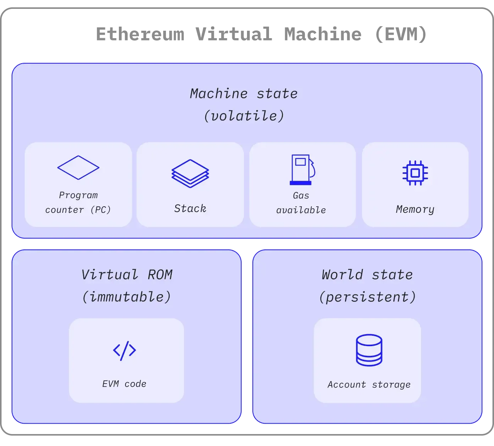
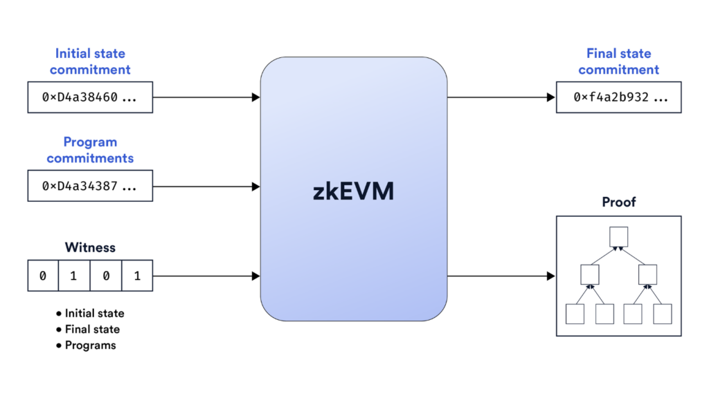
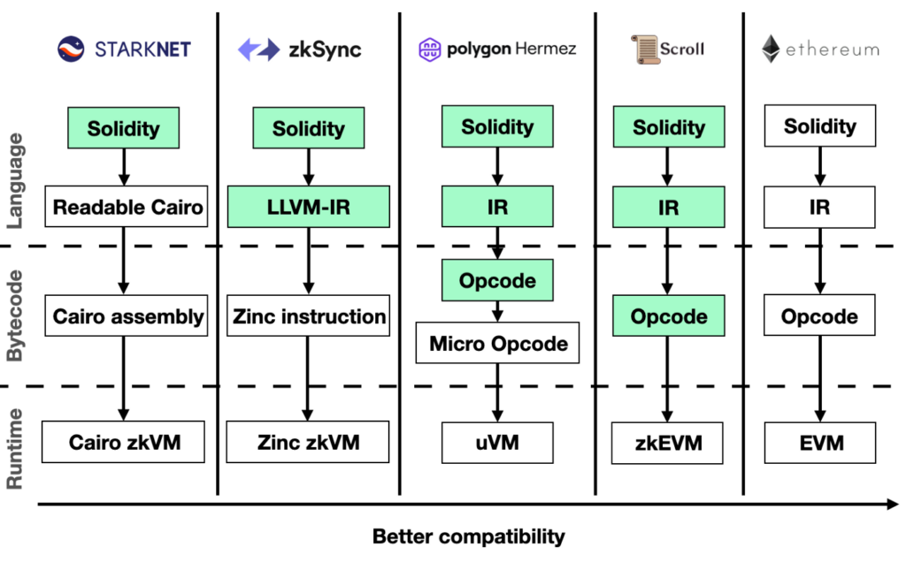
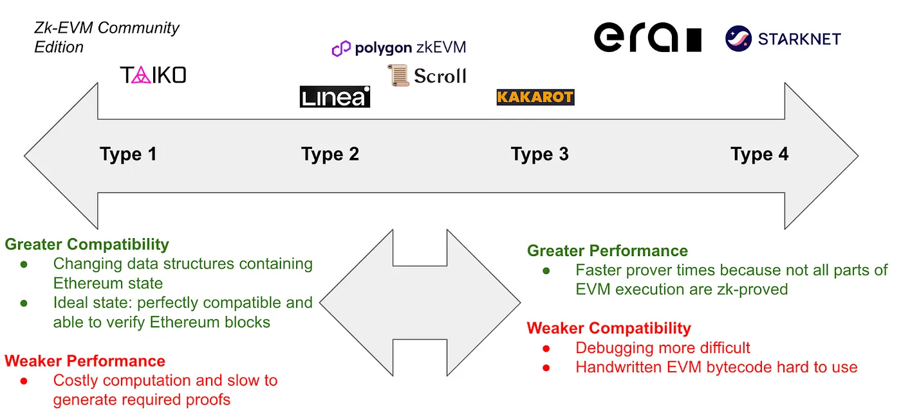
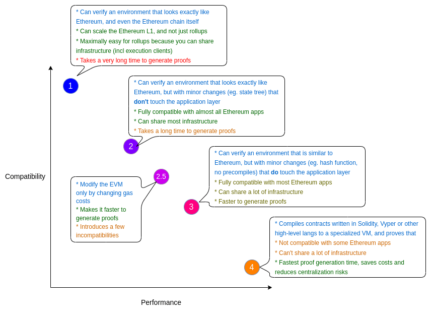

# zkEVM Era 

## What is EVM(Ethereum Virtual Machine)?

*Source: [Ethereum.org](https://ethereum.org/en/developers/docs/evm/#:~:text=Diagram%20adapted%20from,a%20new%20tab)*

EVM은 이더리움 가상 머신(Ethereum Virtual Machine)으로, 이더리움에서 모든 트랜잭션을 처리하는 소프트웨어입니다. 각 노드는 이 소프트웨어(예: geth)를 실행함으로써 이더리움 네트워크에 참여하게 됩니다. 이더리움에서 트랜잭션은 EVM 바이트코드라는 형태로 표현되며, 이는 EVM이 이해하고 실행할 수 있는 명령어 집합을 나타냅니다. 즉, EVM은 smart contract의 배포 및 실행을 담당하며, Stack, Memory, Storage access 등을 포함한 다양한 바이트 코드 명령어([Opcode](https://www.evm.codes/))를 통해 연산을 수행할 수 있습니다. 이는 Solidity와 같은 언어로 작성된 코드를 쉽게 실행할 수 있도록 해주며, 이를 통해 수많은 DApp(탈중앙화 앱)이 만들어질 수 있었습니다. 

## What is zkEVM?

*Source: [Chainlink Education Hub](https://chain.link/education-hub/zkevm)*

zkEVM은 EVM 바이트코드 기반의 스마트 컨트랙트 실행 결과에 대한 receipt를 생성하여 실행이 올바르게 계산되었음을 증명할 수 있는 시스템입니다. 여기서 어떤 계산이 올바르게 수행되었음을 수학적으로 증명할 수 있는 기술인 영지식 증명(ZKP)을 사용합니다. 이러한 zkEVM을 통해 오프체인에서 발생한 여러 트랜잭션을 하나의 receipt로 요약하고 이를 온체인에 제출함으로써, 확장성과 효율성을 높이는 방식의 롤업 구현을 가능하게 합니다. 

zkEVM은 validity proof 기반의 ZK-rollup으로, L1 (Ethereum)에서 증명을 검증받기 때문에 보안은 유지하면서도 자체 실행 환경에서 속도와 처리량을 자유롭게 최적화할 수 있습니다. 이렇게 트랜잭션 입력 데이터(calldata)는 압축된 형태로 L1에 올리되, 상태 루트와 증명만 확인되면 되므로 optimistic rollup이 모든 서명 · 데이터를 그대로 게시할 때보다 가스 비용이 크게 낮아집니다. 증명이 검증되는 즉시(통상 몇 분 이내) 최종성이 확보돼 1–2 주 챌린지 기간이 필요한 optimistic rollup보다 자산 이동이 훨씬 빠르며, 이는 DeFi 유동성 순환을 가속화합니다. 마지막으로 EVM 호환성 덕분에 Solidity 코드, 개발 툴체인, 기존 인프라와 유동성을 그대로 활용할 수 있어 강력한 네트워크 효과를 누린다는 점도 큰 장점입니다.

## Representative projects

[Polygon, zkSync, Scroll](https://x.com/jadler0/status/1549764211542315008), Taiko등 다양한 프로젝트들은 최초의 zkEVM을 만들고자 하였고, 서로를 견제하는 시장이 만들어지기도 했습니다. 이 프로젝트들의 공통된 목표는 ZK-SNARK 기술을 사용하여 이더리움과 유사한 거래의 암호화된 실행 증명을 만드는 것입니다. 이를 통해 이더리움 체인 자체의 검증을 훨씬 쉽게 하거나, 기존 이더리움과 거의 동일한 환경에서도 훨씬 더 확장성이 뛰어난 ZK rollup을 구축 할 수 있습니다.

*Source: [Layer 2s and the zkEVM Landscape](https://medium.com/@johnnyantos/layer-2s-and-the-zkevm-landscape-strategic-implications-9d6a10158200)*

### Type-specific stages of zkEVM (Type 1-4)

이렇게 zkEVM의 각 프로젝트마다 EVM 호환성, 증명 속도, 개발 편의성 등에서 미묘한 차이가 존재하며, 실용성과 성능의 균형을 맞추기 위해 여러 유형의 zkEVM이 등장하게 되었습니다. 

*Source: [Vitalik's Blog - The different types of ZK-EVMs](https://vitalik.eth.limo/general/2022/08/04/zkevm.html)*

[비탈릭이 분류한 zkEVM](https://vitalik.eth.limo/general/2022/08/04/zkevm.html)을 보았을 때, Type 1은 이더리움과 완전히 동일한 환경을 증명할 수 있어 기존 인프라를 그대로 활용할 수 있지만, 증명 생성 시간이 매우 오래 걸립니다. Type 2는 EVM과 거의 동일하지만, 일부 외부 구조(예: 상태 트리 등)만 변경해 약간 더 빠른 증명 생성을 지원하며, 대부분의 이더리움 앱과 호환됩니다. Type 2.5는 가스비 등 일부 파라미터만 조정해 증명 속도를 높이지만, 소수의 비호환성이 생길 수 있습니다. Type 3은 EVM과 유사하지만 일부 기능(예: 프리컴파일 등)을 제거해 증명 속도를 더 높이고, 대부분의 앱과 호환되나 일부는 수정이 필요합니다. 마지막으로 Type 4는 고수준 언어로 작성된 코드를 ZK 친화적인 VM에 직접 컴파일해 증명 속도가 가장 빠르지만, 이더리움과의 호환성이 크게 떨어집니다. 즉, 낮은 타입일수록 호환성은 높지만 느리고, 높은 타입일수록 성능은 뛰어나지만 기존 이더리움 생태계와의 호환성이 줄어드는 trade-off가 존재합니다.

## Inefficiencies of zkEVM

이처럼 zKEVM은 EVM과의 높은 호환성을 제공하는 대신, EVM의 모든 연산 작업(Opcode)을 ZKP로 증명할 수 있는 형태로 회로화하는 작업이 필요하며, 이로 인해 증명 회로를 복잡하게 만들어 성능 저하가 발생하게 됩니다. 일부 프로젝트는 Type 2.5와 같은 방식으로 증명 속도를 개선했지만, 여전히 EVM 고유의 비효율성과 ZK-unfriendliness 문제는 완전히 해소되지 않았습니다. 즉, EVM은 zk proving에 있어서 매우 비효율적인 ISA(Instruction Set Architecture)입니다.

**Stack-Based Architecture**

EVM은 256bit Stack 머신으로 설계되어 하드웨어 친화성이 낮고, 단순한 연산에도 여러 단계의 명령어가 필요하게 됩니다. 모든 연산이 스택을 통해 처리되며, 각 명령어가 이전 명령어의 결과게 직접적으로 의존하게 됩니다. 또한, 스택은 메모리의 한 영역으로 메모리 접근은 CPU 레지스터 연산보다 수십~수백배 느리기 때문에 접근 횟수가 증가하면 병목현상이 발생할 수 있습니다. 이렇게 제한적인 명령어와 256bit 산술 회로 때문에 복잡한 로직의 구현이 어렵다는 단점이 존재합니다. 

**Opcode Complexity**

EVM에는 140개가 넘는 Opcode가 존재하며, 새로운 EIP(Ethereum Improvement Proposal)가 도입될 때마다 새롭게 추가되는 Opcode를 위해서는 회로를 재설계 해야 합니다. 

**Proving Costs & Storage Overhead**

특히, Keccak-256 등의 해시 함수의 경우 각 명령마다 별도의 회로 설계가 필요하며, Poseidon 해시와 같은 zk 친화적인 해시에 비해 회로 비용이 높기 때문에 ZKP에 적합하지 않은 구조입니다.

