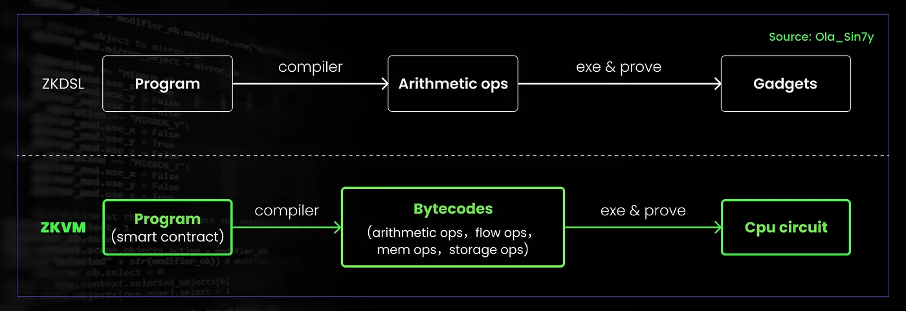

# ZK-based Scaling: Unlocking Blockchain's Potential

## Motivation of ZK-based Scaling

블록체인은 분산원장 기술의 혁신을 가져왔지만, 모든 거래를 모든 노드가 검증하고 저장해야 하는 구조로 인해 확장성(Scalability)에 근본적인 한계를 가집니다. 이 구조는 네트워크가 커질수록 성능 병목을 유발합니다.모든 노드가 동일한 상태를 유지하기 위해 전체 거래를 처리해야 하므로, TPS(Transactions Per Second)가 제한되고 병렬처리가 어렵습니다. 특히, 사용자가 급증할 경우 블록의 용량 제한과 처리 속도 한계로 인해 거래 지연이 발생하고, 수수료(Gas Fee)는 수요 증가에 따라 자동으로 상승합니다. 이러한 구조적 한계는 블록체인이 고성능이 요구되는 대규모 애플리케이션에 적용되는 데 장애 요소로 작용합니다.

블록체인의 확장성 문제를 해결하기 위한 기술적 접근 중 하나는 영지식 증명(Zero-Knowledge Proofs, ZKP)입니다. 이 기술은 연산 집약적인 작업을 오프체인 Prover에게 위임(offload)하고, 그 결과에 대한 검증 가능한 증명(proof)만을 블록체인에 제출하는 방식으로 동작합니다. 예를 들어, 수천 건의 거래나 복잡한 스마트 컨트랙트 실행 결과를 프로버가 오프체인에서 처리한 후, 이를 증명하는 짧은 ZK-SNARK 또는 ZK-STARK 증명을 생성합니다. 온체인에서는 이 증명만 검증하면 전체 연산의 유효성을 확인할 수 있으며, 이를 통해 블록체인은 개별 연산을 직접 처리하지 않고도 전체 상태의 정합성을 유지할 수 있습니다. 

ZKP 기반 확장 기법은 블록체인 네트워크의 처리 효율을 다음과 같이 개선합니다:

- 온체인에 기록되는 데이터량과 연산량이 감소함에 따라, 블록 크기 및 블록 생성 주기 내 처리 가능한 거래 수(TPS)가 증가합니다. 이는 동일한 블록 크기에서 더 많은 사용자 거래를 포함할 수 있게 합니다.

- 메인넷 검증자는 ZK 증명만 검증하면 되므로, 개별 거래나 상태 전이(state transition)를 다시 실행할 필요가 없습니다. 이로 인해 검증 비용이 일정하게 유지되며, 네트워크 부담이 크게 줄어듭니다.

이 방식은 메인넷의 연산 병목을 제거하고, 오프체인 연산 후 온체인 검증이라는 분리된 실행 구조를 통해 효율적이고 확장 가능한 블록체인 아키텍처를 구현합니다.

## Early ZK Implementations

ZK 기술의 실질적 도입은 2016년 [Zcash](https://z.cash/)의 메인넷 론칭에서 시작되었습니다. Zcash는 [libsnark](https://github.com/scipr-lab/libsnark) 라이브러리를 활용해 zk-SNARKs를 실용적으로 적용하여, 트랜잭션의 유효성을 증명하면서도 거래 내역을 완전히 암호화하는 프라이버시 중심의 블록체인 거래를 구현했습니다. 

하지만, 초기 ZK 응용은 저수준 라이브러리(예: libsnark)를 직접 활용해야 했기 때문에 개발 난이도가 매우 높았습니다. 이를 극복하기 위해 등장한 것이 zkDSL입니다.

### zkDSL(Zero-Knowledge Domain Specific Language)

*Source: [OLA zkVM: A Programmable Privacy Platform for Ethereum](https://medium.com/@ola_zkzkvm/a-programmable-privacy-platform-for-ethereum-understanding-olas-design-principles-and-technical-8a47ff07e725)*
ZKDSL은 ZKP 회로(zk-circuit)를 효율적으로 설계하고 작성할 수 있도록 만든 도메인 특화 언어입니다. 개발자는 고수준의 프로그래밍 언어로 복잡한 암호 회로를 설계할 수 있으며, 이 언어로 작성된 프로그램은 산술 회로로 변환되어 증명 시스템에 전달됩니다. 대표적인 zkDSL로는 Circom, Noir, Leo, Halo2 등이 있습니다. 

zkDSL은 복잡한 연산에서는 회로 크기와 증명 생성 시간이 급격히 증가하는 성능상의 한계가 있습니다. 이러한 ZKP 회로는 테스트와 디버깅이 어려우며, 특히, 입력/증인(witness) 생성, 회로의 부분적 테스트, 성능 최적화 등이 복잡하며, DSL마다 지원 수준이 다르고, 표준화된 중간 표현(IR) 부재로 인한 호환성 문제도 있습니다. 또한, 제약 조건이 충분하지 않으면 보안 취약점이 발생할 수 있으며, 고수준 언어에 비해 표현력과 라이브러리 생태계가 제한적이라는 점에서 실용적 한계가 존재합니다.

## Overview of zkEVM vs zkVM debate

ZK(Zero-Knowledge) 기술이 블록체인 확장성의 핵심으로 부상하면서, 이를 블록체인에 적용하는 방식에 대한 다양한 접근법이 등장했습니다. 그중에서도 ZK 기술의 적용 방식은 EVM 호환성에 중점을 둔 zkEVM과, 범용성과 최적화에 중점을 둔 zkVM으로 나뉘며, 서로 다른 철학과 기술적 지향점을 가지고 발전해왔습니다.

### zkEVM
zkEVM은 이더리움 가상 머신(EVM)에서 실행되는 모든 연산을 영지식 증명 회로(zk-circuit)로 모델링하여, 이더리움 상의 트랜잭션 실행이 정확했음을 증명합니다. 구체적으로는 스마트 컨트랙트 바이트코드의 실행, 스택 및 메모리 상태의 변화, 스토리지 접근, 가스 사용량 계산 등을 모두 증명 가능한 방식으로 모델링합니다. 이는 기존의 Solidity 스마트 컨트랙트를 수정 없이 ZK 환경에서 실행할 수 있게 하여 기존 이더리움 생태계와의 완전한 호환성을 제공합니다.

하지만 EVM은 ZK 회로를 고려하지 않고 설계된 구조로, 영지식 증명에 적합하지 않은 여러 특성을 가집니다. 예를 들어, 스택 기반의 실행 모델, 불규칙하고 복잡한 명령어 세트, 비효율적인 가스 계산 로직 등은 회로 구현을 어렵게 만들고, 증명 생성 시간과 회로 크기를 증가시킵니다. 또한 EVM 사양은 지속적으로 변경되며(EIP 업데이트 등), 이에 따라 회로를 자주 수정하고 검증해야 하므로 유지보수 비용도 큽니다. 이러한 점은 zkEVM을 구축하고 운영하는 팀에게 기술적인 부담이 되며, 결국 롤업의 처리 성능과 증명 비용에도 영향을 미칩니다.

### zkVM

zkVM은 특정 블록체인이나 가상 머신(EVM)에 종속되지 않고, 범용적인 명령어 집합 아키텍처(예: RISC-V)를 기반으로 프로그램을 실행하고 해당 실행을 증명하는 방식입니다. zkVM은 Rust, C, Go 등의 일반적인 고수준 언어로 작성된 프로그램을 증명 가능한 회로로 컴파일하고, 이를 기반으로 증명을 생성합니다. 이처럼 범용 컴퓨팅 환경을 기반으로 하여, ZK 회로의 설계와 증명 효율성을 중심으로 시스템을 최적화할 수 있습니다.

RISC-V와 같은 단순한 ISA를 선택함으로써 회로 구조는 간결해지고, 증명 생성 시간은 짧아지며, 회로의 크기와 복잡도도 줄일 수 있습니다. 이로 인해 zkVM은 병렬화, 하드웨어 가속, 다양한 언어 지원 등 기술적 확장성 측면에서 유리합니다. 다만 zkVM은 EVM과 직접적인 호환성을 제공하지 않기 때문에, 기존 Solidity 기반 DApp을 실행하려면 별도의 변환 또는 에뮬레이션 계층이 필요합니다. 하지만 ZK 시스템의 근본적인 성능 개선을 목표로 할 때, zkVM은 EVM의 복잡성으로 인한 유지보수 어려움을 해소하고, 더 넓은 개발자 생태계와 다양한 블록체인 환경에 ZK 기술을 적용할 수 있는 길을 열고 있습니다.

## ZK-Rollup

ZK(Zero-Knowledge) 기술이 블록체인의 확장성 문제 해결 수단으로 본격적으로 주목받기 시작한 계기는 1세대 ZK Rollup의 등장입니다. Loopring, zkSync Lite와 같은 초기 ZK Rollup 프로젝트들은 이더리움 메인체인의 처리 부담을 줄이기 위해, 트랜잭션을 오프체인에서 실행한 후, 해당 실행의 결과 상태만을 ZK Proof와 함께 온체인에 기록하는 방식을 사용했습니다. 이러한 구조는 데이터 무결성과 보안성을 유지하면서, 온체인 계산 및 데이터 기록 비용을 줄이는 데 기여했습니다.

다만, 초기 ZK Rollup은 간단한 토큰 전송이나 교환 기능에만 초점을 맞췄고, EVM 수준의 스마트 컨트랙트 실행은 지원하지 않았습니다. 이는 당시 ZK 회로 설계 및 증명 생성 기술의 한계 때문이었습니다.

이후 회로 최적화, 프로버 아키텍처 개선, 고성능 증명 시스템의 개발이 이어지면서, 풀 스마트 컨트랙트 실행을 지원하는 zkEVM 기반 Rollup들이 등장했습니다. 대표적인 예로 zkSync Era, Polygon zkEVM, Scroll, StarkNet 등이 있으며, 이들은 EVM 바이트코드를 ZK 회로로 재현하거나, 자체 VM 구조를 바탕으로 스마트 컨트랙트 실행의 증명 생성을 가능하게 했습니다.

이와 병행하여, ZK 기술을 EVM에 종속시키지 않고 보다 범용적인 환경에서 구현하려는 시도로 zkVM이 개발되었습니다. zkVM은 RISC-V와 같은 ZK 친화적인 명령어 집합을 기반으로 증명 회로를 구성하며, EVM 이외의 환경에서도 효율적인 ZK 실행을 가능하게 합니다. 이를 통해 ZK 기술은 이더리움뿐 아니라 다양한 블록체인 및 일반 컴퓨팅 환경에서의 적용 가능성을 확보하게 되었습니다.
