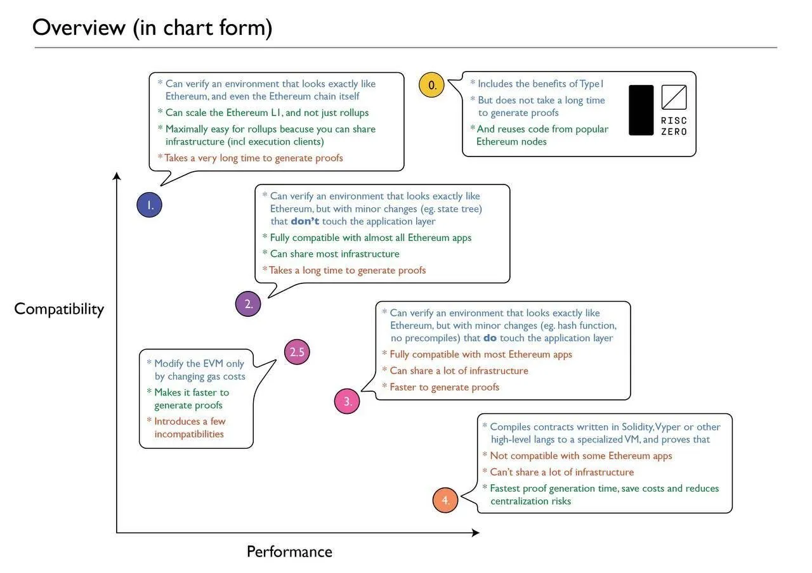

# Why Most zkVMs Are Adopting RISC-V

## What is RISC-V?

RISC-V is an open-source, general-purpose hardware instruction set architecture (ISA) that follows a 64-bit register-based design similar to conventional CPU architectures. This design allows RISC-V to access registers approximately 100 times faster than memory. Data is stored directly in these registers, and computations are performed between registers, boosting efficiency.

**Advantages Over EVM**

Ethereum aims to improve the efficiency and simplicity of its execution layer to resolve bottlenecks. One approach is to replace the EVM’s opcode set with the RISC-V ISA. While operations like signature verification or hash functions on Ethereum require hundreds to thousands of EVM instructions—due to complex operations such as elliptic curve point addition/multiplication, modular arithmetic, and hashing—the same processes can be compressed into a single RISC-V instruction.

In contrast to the EVM’s 256-bit stack-based architecture, which makes computation complex and inefficient, RISC-V’s fewer instructions and simpler structure facilitate compiler optimizations and parallel processing. Furthermore, while EVM development is largely limited to languages like Solidity and Vyper, RISC-V allows programs written in languages like Rust, C, and Go to be compiled directly into native RISC-V code executable on Ethereum.

Replacing the EVM with RISC-V also maintains verifiability while raising the gas limits on Layer 1(L1). Ethereum’s delayed execution upgrade helps increase gas limits, with one key goal being to facilitate zkVM proof verification on Ethereum L1. By using zkVMs, all computation happens off-chain, and only a succinct proof confirming correct computation is verified on-chain. This dramatically reduces processing costs and significantly enhances scalability.

## Why zkVMs are adopting RISC-V

### RISC Zero

A notable feature of RISC Zero is its "[Continuation](https://risczero.com/blog/continuations)" capability, which automatically segments long-running program executions into multiple smaller segments that can be computed and proven independently. Previously, zkVMs faced limits on the maximum number of computation cycles they could process in a single proof, making it impossible to verify large or complex transactions all at once. With Continuations, any program, no matter the size, can be divided into sequential or parallel segments. Each segment can be proven independently, which significantly reduces total proof latency and maintains consistent memory usage, thereby greatly enhancing both efficiency and scalability.

Building on the general-purpose RISC-V architecture, RISC Zero has developed a zkVM that allows developers to write code in familiar languages like Rust or C++ and automatically convert it into STARK-based proofs. In particular, RISC Zero created [Zeth](https://risczero.com/blog/designing-high-performance-zkVMs), a Type 0 zkEVM that compiles and runs the Rust-based Ethereum client (Reth) directly within the zkVM without modifications, enabling full proof generation of EVM execution. This accomplishment established that zkVMs are well-suited for developing verifiable software applications and reinforced the recognition of RISC-V as an optimal foundation for such ZK systems.

*Source: [RISC Zero Zeth Release](https://risczero.com/blog/zeth-release)*

### SP1

In February 2024, Succinct Labs released [SP1](https://blog.succinct.xyz/introducing-sp1/), marking a significant evolution in the zkVM landscape by shifting the focus towards performance competition. Although based on RISC-V, SP1 was designed from the ground up with an emphasis on speed and flexibility, boasting benchmark results of proving times that are up to 10 to 28 times faster than existing solutions. Notably, SP1 is fully open-source and developer-friendly, supporting proof generation for any program written in LLVM-compatible languages such as Rust. This combination of high performance, openness, and ease of use positions SP1 as a leading zkVM in accelerating zero-knowledge proof applications across diverse computing environments.

*Source: [Introducing SP1](https://blog.succinct.xyz/introducing-sp1/)*

In the current ZK field, the question is no longer "Which is correct, zkEVM or zkVM?" but rather "Which zkVM best suits our project?" While zkEVM used to attract attention, zkVMs like RISC Zero and SP1 have recently gained more interest as they are being utilized in real services. zkVM enables fast proof generation while reusing existing code, making it an effective solution for implementing blockchain scalability and privacy.

In this process, the importance of ZK-friendly system design, open-source transparency, and developer experience is also emphasized, showing the direction in which ZK technology will progress in the future.

## Is RISC-V zkVM the Endgame?

[Vitalik Buterin](https://ethereum-magicians.org/t/long-term-l1-execution-layer-proposal-replace-the-evm-with-risc-v/23617) recently pointed out that the major long-term bottleneck to Ethereum Layer 1(L1) scalability lies in the inherent limitations of zkEVM itself, and proposed transitioning to a RISC-V based zkVM as a promising direction for improvement.

In the short term, ongoing and upcoming Ethereum Improvement Proposals(EIPs)—such as block-level access lists, delayed execution, distributed history storage, and EIP-4444—can help alleviate scalability bottlenecks. Medium-term efforts aim to address statelessness and issues related to zkEVMs. However, from a long-term perspective, the following three factors are critical:

1. Stability of Data Availability Sampling(DAS) and history storage protocols

2. Maintenance of competitive block production

3. Improvement of zkEVM proving performance

Vitalik argues that the bottlenecks related to competitive block production and proving performance (points 2 and 3) can be significantly mitigated by replacing the zkEVM with a RISC-V based zkVM.

This means that while current EIPs may address scalability challenges in the short run, they provide only temporary relief. Replacing zkEVM with RISC-V zkVM offers a long-term solution to fundamental scalability issues in Ethereum. This replacement is intended to enhance the efficiency and simplicity of Ethereum’s execution layer.

Regarding the practical adoption of RISC-V on Ethereum, there are two main approaches:

1. Supporting both virtual machines—the existing EVM and RISC-V—simultaneously, allowing execution on either VM.

2. Converting all existing EVM contracts to run through an EVM interpreter implemented on RISC-V.

Vitalik regards the second approach, which involves transitioning all EVM contracts to RISC-V via a Virtual Machine interpreter, as a more appropriate direction. In other words, he proposes replacing the part of the execution environment that interprets and executes instructions (opcodes) of smart contract bytecode from EVM to RISC-V.

Ultimately, this aims to generalize Ethereum’s execution environment to the level of a general-purpose CPU architecture and to optimize the integration with zero-knowledge proof technology.

### Opposition to Ethereum Adopting RISC-V based zkVM?

Some members of the community, including [Wei Dai](https://x.com/_weidai/status/1914053842888769626?ref=nockchain.org), advocate for adopting a WebAssembly (WASM)-based zkVM instead of RISC-V. Their argument is that WASM already possesses several features suitable for smart contracts, particularly ease of static analysis (such as the absence of jump instructions). In fact, WASM inherently includes many of the properties that the Ethereum Object Format (EOF) attempts to introduce. Previously, the eWASM project also attempted zkEVM implementation based on WASM.

However, recent Ethereum developer community sentiment toward the adoption of EOF has been [negative](https://www.ainvest.com/news/ethereum-developers-reject-eof-upgrade-fusaka-fork-2504/). EOF requires the addition of 11 EIPs and 19 new opcodes, significantly increasing complexity. Many critiques argue that the development and operational costs outweigh the actual benefits. This led to EOF being excluded from the Fusaka upgrade, and the community has not gained momentum for transitioning to a WASM-based environment.

Meanwhile, RISC-V based zkVMs have already demonstrated practical advantages such as faster proof generation, development convenience, and support for high-level languages like Rust and C across multiple projects. Vitalik Buterin also considers RISC-V to overcome the structural limitations of the EVM and to drastically improve zk proof efficiency. RISC-V, as an open-source ISA, offers scalability, standardization, and performance optimization, and is rapidly becoming the accepted standard within the zkVM ecosystem.

:::note[**What is EOF(EVM Object Format)?**]

[EOF(EVM Object Format)](/docs/miscellaneous/EOF.md)

:::

:::note[**What is WASM(WebAssembly)?**]

[WASM(WebAssembly)](/docs/miscellaneous/WASM.md)

:::
