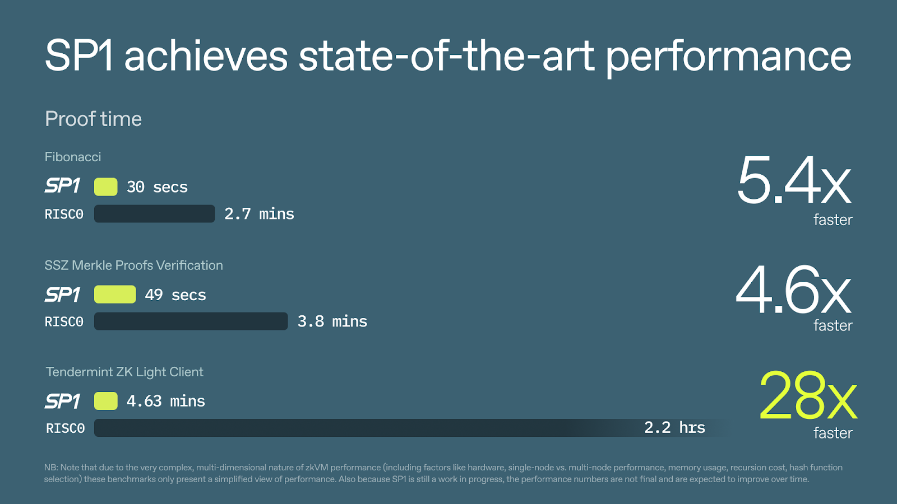
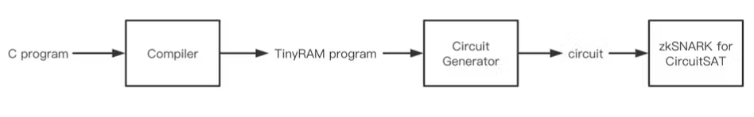
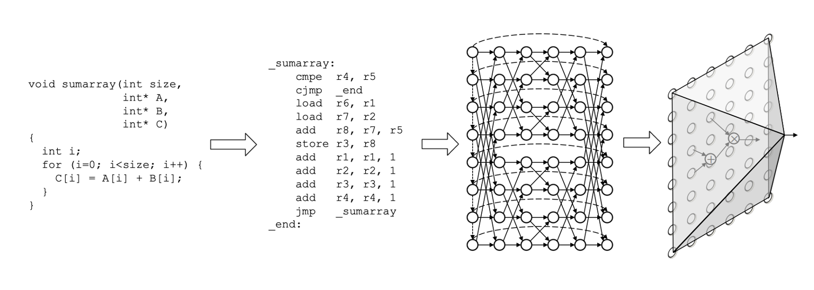

# RISC-V

### What is RISC-V?
RISC-V는 오픈소스 범용 하드웨어 ISA로, 일반 CPU구조에 가까운 64비트 레지스터 기반 설계를 따릅니다. 이러한 구조로 메모리보다 약 100배 이상 빠르게 접근이 가능하며, 데이터를 직접 이 레지스터에 저장하고, 연산도 레지스터 사이에서 직접 수행하게 됩니다. 

**EVM 대비 장점**

이더리움에서는 실행 계층의 효율성(병목 현상 중 하나 해결)과 단순성 향상시키고자, EVM에서 사용하는 opcode 명령어를 RISC-V ISA로 변경하고자 합니다. 이더리움에서 서명 검증이나 해시 함수 실행시, EVM은 수백~수천개의 명령어를 필요로 했다면(타원곡선 점 덧셈/곱셈, 모듈로 연산, 해시 함수 계산 등을 할 수 있게 하는 명령어들 필요), RISC-V에서는 이러한 복잡한 과정을 단일 명령어로 압축할 수 있습니다. 이렇게 기존 EVM은 256bit 스택 기반 구조로 인해 연산이 복잡하고 비효율적이지만, RISC-V는 명령어 수가 적고 구조가 단순하여 컴파일러 최적화 및 병렬처리에 적합합니다. 또한, EVM은 Solidity나 Vyper 위주의 한정된 개발 언어를 사용했던 반면, RISC-V의 경우 Rust, C, Go 등과 같은 언어로 개발한 코드를 바로 RISC-V 네이티브 코드로 컴파일하여 이더리움에서 실행할 수 있습니다. 

또한, EVM을 RISC-V로 대체하면 검증 가능성을 유지하면서도 L1의 가스 한도를 높일 수 있습니다. 이더리움에서 지연 실행(Delayed execution)은 가스 한도를 높이는 데 도움이 되는 업그레이드로, 주요 목표 중 하나는 이더리움 L1에서 zkVM 증명을 용이하게 하는 것인데요. zkVM을 사용하면 모든 연산은 오프체인에서 수행되고, 온체인에서는 해당 연산이 올바르게 수행되었음을 증명하는 간결한 증명(Proof)만 검증하면 되므로, 전체적인 처리 비용을 줄이고 확장성을 높일 수 있습니다.

### Why zkVMs (e.g., RISC Zero, SP1) are adopting RISC-V

**RISC Zero**

특히, RISC Zero의 "[continuation](https://risczero.com/blog/continuations)" 기능은 긴 프로그램 실행을 여러 개의 작은 세그먼트로 자동 분할해 각각 독립적으로 계산하고 증명할 수 있게 해줍니다. 이 기능 덕분에 기존에는 zkVM이 한 번에 처리할 수 있는 연산(사이클) 수에 제한이 있어 복잡하거나 큰 트랜잭션을 증명할 수 없었지만, 이제는 어떤 크기의 프로그램도 여러 세그먼트로 나눠 순차적 또는 병렬로 증명할 수 있습니다. 각 세그먼트는 서로 독립적으로 증명할 수 있어 전체 증명 시간(지연)이 단축되고, 메모리 사용량도 일정하게 유지되어 효율성과 확장성이 크게 향상됩니다.

이렇게 RISC Zero는 범용 RISC-V 아키텍처 기반의 zkVM을 개발하여, 개발자가 Rust나 C++ 같은 일반적인 언어로 코드를 작성하면 이를 자동으로 STARK 기반 증명으로 변환할 수 있도록 했습니다. 특히, RISC Zero는 Rust 기반 이더리움 클라이언트(Reth)를 zkVM에 그대로 컴파일해 실행하면서도 수정 없이 EVM을 증명할 수 있는 Type 0 zkEVM인 [Zeth](https://risczero.com/blog/designing-high-performance-zkVMs)를 만들었습니다. 이를 통해 zkVM이 검증 가능한 소프트웨어 애플리케이션 구축에 적합하며, RISC-V가 이를 위한 최적의 기반이라는 인식이 확산되었습니다.

*Source: [RISC Zero Zeth Release](https://risczero.com/blog/zeth-release)*

**SP1**

또한, 2024년 2월, Succinct Labs가 [SP1](https://blog.succinct.xyz/introducing-sp1/)을 공개하면서 zkVM 전쟁은 성능 경쟁으로 진화했습니다. SP1은 RISC-V 기반이지만 처음부터 속도와 유연성 등 성능 최적화에 집중해 “최대 10–28배 빠른 proving” 벤치마크를 내세웠습니다. 특히 SP1은 100% 오픈소스로 공개하며, LLVM 호환 언어(Rust 등)로 작성된 어떤 프로그램이라도 증명할 수 있게 설계되어 개발자 친화적입니다.

*Source: [Introducing SP1](https://blog.succinct.xyz/introducing-sp1/)*

이제 ZK 분야에서는 “zkEVM과 zkVM 중 어느 것이 맞냐”가 아니라, “우리 프로젝트에는 어떤 zkVM이 더 잘 맞을까”라는 질문이 중심이 되고 있습니다. 과거에는 zkEVM이 주목받았지만, 현재는 RISC Zero, SP1 같은 zkVM들이 실제 서비스에 활용되면서 더 많은 관심을 받고 있습니다. zkVM은 기존 코드를 그대로 사용하면서도 빠르게 증명을 만들 수 있어, 블록체인 확장성과 프라이버시를 구현하는 데 효과적인 방법으로 자리잡고 있습니다. 이 과정에서 ZK-친화적인 시스템 설계, 오픈소스 기반의 투명성, 개발자 경험의 중요성도 함께 강조되며, 앞으로 ZK 기술이 나아갈 방향을 보여주고 있습니다.

## NOTE

### What is TinyRAM?

TinyRAM은 ZKP 시스템에서 범용 프로그램을 효율적으로 증명하기 위해 설계된 RISC(Reduced Instruction Set Computer)기반 RAM 아키텍처입니다. 즉, TinyRAM은 실제 컴퓨터처럼 동작하는 간단한 명령어 기반의 가상머신을 도입해, C나 C++과 같은 고수준 언어로 작성된 프로그램을 효율적으로 실행하고 그 실행 과정을 증명할 수 있도록 설계되었습니다. 이를 통해 반복문이나 메모리 접근 같은 복잡한 연산도 효율적으로 처리할 수 있고, 증명 생성에 필요한 회로 크기와 계산량을 크게 줄일 수 있습니다. 즉, TinyRAM은 복잡한 프로그램의 실행을 간단한 명령어 트레이스로 바꿔서, 증명 시스템이 더 적은 자원으로 빠르게 영지식증명을 생성할 수 있게 해줍니다.

*Source: [libsnark](https://github.com/scipr-lab/libsnark?ref=hackernoon.com)*

즉, C 프로그램을 TinyRAM 프로그램으로 컴파일한 후, 회로 생성기를 통해 회로를 생성하고, 최종적으로 zkSNARK 회로를 얻습니다. 이렇게 TinyRAM 기반 zk-SNARK 시스템은 프로그램의 실행 과정을 산술 회로로 변환해, 해당 프로그램이 주어진 입력에서 올바르게 실행되었음을 ZKP로 증명할 수 있습니다.

*Source: [TinyRAM Paper](https://eprint.iacr.org/2013/507.pd)*

이 그림은 TinyRAM 프로그램의 실행을 ZKP에서 어떻게 증명 가능한 형태로 변환하는지 보여줍니다.

먼저 반복문, 조건문, 메모리 접근 등 실제 프로그램의 명령어들이 나열되어 있는 TinyRAM 어셈블리 코드를 제약 충족 문제(constraint satisfaction problem)로 변환합니다. 

각 노드는 프로그램 실행의 상태(예: 레지스터 값, 메모리 상태 등)를 나타내고, 화살표는 명령어 실행에 따른 상태 변화를 의미합니다. 즉, 프로그램이 올바르게 실행되었는지를 확인하기 위한 논리적 제약 조건들이 네트워크 형태로 표현된 것입니다. 

가장 오른쪽 그림은 이를 산술 회로(arithmetic circuit)로 변환하는 과정으로, 각 제약 조건을 수학적으로 표현하여, 실제 입력(assignment)이 주어졌을 때 모든 제약 조건이 만족되는지 빠르게 검증할 수 있도록 합니다.

**한계**

TinyRAM 아키텍처는 기존 회로 기반 방식보다 효율적이지만, 여전히 실제 대규모 프로그램이나 복잡한 연산(특히 메모리 접근이 많은 경우)에서는 증명 생성 시간이 매우 길어질 수 있습니다. 또한, TinyRAM은 범용성을 위해 설계된 만큼, 특정 연산(예: 해시 함수, 암호 연산 등)에 대해 특화된 회로 방식에 비해 비효율적일 수 있습니다. 그리고 zkDSL과 비슷하게 제약 조건이 충분하지 않으면 잘못된 실행도 증명될 수 있다는 위험이 존재합니다.

