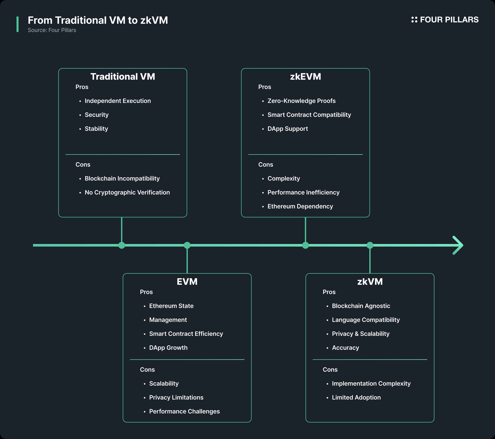
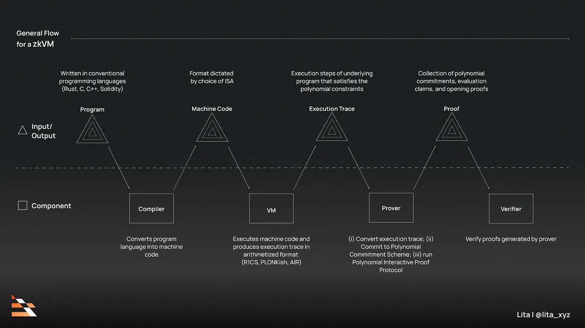

# Transition to zkVM

zkEVM의 한계가 명확해지면서, 2023년을 기점으로 RISC Zero, Jolt, ZKM 등 범용 아키텍처(RISC-V, MIPS 등)에 기반한 zkVM이 주목받기 시작했습니다. zkVM은 Rust, C++, Go 등 표준 프로그래밍 언어로 작성된 임의의 프로그램을 증명할 수 있고, 블록체인에 종속되지 않아 다양한 환경에 적용이 가능합니다.

*Source: [zkVM: New Paradigm for Web3 Computing](https://4pillars.io/en/issues/zkvm-new-paradigm-for-web3-computing#:~:text=2.1%20From%20Traditional%20VMs%20to%20zkVMs)*

### What is zkVM?
zkVM은 특정 블록체인에 종속되지 않고, ZKP 기술을 활용하여 프로그램 실행의 무결성(Integrity)과 프라이버시(Privacy)를 보장하는 가상 머신입니다.

증명자(Prover)가 “내가 이 코드를 정확히 실행했고 결과도 맞다”는 것을 ZK로 만들어 제시하면, 검증자(Verifier)는 “이 사람이 계산을 제대로 했구나”라고 해당 결과가 올바르다는 것을 확인할 수 있습니다. 이 과정에서 실제 계산된 값이나 내부 로직 같은 건 전혀 노출되지 않아, 민감한 정보도 안전하게 지킬 수 있습니다.

*Source: [Zero Knowledge Paradigm: zkVM](https://www.lita.foundation/blog/zero-knowledge-paradigm-zkvm#:~:text=An%20abstracted%2C%20generalized%20process%20flowchart%20of%20a%20zkVM%2C%20split%20and%20categorized%20between%20the%20format%20(inputs%20/%20outputs)%20of%20a%20program.)*

먼저, 우리가 Rust 같은 언어로 코드를 작성하면, Compiler가 이를 바이트코드(Bytecode) 형태로 바꿔줍니다. 이 바이트코드가 어떤 명령어로 구성될지는 ISA(Instruction Set Architecture)에 따라 결정됩니다. 그 다음으로, VM이 해당 바이트코드를 실제로 실행하게 되며, 이 과정에서 어떤 명령어가 언제 실행되었는지, 어떤 값이 저장되었는지 등이 전부 기록되는데 이를 Execution Trace라고 합니다. Prover는 Execution Trace를 수학적 형태인 다항식(Polynomial)으로 변환하여 ZKP를 생성합니다. 이러한 계산 과정을 수학적으로 증명 가능한 형태로 바꾸는 과정을 Arithmetization이라고 하며, 이때 Polynomial Commitment Schemes(PCS)과 같은 암호학적 기술이 사용됩니다. 마지막으로 Verifier는 실제 코드나 데이터를 들여다보지 않고도, 제공된 증명만으로 해당 계산이 올바르게 수행되었음을 검증할 수 있습니다.

zkVM은 ZK 기반의 계산 무결성을 통해 민감한 정보를 공개하지 않고도 연산의 정확성을 증명할 수 있어 높은 보안성과 프라이버시를 보장하며, 대부분의 연산을 오프체인에서 처리해 네트워크 확장성과 수수료 효율성을 높입니다. 또한 Rust, C/C++ 등의 친숙한 언어 지원으로 개발자 진입장벽이 낮고, GPU 병렬화와 같은 최신 하드웨어 가속 기술을 통해 성능도 지속적으로 향상되고 있습니다.

