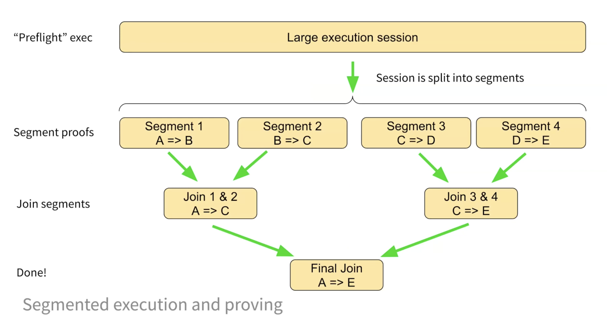
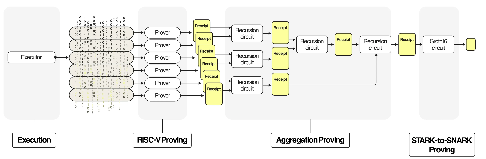
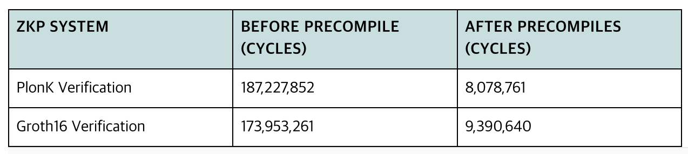
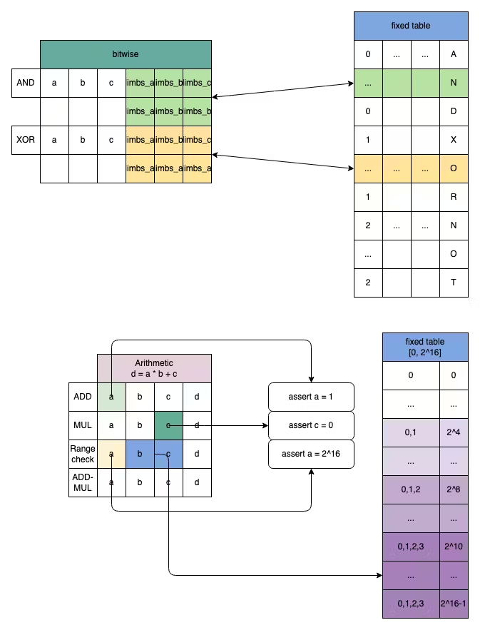

# Optimization

Existing zkVMs already have complex and mature codebases spanning millions of lines. Various optimization approaches are being implemented across all layers, from underlying cryptographic research and protocol design to code implementation. However, the major optimization ideas that have brought significant and practical changes in zkVM development can be summarized as follows.

## Continuation

zkVM creates proofs for the execution of a given program. To do this, the Prover must execute the program with given inputs to understand which instructions were executed, with what values, and in what order. This execution history, organized as a list of instructions, is called an execution trace, and the proof created by zkVM verifies whether each line of this trace follows the defined program execution rules.

Since the execution flow of the program we want to prove is 'sequential', proof generation also proceeds sequentially. That is, when the execution trace proceeds in the order I₁, I₂, I₃, ..., the ZK protocol internally can only move on to proving I₂ after completing the processing for I₁. This means parallelization is difficult, which is a significant disadvantage considering that modern large-scale computation servers have very powerful parallel computing capabilities.

Continuation is a method to minimize bottlenecks due to parallelization difficulties, a technology first introduced and pioneered by RISC Zero. The trace to be proven is split into multiple segments, and multiple machines independently generate proofs for each segment. Since it must also be proven that each segment is correctly connected, the segments are merged in a tree structure and compressed into a single final root proof. Since the depth of a binary tree is O(log n), each aggregation can also be performed in parallel, so the merging overhead is not significant.

While originally a single machine had to generate proof for a large execution trace from start to finish, the work can now be divided into multiple non-dependent pieces and distributed in parallel to multiple independent machines. This means horizontal scaling is now possible, unlike the previous design where expansion was only possible through faster CPUs and larger memory. Additionally, the previous limitation of being unable to prove arbitrarily large programs at once due to memory peak issues has been resolved, as traces can now be split into any number of pieces and proven on each machine.

## Recursion

Generally, ZK proof generation protocols are classified into STARK and SNARK based on their characteristics. Although various protocols that share each other's characteristics have been designed, making clear classification ambiguous, proof generation techniques can fundamentally be classified based on two trade-offs: Prover cost and Verifier cost (and proof size).

STARK-based proofs have low Prover costs even for large execution traces, but have large proof sizes and high Verifier costs. Particularly, verifying STARK proofs (receipts) in an on-chain environment is very expensive and impractical.

Conversely, SNARK-based proofs have much smaller proof sizes, typically O(1) regardless of the size of the proof target or with very little dependency. However, the Prover cost is high, making it difficult to generate proofs for long execution traces.

To solve this, the STARK Verifier computation for STARK proofs is represented as a circuit that can create ZK proofs, and SNARK proofs are generated for that circuit. This process of performing ZK proof verification within another ZK circuit is called Recursion, and ultimately allows large-scale STARK execution proofs to be summarized into very small SNARK proofs. Most zkVMs prove the execution trace itself using STARK methods, but instead of directly submitting this proof, they create the logic for verifying that proof as another SNARK proof and submit that. This recursive proof method is also called Proof Composition.

RISC Zero's Proof Composition implementation is as follows:

| Receipt Type            | Description                                                         |
|-------------------------|---------------------------------------------------------------------|
| **Composite Receipt**   | A proof set collecting each segment (STARK proof) as a vector      |
| **Succinct Receipt**    | A single STARK merging Composite Receipt through **Recursion Circuit** |
| **Groth16 Receipt**     | A small proof finally compressing Succinct Receipt through **Groth16 Circuit** |

Multiple STARK proofs can be recursively compressed and merged into one STARK, then the result is proven again with a SNARK called Groth16 to reduce the final proof size to kilobytes.

## Precompile

The term Precompile originally comes from EVM, where it refers to a mechanism that reduces execution costs by processing complex and expensive operations (e.g., SHA-2, elliptic curve pairing) in native code rather than implementing them in EVM bytecode.

Precompile in zkVM design has a similar significance. Instead of expressing frequently performed operations as general RISC-V code and proving them within the entire program, they are bundled into separate special-purpose SNARK/STARK circuits and the operation results are included in the proof. These circuits specialized for specific operations have undergone extensive optimization, so they can significantly reduce costs by partially sacrificing the high expressiveness of the existing method that must be able to prove arbitrary RISC-V code. Like EVM Precompile, each zkVM implementation supports cryptographic hash operations, elliptic curve operations, etc. For instance, SHA-256 hash operations require thousands of RISC-V instructions to express, but using Precompile can prove them with much fewer constraints, i.e., polynomials of lower degree.

Below is a benchmark showing how much performance improvement the SP1 Precompile-based SNARK Verifier library published by Succinct achieved compared to implementations without Precompile.

Similarly, operations such as KZG verification for Ethereum EIP-4844 blobs or BLS12-381 signature verification used in Ethereum consensus can significantly improve performance using elliptic curve operation Precompile. By processing specific repetitive operations with Precompile, significant costs can be saved.

## Lookup Argument

Some zkVMs are implemented with Lookup Argument at their core. Jolt is a representative example.

One problem that ZK solutions face is that operations commonly used in real computers (e.g., bitwise, division, modular arithmetic, comparison operations) are very difficult to represent as circuits. While these operations are processed as simple small-unit operations in regular computers, circuits require numerous gates to express them.

In such cases, instead of computing directly within the circuit, it's cheaper to create an evaluation table for the operation in advance and prove that the input/output values of the instruction are in this table. The module that enables this is Lookup Argument. Additionally, Lookup Argument can be used to prove that values are within specific ranges or to prove the correctness of read/write operations in memory, making processing much simpler.

## Hardware Acceleration

The most notable recent approach is hardware acceleration. Since simply using many GPUs is insufficient to parallelize and accelerate core operations in ZK proofs (e.g., MSM, FFT, hashing), hardware-software co-design using FPGA or ASIC is emerging. Many players are distinguishing themselves and gaining recognition in this field with the goal of Ethereum real-time proving. Like Bitcoin mining, it is expected that teams creating specialized hardware for zkVM proof generation will occupy a large portion of the network in the future.

In addition to such structural optimizations, significant optimization also occurs at the code implementation stage. Large-scale operations that must be repeatedly executed when creating proofs have been optimized through mathematical research over long periods. During implementation, how to optimize and parallelize at the software level greatly affects overall performance. Moreover, operations in ZK mostly don't correspond one-to-one with commonly used machine instructions in computers and require appropriate transformations, where various mathematical tricks are also used. These mathematical operations must be well-optimized according to the characteristics and requirements of the ZK domain to reduce costs when operating proof generators that perform large-scale computations, and many teams are working on this in various ways.