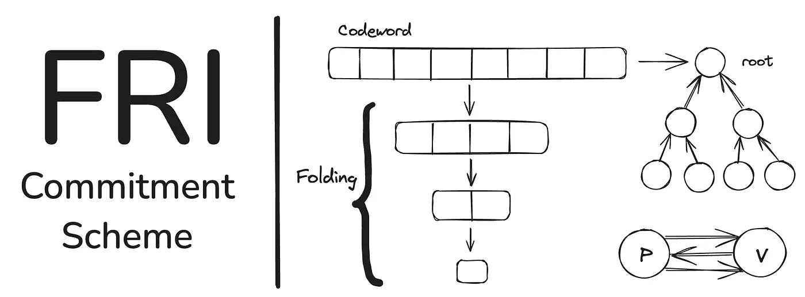

# RISC-V zkVM Architecture

## Overview

```
Source Code (Rust)
   ↓ Compile (RISC-V Toolchain)
ELF (RISC-V Binary)
   ↓ Load
zkVM (RISC-V Emulator that generates a Zero-Knowledge Proof)
   ↓ Execute
Execution Trace (Recorded as a Table)
   ↓ Arithmetization (Convert trace and constraints into polynomials)
   ↓ Polynomial Commitment Scheme (e.g., FRI)
   ↓ Lookup Argument: Memory Consistency
Generate Zero-Knowledge Proof
```

zkVM은 프로그램 실행의 전체 과정을 수학적으로 증명 가능한 형태로 변환하는 시스템입니다. 이 글을 통해 각각의 단계를 살펴보고 프로그램을 어떠한 구조의 Execution Trace로 변환하는지, 해당 Trace를 어떻게 수학적으로 증명 가능한 형태로 만드는지를 구체적인 예시를 통해 살펴보도록 하겠습니다.

## RISC-V Execution Trace Extraction

RISC-V 기반 프로그램은 다음 과정을 통해 zkVM에서 실행 가능한 형태로 변환됩니다:


### Compilation Process

Rust는 다양한 RISC-V 아키텍처를 공식적으로 지원합니다. 해당 툴체인(source → binary 역할)을 이용해서 일반적인 Rust 코드를 컴파일하면, RISC-V ISA 기반 ELF(Executable and Linkable Format)으로 생성됩니다. 이렇게 생성된 ELF 파일은 zkVM에서 실행할 수 있는 형태입니다.

### RISC-V ELF Binary

생성된 ELF 파일은 zkVM에 로드되어 RISC-V 명령어들이 순차적으로 수행됩니다. 프로그램 실행 중 외부로부터 입력을 받아야 하는 경우, 프로그램은 특정 시스템 호출(syscall) 코드를 사용하여 ECALL 명령어를 호출합니다. zkVM은 이 ECALL을 감지하고, 미리 정의된 방식(예: 호스트 환경과의 통신)을 통해 프로그램에 필요한 입력 값을 전달하고 실행을 재개합니다. 예를 들어, 표준 입력으로부터 데이터를 읽거나, 증명 시스템에 비공개 입력을 제공하는 등의 작업이 ECALL을 통해 이루어질 수 있습니다.

### Execution trace in zkVM

ELF 파일이 zkVM 내에서 실행될 때, 매 clock cycle마다 프로그램의 상태 변화와 관련된 모든 중요한 정보가 "Execution trace"라는 Table 형태로 기록됩니다. 이 Execution trace는 이후 ZKP 생성의 핵심적인 입력 데이터인 'witness'가 됩니다.

RISC Zero팀에서 제공한 [STARK by Hand](https://dev.risczero.com/proof-system/stark-by-hand) 문서는 이 Execution Trace가 어떻게 구성되고, 이후 ZKP 생성 과정에서 어떻게 활용되는지를 구체적인 예시(피보나치 수열 계산)를 통해 보여줍니다. 이 예시를 통해 zkVM에서의 Execution trace 기록부터 최종 ZKP 생성까지의 과정을 상세히 살펴보겠습니다. _(각 zkVM이 채택한 ZKP 프로토콜이나 구현 방식에는 차이가 있을 수 있으나, 전체적인 구조와 작동 원리는 유사합니다.)_

Execuion trace는 여러 개의 열(column)으로 구성되며, 각 행(row)은 단일 clock cycle에서의 VM 상태를 나타냅니다. (RISC Zero zkVM을 따르는) STARK by Hand 예제에서 Execution trace는 총 6개의 열(column)로 구성됩니다:


**1. Data Columns:**
처음 3개의 Column은 Data Column으로, 각 clock cycle에서 레지스터의 내부 상태를 기록합니다.
- 해당 예제에서는 `Data Column 1`, `Data Column 2`, `Data Column 3` 이 피보나치 수열의 연속적인 값들을 저장하는 레지스터 역할을 합니다. 예를 들어, clock cycle 0(초기화 단계)에서 `Data Column 1`은 사용자 첫 번째 입력인 24, `Data Column 2`는 사용자 두 번째 입력인 30, 그리고 `Data Column 3`은 이 둘의 합인 54 (modulo 97)을 가집니다.

- 실제 RISC Zero zkVM에서는 이 Data Column들이 RISC-V 프로세서의 상태, 즉 ISA 레지스터, 프로그램 카운터(PC), 명령어 디코딩 데이터, ALU 레지스터 등 다양한 마이크로아키텍처 세부 정보를 포함하게 됩니다.


**2. Control Columns:**
다음 3개의 column은 control column으로, 실행의 초기화 및 종료 지점을 표시하는 데 사용됩니다.
- 해당 예제에서는 `Control Column - Initialization`, `Control Column - Transition`, `Control Column - Termination`이 사용됩니다.
- Clock cycle 0에서는 `Control Column - Initialization`이 1이고 나머지는 0입니다. 이는 실행의 시작을 나타냅니다.
- 중간 전이 단계(clock cycle 1, 2)에서는 `Control Column - Transition`이 1이고 나머지는 0입니다.
- 마지막 종료 단계(clock cycle 3)에서는 `Control Column - Termination`이 1이고, `Control Column - Transition`도 1로 설정되어 마지막 전이 규칙을 적용하고 동시에 종료를 표시합니다._(위 그림 참조)_
- 실제 RISC Zero zkVM에서 Control Column들은 시스템 시작과 종료 및 여러 기타 제어 신호들을 처리합니다.

이렇게 생성된 Execution Trace는 프로그램이 올바르게 실행되었는지, 그리고 그 실행 과정이 사전에 정의된 모든 규칙을 준수했는지를 검증하는 witness가 됩니다. 이 다음에 추가되어야될 내용이 있는데, 해당 execution trace의 유효성을 보이기 위한 여러가지 규칙 검사(Rule Checks)입니다.


그림에서 확인할 수 있듯이, 6가지의 규칙 검사(Rule Checks)가 추가되었습니다. 각 규칙은 Execution Trace에 기록된 값들이 올바른지를 확인하는 수학적인 조건식입니다. 예를 들어, "피보나치 관계가 성립하는가?"라는 규칙은 앞의 두 숫자를 더한 값이 다음 숫자가 되어야 합니다.(a + b = c). 이를 검증하기 위해 `(Data Column 1의 값) + (Data Column 2의 값) - (Data Column 3의 값) = 0`이라는 조건식을 사용합니다. 만약 계산이 올바르다면, 이 식을 항상 만족해야 됩니다.

중요한 점은 모든 규칙이 항상 적용되는 것은 아닙니다. Control Column이 이러한 규칙 적용의 스위치 역할을 합니다. 예를 들어, `Control Column - Initialization`이 켜져 있을 때만(값이 1일 때) "초기 값이 사용자의 입력과 일치하는가?"라는 규칙을 검사하고, `Control Column - Transition`이 켜져 있을 때만 "피보나치 계산이 올바르게 진행되었는가?"라는 규칙을 검사합니다.

수학적으로는 규칙을 나타내는 식에 Control Column의 상태를 나타내는 식을 곱해서, Control Column 값이 0일 때는 규칙 위반 여부와 상관없이 전체 식이 0이 되어 통과하고, 값이 1일 때는 반드시 규칙을 만족해야만 전체 식이 0이 되어 통과하도록 만듭니다.

실제 RISC Zero zkVM에서는 컴퓨터가 명령어를 가져오고, 해석, 실행, 메모리 접근, 에러 처리 등 모든 행동 하나하나를 검증하기 위해 수천 개의 정교한 규칙들이 정의되어 Execution Trace의 모든 단계에 적용됩니다. 이 모든 규칙들이 Execution Trace의 모든 step에서 만족되어야만 올바르다고 인정받을 수 있습니다.

## Convert Trace and constraints into polynomials

### Padding the Trace
Execution trace가 완성되고 규칙이 정의된 이후, 이 trace가 해당 규칙들을 충실히 만족함을 증명해야 합니다. 그러나 trace를 있는 그대로 공개할 경우, 계산 중 발생한 값들이 모두 노출되므로 Zero-Knowledge 속성이 깨집니다.

이를 방지하기 위한 첫 번째 조치가 바로 무작위 패딩(Padding)입니다. 이는 실제 연산과 무관한 랜덤 데이터를 Trace 뒤쪽에 추가하는 과정으로 다음과 같은 목적을 달성합니다:
1. **Hiding**: 실제 실행 데이터를 무작위 값으로 덮어 구별하기 어렵게 만듭니다.

2. **Degree Alignment**: 추후 다항식 보간 및 인코딩을 위해 row 수를 $2^k$로 맞춰야 하므로, 필요한 만큼 무작위 row를 추가해 다항식의 차수를 일정하게 유지합니다.

3. **Rule Nullification**: 무작위 데이터에는 규칙이 적용되지 않아야 하므로, 이 row들의 Control Column은 모두 0으로 설정합니다.


원래의 Execution Trace는 4개의 clock cycle (0~3)로 구성되어 있으며, 여기에 4개의 무작위 row를 덧붙여 총 8($2^3$)개 row로 구성합니다.

### Constructing Trace Polynomials

이제 각 column에 대해 8개의 값을 유일하게 가지는 하나의 다항식으로 변환합니다. 이 과정을 보간법(Interpolation)이라고 하며, 일반적으로 Lagrange Interpolation이나 NTT기반 보간 (iNTT: inverse Number Theoretic Transform) 기법을 사용합니다.

수학적으로 다음과 같은 다항식을 구성합니다:
$$
P(x) = a_0 + a_1x+a_2x^2+...+ a_7x^7
$$

현재 STARK 예시에서는 모든 연산이 유한체 $\mathbb{F}_{97}$ 위에서 이루어집니다. 


:::note[**유한체란?**]
일반적인 무한한 실수와 달리, 정해진 개수의 원소만을 가지는 수학적 구조입니다. 여기서는 0부터 96까지의 97개 숫자만 사용하며, 97로 나눈 나머지 연산(modulo 97)을 통해 계산합니다. 예를 들어, 50 + 60 = 110이지만, 유한체에서는 110 mod 97 = 13이 됩니다.

이 유한체에서는 특별한 성질을 가진 원시근(primitive root) $g=5$를 사용합니다. 이는 5의 거듭제곱($5^0, 5^1, 5^2, ..., 5^{95}$)으로 0을 제외한 모든 숫자를 표현할 수 있다는 의미입니다.
:::

:::note
유한체와 원시근의 수학적 세부사항보다는, "zkVM에서 증명을 생성하기 위해 특별한 수학적 구조를 사용한다"는 점만 이해하고 넘어가도 무방합니다.
:::

STARK에서 iNTT를 사용하려면 n차 단위근 (n-th root of unity) $\omega$가 필요합니다. 이는 $\omega^n=1$이고 $\omega^k \not= 1$(for $0\lt k \lt n$)을 만족하는 $\mathbb{F}_{97}$의 원소입니다.

우리의 execution trace는 8개의 row를 가지므로, 8차 단위근이 필요합니다. 따라서 $5^{12}$를 사용하며, 이는 정확히 8차 단위근의 역할을 합니다. 이를 통해 $\mathcal{D}(5^{12}) = \{5^{12k}\ | \ 0\leq k \lt 8\}$라는 8개의 서로 다른 평가 지점을 얻을 수 있습니다.


<!-- - $$\mathcal{D}(5^{12}) = \{5^{12k}\ | \ 0\leq k \lt 8\}$$: interpolation 및 Trace 다항식을 정의하는 Domain
- $$\mathcal{D}(5^{3}) = \{5^{3k}\ | \ 0\leq k \lt 32\}$$: 확장된 Evaluation Domain (LDE) -->


예를 들어, Data Column 1의 값들 `[24, 30, 54, 84, 78(random), 15(random), 29(random), 50(random)]`로부터 이 8개 값을 모두 통과하는 유일한 7차 다항식 $d_1(x)$을 구성할 수 있습니다.

### Reed-Solomon Encoding: 도메인 확장을 통한 Soundness 강화
이렇게 보간된 Trace 다항식 ($d_1(x), d_2(x), d_3(x), c_1(x),...$)은 8개의 제한된 지점에서 정의되어 있습니다. 그러나 STARK 프로토콜에서는 이 다항식들을 더 넓은 evaluation domain에서 평가합니다. 이 과정을 Reed-Solomon encoding 또는 LDE(Low Degree Extension)이라고 부릅니다. 우리의 예시에서 8개의 지점에서 정의된 7차 이하의 다항식을 $\mathcal{D}(5^{3}) = \{5^{3k}\ | \ 0\leq k \lt 32\}$에 해당하는 32개의 지점으로 Evaluation Domain을 확장합니다.

이 확장은 단순한 계산적 확장이 아니라 STARK의 건전성(soundness), 즉 부정확한 증명 거부 능력을 강화하는 핵심 메커니즘입니다:

- 정직한 증명자는 여전히 degree $\leq$ 7인 다항식을 제출하므로, 확장된 도메인에서도 평가 결과의 일관성이 유지됩니다.

- 악의적인 증명자가 조작된 데이터를 기반으로 다항식을 구성하면, 일반적으로 더 높은 차수를 갖게 되어 확장된 도메인에서의 무작위 샘플링 시에 발각 확률이 크게 증가합니다.

즉, Reed-Solomon Encoding은 작은 도메인의 조작 또는 오류가 넓은 도메인에서 크게 증폭되도록 하여, 부정확함을 극대화하는 역할을 합니다. 이는 추후 STARK가 소수의 query만으로 전체 계산의 무결성을 검증할 수 있게 만드는 핵심 원리입니다.

### Commitment to Trace Polynomials
확장된 도메인 $\mathcal{D}(5^{3})$에서 각 trace 다항식들을 평가한 값들을 그대로 공개하지 않고, 이들 값이 증명에 참조될 수 있도록 암호학적으로 Commit해야 합니다. 이를 위해 사용되는 개념이 Merkle Tree Commitment입니다.

각 column의 32개의 평가 값을 leaf로 하여 Merkle Tree를 구성하고, 그 root를 commitment로 사용합니다. 증명자는 오직 Merkle Root만을 공개하며, 필요 시 특정 leaf의 존재 여부를 Merkle Proof로 입증할 수 있습니다.

여기서 한 가지 더 중요한 트릭이 사용됩니다. 데이터를 더 안전하게 숨기기 위해, 다항식의 결과값을 계산할 때 사용하는 x값들(평가 지점)을 shift합니다. 예를 들어, 원래 사용하려던 x 대신 $\beta x$(예: $\beta=5$을 사용하면 머클 트리에 저장되는 값들은 실제 trace 값과 직접적인 연관성을 제거할 수 있습니다. 즉, 원래의 데이터를 추론하기 더 어려워져 Zero-Knowledge 속성이 강화됩니다.

### 하나의 큰 다항식으로 통합: $C_{mix}(x)$
수많은 규칙들을 하나씩 검사하는 것은 비효율적이므로(실제 RISC Zero zkVM 규칙은 수천개), 모든 규칙을 하나의 거대한 다항식으로 통합하는 작업이 필요합니다.

- **Constraint Polynomials**:<br />
이전에 정의했던 각 규칙(예: 피보나치 규칙)을 이제 각 Data Column을 나타내는 trace 다항식 $d_1(x), d_2(x), d_3(x)$을 사용하여 다시 작성합니다. 예를 들어 피보나치 규칙은 $d_1(x) + d_2(x) - d_3(x) = 0$과 같은 Constraint 다항식 $C_k(x)$로 표현됩니다. 다음 row의 값을 참조해야 하는 규칙의 경우 $d_3(gx)$처럼 x 대신 x에 단위근 g를 곱한 것을 대입하여 표현합니다. Root of unity 도메인을 이해하셨다면 눈치채셨겠지만 여기서 g는 다음 단계를 의미합니다.

- **Mixing Constraint Polynomials**: <br />
모든 constraint 다항식 $C_k(x)$들을 하나의 혼합 다항식 $C_{mix}(x)$으로 합칩니다.
$$
C_{mix}(x) = \sum_{k}{\alpha^k} \cdot C_k(x)
$$

### Validity Polynomial: $V(x) = C_{mix}(x)/Z(x)$
$C_{mix}(x)$는 계산이 올바르게 수행되었는지를 하나의 다항식으로 압축해 표현하지만, 이를 효과적으로 검증하려면 특정 지점들에서 이 다항식이 0이 되는지를 확인해야 합니다. 이때 기준이 되는 것이 바로 Zeros Polynomial Z(x)입니다.

이 다항식 Z(x)는 execution trace에서 실제 계산이 이루어진 모든 시점(padding 이전의 rows, 예시에서는 clock cycle 0,1,2,3에 해당하는 4개의 특정 x 값들)을 근으로 가집니다. 따라서 이 Z(x)는 해당 지점들에서 값이 0이 됩니다. 예를 들어, 그 4개의 x값이 $z_0,z_1,z_2,z_3$라면 $Z(x) = (x-z_0)(x-z_1)(x-z_2)(x-z_3)$가 됩니다.

증명자는 이 $Z(x)$로 $C_{mix}(x)$를 나누어 새로운 다항식 $V(x)={C_{mix}(x)}/{Z(x)}$를 정의합니다. 만약 계산이 정확히 수행되었다면, $C_{mix}(x)$ 는 Z(x)의 모든 근에서 0이므로, Z(x)로 정확히 나누어 떨어지며 V(x)는 온전한 다항식이 됩니다. 하지만 규칙이 어겨진 경우, $C_{mix}(x)$는 Z(x)의 근들 중 적어도 한 지점에서 0이 아니므로, 나눗셈에서 나머지가 발생하거나 정의되지 않는 지점이 생깁니다. 이는 V(x)가 다항식이 아님을 의미하며, 검증 과정에서 쉽게 탐지됩니다.

마지막으로 증명자는 이 V(x)도 Merkle Tree를 통해 Commit하고, 평가 도메인에 shift를 적용해 Zero-Knowledge 속성 또한 유지합니다.

이제 전체 증명은 두 가지 핵심적인 주장을 보이는 것으로 압축됩니다:
1. $C(x)$에 $Z(x)$를 곱하면 정말 $C_{mix}(x)$가 되는가? $(V(x) \cdot Z(x) = C_{mix}(x))$
2. $V(x)$ 및 trace 다항식들이 저차수 다항식인가?($degree \leq 7$)

이 두 주장이 증명이 되면, Execution Trace가 모든 제약조건을 만족한다는 것이 수학적으로 보장됩니다. 이때 DEEP-ALI가 첫 번째 주장을, FRI가 두 번째 주장을 검증하는 데 사용됩니다.

## Proving Polynomials (DEEP-ALI, FRI)

### DEEP-ALI: "$V(x) \cdot Z(x) = C_{mix}(x)$가 성립한다"는 증명
DEEP(Domain Extending for Eliminating Pretenders)-ALI(Algebraic Linking IOP)는 다항식 관계 $V(x)\cdot Z(x) = C_{mix}(x)$를 검증하는 프로토콜입니다.

가장 단순한 검증 방법은 검증자가 여러 개의 x 값을 선택하고, 각 지점에서 $V(x)\cdot Z(x) = C_{mix}(x)$가 성립하는지 확인하면 됩니다. 하지만 이미 commit된 domain 내에서만 검증하면 악의적인 증명자가 해당 지점들에서만 올바른 값을 가지도록 조작할 수 있다는 한계점이 존재합니다.

DEEP-ALI는 이를 개선하는 방법입니다. 핵심 아이디어는 Commitment domain 밖의 점에서 검증하는 것입니다(out-of-domain 검증). 검증자는 이전에 생성된 모든 Merkle root들을 해시하여 의사난수를 생성하고, 이를 통해 commitment domain 밖의 랜덤한 점 z를 선택합니다.
만약 다항식이 올바르지 않다면 이 점에서 발견할 수 있습니다. 이 예시에서는 z = 93을 사용합니다.

검증자가 $C_{mix}(93)$을 독립적으로 계산할 수 있도록 증명자는 필요한 정보들을 제공해야 합니다:
$V(93), d_1(93), d_2(93), d_3(93), c_1(93), c_2(93), c_3(93), d_2(93 \cdot 5^{-12}), d_3(93 \cdot 5^{-12})$
(여기서 $5^{-12}$의 의미는 trace에서 한 단계 이전 값을 가르킵니다.)

이 값들로, 검증자는 공개된 규칙 검사(Constraints)를 통해 $C_{mix}(93)$을 계산할 수 있고, 이를 통해 $V(93) \cdot Z(93)$과 일치하는지 확인할 수 있습니다.

여기서, 증명자는 본인이 제공한 정보들이 정말로 commit된 다항식에서 나온 것인지 증명자에게 확신시키기 위해서 DEEP 다항식들을 추가적으로 만들어야 합니다.

예를 들어, $d_1(x)$에 대한 DEEP 다항식은 다음과 같이 정의됩니다:
$$
d'_1(x) = \frac{d_1(x)-d_1(93)}{x-93}
$$
만약 $d_1(93)$이 정말로 다항식 $d_1(x)$의 93에서의 값이라면, 분자는 $(x-93)$을 인수로 가지므로 나눗셈이 정확히 떨어집니다.
따라서 $d'_1(x)$는 여전히 다항식이며, 차수는 1 감소합니다. 반대로 거짓 값을 제출했다면, $d'_1(x)$는 다항식이 아니게 됩니다.
$d'_2(x)$처럼 두 값$(d_2(93),d_2(93 \cdot 5^{-12}))$을 제공한 경우 다음과 같이 정의됩니다: (참고: $93 \cdot 5^{-12} \equiv 6 \mod{97}$)
$$
d'_2(x) = \frac{d_2(x) - \overline{d_2}(x)}{(x - 93)(x - 6)}
$$
여기서 $\overline{d_2}(x)$는 $(93,d_2(93)), (6, d_2(6))$ 두 점을 이용해 보간한(interpolated) 다항식입니다.

이렇게 구성된 DEEP 다항식들의 핵심적인 성질은 다음과 같습니다:
- 만약 원래 다항식이 낮은 차수이고 제공된 평가값이 정확하다면, DEEP 다항식도 낮은 차수를 유지합니다.
- 반대로 거짓 값을 제공했다면, DEEP 다항식의 차수가 증가하거나 다항식이 되지 않습니다.

DEEP 기법이 없다면, 증명자는 모든 원래 trace 다항식들 $(d_1, d_2, d_3, c_1, c_2, c_3)$과 validity 다항식 $V$가 낮은 차수임을 직접 증명해야 합니다. 
하지만 DEEP 기법을 사용하면, 대신 DEEP 다항식들 $(d'_1, d'_2, d'_3, c'_1, c'_2, c'_3, V')$이 낮은 차수임을 증명하면 됩니다.

이는 단순한 변환처럼 보이지만, out-of-domain 검증과 결합되어 단일 쿼리만으로도 높은 보안성을 달성할 수 있게 해줍니다. 
검증자가 선택한 $z = 93$은 commitment 이후에 결정되므로, 증명자가 미리 조작할 수 없기 때문입니다.

### FRI: $V(x)$ 및 trace 다항식들이 저차수 다항식인지에 대한 증명
이제 DEEP 다항식들이 저차수 다항식인지 검증하면 모든 증명이 끝납니다.
저차수 다항식인지 증명하기위해 FRI(Fast Reed-Solomon Interactive Oracle Proof of Proximity)를 사용합니다.


*출처: [Medium](https://medium.com/truezk/fri-commitment-scheme-afca71739fab)*

#### Mixing for FRI
7개의 DEEP 다항식 $(d'_1,d'_2,d'_3,c'_1,c'_2,c'_3,V')$을 모두 개별적으로 검증하는 것은 비효율적입니다. $C_{mix}(x)$을 구성할때처럼 여러개의 다항식을 검증자가 제공하는 랜덤값 $\alpha_2$을 사용하여 하나의 다항식으로 혼합합니다:
$$
f_0(x) = \alpha_2^0 \cdot d'_1(x) + \alpha_2^1 \cdot d'_2(x) + ... + \alpha_2^6 \cdot V'(x)
$$
만약 모든 DEEP 다항식이 저차수라면 이들의 선형 결합인 f_0(x)도 저차수를 유지합니다. 실제 예시에서 다음과 같은 $f_0(x)$를 구할 수 있습니다.
$$
f_0(x) = 19 + 56x + 34x^2 + 48x^3 + 43x^4 + 37x^5 + 10x^6 + 0x^7
$$

#### FRI Protocol - Commit Phase
FRI에서 commit phase는 다항식의 차수를 반복적으로 줄여가는 folding 과정입니다. 일반적으로 절반씩 줄이는 방식입니다. 위에서 언급한 $f_0(x)$ 예시를 통해 살펴보겠습니다.

**Round 1**:<br />
$$
f_0(x) = 19 + 56x + 34x^2 + 48x^3 + 43x^4 + 37x^5 + 10x^6 + 0x^7
$$

이 다항식을 짝수 차수 항과 홀수 차수 항으로 분리합니다:
- $f_{0,even}(x) = 19 + 34x + 43x^2 + 10x^3$
- $f_{0,odd}(x) = 56 + 48x + 37x^2 + 0x^3$

이를 통해 $f_0(x)$를 나타낼 수 있습니다: $f_0(x) = f_{0,even}(x^2)+x \cdot f_{0,even}(x^2)$

여기서 검증자의 랜덤값 $r_1 = 12$를 사용하여 새로운 다항식을 만듭니다:
$$
f_1(x) = f_{0,even}(x) + r_1 \cdot f_{0,odd}(x) = f_{0,even}(x) + 12 \cdot f_{0,odd}(x)
$$

실제로 계산하면 다음과 같이 7차 다항식에서 3차 다항식으로 축소됩니다:
$$
f_1(x) = (19 + 34x + 43x^2 + 10x^3) + 12(56 + 48x + 37x^2 + 0x^3) \\
= 12 + 28x + 2x^2 + 10x^3 \pmod{97}
$$

**Round 2, Round 3**에서 같은 과정을 반복합니다:
- **Round 2**: 검증자의 랜덤값 $r_2 = 32$를 받아 $f_1$을 folding하여 $f_2(x) = 35 + 31x$ 생성 (차수 3 -> 1)
- **Round 3**: 검증자의 랜덤값 $r_3 = 64$를 받아 $f_2$를 folding하여 $f_3(x) = 79$ 생성 (차수 1 -> 상수)

#### FRI Protocol - Query Phase
증명자의 Commit Phase가 끝나면, 검증자는 query를 통해 folding이 올바르게 수행되었는지 검증해야 합니다. 검증자는 랜덤 쿼리를 수행합니다. 검증자가 랜덤하게 $g$를 선택했다고 가정해서 query 예시를 살펴보겠습니다:
- **Round 0 (원래 다항식) 검증**
   - 검증자는 $f_0(g), f_0(-g)$ 값을 증명자에게 요청합니다.
   - 증명자는 이 값들과 함께 Merkle proof를 제공하여 commit된 값임을 증명합니다.

- **Round 1 검증**
   - 검증자는 $f_1(g^2), f_1(-g^2)$ 값을 증명자에게 요청합니다.
   - Round 0 검증과 같이 해당 갑들과 함께 Merkle proof를 제공받아 검증합니다.
   - 올바른 folding을 검증하기 위해, 검증자는 짝수 항 홀수 항을 이전 round 값을 통해 다음과 같이 계산할 수 있습니다:
      $$
      f_{0,even}(g^2) = \frac{f_0(g) + f_0(-g)}{2}, \quad f_{0,odd}(g^2) = \frac{f_0(g) - f_0(-g)}{2g}
      $$
      이를통해 $f_1(g^2)$을 확인할 수 있습니다:
      $$
      f_1(g^2) = f_{0,even}(g^2) + r_1 \cdot f_{0,odd}(g^2)
      $$
이러한 방식으로 Round 3까지 검증할 수 있습니다. 이렇게 query phase는 증명자가 제출한 모든 commitment들이 정말로 올바른 folding을 통해 생성되었는지를 효율적으로 검증합니다.

정리하자면 DEEP-ALI을 통해 단 하나의 out-of-domain 점에서도 다항식 관계를 안전하게 검증할 수 있고, FRI를 통해 다항식의 차수를 효율적으로 검증할 수 있다는 것을 살펴보았습니다. 하지만 지금까지 살펴본 STARK by Hand 예시에서는 zkVM의 단순화된 버전으로, 실제 RISC-V기반 zkVM은 메모리 관리를 포함하는 더 복잡한 구조를 가지고 있습니다.

## Lookup Argument: Memory Consistency
실제 RISC Zero zkVM 구현에서는 Data Columns와 Control Columns 외에도 Accumulator Columns라는 추가적인 구조가 존재합니다. Accumulator Columns의 역할중에서도 가장 핵심적인 역할은 RISC-V 메모리 연산의 일관성을 보장하는 것입니다.

### Memory Consistency Problem
실제 프로그램 실행에서 메모리 연산의 문제를 간단한 예시로 살펴보겠습니다:
```
// Clock cycle 100
STORE x1, 0x1000    // 값 42를 메모리 주소 0x1000에 저장

...
// 수많은 다른 명령어 실행
...

// Clock cycle 500
LOAD x2, 0x1000     // 메모리 주소 0x1000에서 값을 읽음 (42)
```
zkVM은 cycle 500에서 읽은 값이 정확히 cycle 100에서 저장한 값과 일치함을 증명해야 합니다. 하지만 이 두 연산은 Execution Trace에서 400개의 row만큼 떨어져 있습니다. 단순히 인접한 row 간의 제약조건으로는 이러한 관계를 표현하기 어렵습니다.

### Lookup Argument
이 문제를 해결하는 방법 중 하나는 메모리 접근을 테이블 조회(lookup) 문제로 변환하는 것입니다.
1. 모든 메모리 접근을 기록: 실행 중 발생한 모든 STORE/LOAD를 하나의 Table에 기록
2. 주소별로 정렬: 같은 주소의 접근들을 모아서 시간 순으로 정렬
3. 일관성 검증: 각 LOAD가 해당 주소의 가장 최근 STORE 값과 일치하는지 확인 등

Lookup Argument를 통해 "이 값이 메모리 테이블에 존재하는가?"라는 질문을 다항식 제약조건으로 변환할 수 있으며, 이는 FRI를 통해 검증됩니다.

## 결론
본 글에서는 RISC-V zkVM Architecture을 전체적으로 훑어보는 목적으로, 임의의 Rust 프로그램이 어떻게 RISC-V 바이너리로 컴파일되고, 어떻게 zkVM에서 실행되면서 Execution Trace로 기록되는지 살펴보았습니다. 이 Execution Trace는 프로그램의 모든 상태 변화를 담은 거대한 테이블로, 증명자가 ZKP로 증명할 대상이 됩니다.

실제 RISC-V 기반의 복잡한 Execution Trace로 살펴보는 대신, 구조는 유사하지만 간소화된 버전의 STARK by hand 예시를 통해 Execution Trace가 어떻게 증명되는지 단계별로 살펴보았습니다. 마지막으로 실제 zkVM에서 필수적인 메모리 일관성 문제를 Lookup Argument로 해결하는 방법도 살펴보았습니다.

각 zkVM 구현체마다 Execution Trace를 처리하는 세부적인 방법이나 메모리 관리에 사용하는 기법들은 다를 수 있습니다. 예를 들어 RISC Zero는 단일 테이블 구조를 사용하는 반면, SP1은 다중 테이블 구조를 채택했습니다. 하지만 RISC-V 명령어를 실행하고, 그 과정을 Table로 기록하며, 이를 ZKP로 변환하는 큰 흐름은 모든 RISC-V zkVM에서 공통적입니다.

RISC-V zkVM이 현실적으로 사용할 수 있게 되면서, 개발자는 복잡한 암호학적 지식 없이도 일반적인 Rust 프로그램을 작성하는 것만으로 ZKP를 생성할 수 있게 되었습니다. 다음 글에서는 이러한 기본 구조를 바탕으로 어떻게 zkVM의 성능을 극대화했는지에 대한 optimization 방법들(e.g., Continuations, Precompiles)을 살펴볼 예정입니다.
