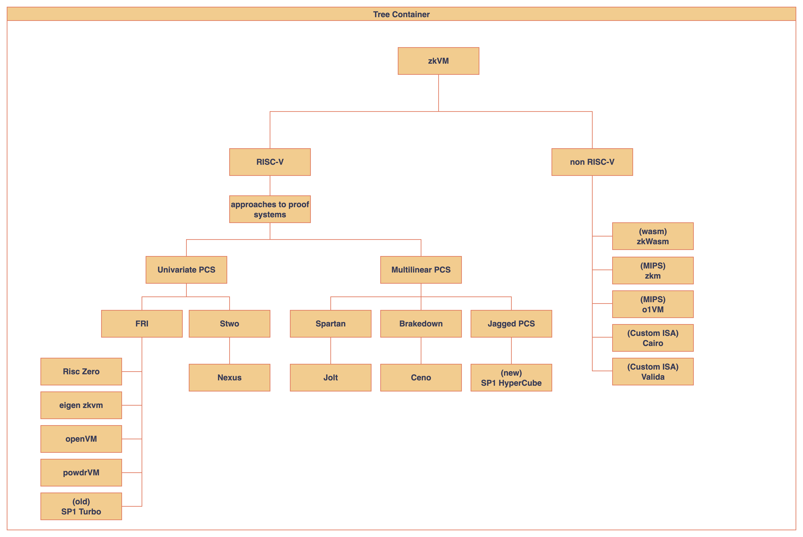

# zkVM Landscape

This is a diagram that systematically classifies the major projects in the current zkVM ecosystem.

Projects are broadly divided into RISC-V based and non-RISC-V categories, with RISC-V based projects further classified according to their ***ZK backend**. The classification criteria and project information were referenced from the [awesome-zkvm](https://github.com/rkdud007/awesome-zkvm) repository.

:::note
**ZK Backends** 
The proof system, typically in the form of a (Polynomial) Interactive Oracle Proof (IOP) and Polynomial Commitment Scheme (PCS), used for the (typically non-interactive) prover-verifier checks.
:::

:::caution
- For information corrections or additions, please submit a GitHub issue.
:::

## RISC-V zkVM
### STARK based Projects
- [Risc Zero](https://github.com/risc0/risc0)
- [ZisK](https://github.com/0xPolygonHermez/zisk)
- [openVM](https://github.com/openvm-org/openvm)
- [powdrVM](https://github.com/powdr-labs/powdr)
- [Airbender](https://github.com/matter-labs/zksync-airbender)
- [Nexus 3.0](https://github.com/nexus-xyz/nexus-zkvm)

### Sumcheck based Projects
- [Spartan](https://github.com/microsoft/Spartan)
- [Jolt](https://github.com/a16z/jolt)
- [Ceno](https://github.com/scroll-tech/ceno)
- [SP1 HyperCube](https://github.com/succinctlabs/sp1)

## non RISC-V zkVM
### Wasm
- [zkWasm](https://github.com/DelphinusLab/zkWasm)
### MIPS
- [Ziren](https://github.com/ProjectZKM/Ziren)
- [o1VM](https://github.com/o1-labs/proof-systems/tree/master/o1vm)
### Custom ISA
- [Cairo VM](https://github.com/lambdaclass/cairo-vm)
- [Valida VM](https://github.com/lita-xyz/valida-vm)