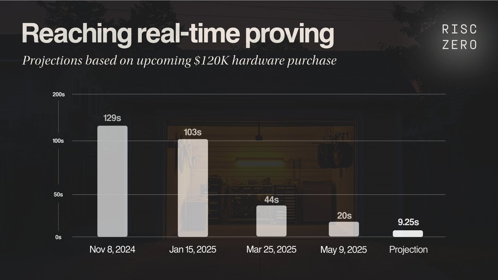

## Risc zero

* X: [https://x.com/RiscZero/status/1924536174707691710](https://x.com/RiscZero/status/1924536174707691710)

* blog: [https://risczero.com/blog/making-real-time-proving-accessible)](https://risczero.com/blog/making-real-time-proving-accessible)

#### 왜 Real-Time Proving이 중요한가

이더리움 L1에서 ZKP를 도입하려면 블록 유효성 증명이 12초 슬롯 내에 완료되어야 하며, Real-Time Proving이 가능해지면 다음이 가능해집니다.

- **100-1000x gas limit**: 연산 크기와 상관없이 일정 시간 내 검증 가능해, 현재의 제한적인 가스 한도를 유지할 필요가 없게 됩니다.
- **Cross-rollup synchronous composability**: Real-time proving을 통해 롤업 간 원자적(atomic) 조합성이 가능해집니다.
- **More Secure light clients**: 현재 라이트 클라이언트는 검증자 서명만 확인할 뿐, EVM 상태 업데이트의 유효성은 실제로 확인하지 않습니다. Real-Time Proving이 가능해지면, validator들을 신뢰할 필요 없이 상태 업데이트의 무결성(integrity)을 직접 검증할 수 있습니다.

#### 왜 속도만으로는 충분하지 않을까

블록 증명을 12초 안에 생성해야 ‘real-time’이라고 할 수 있지만, 그걸 할 수 있는 사람이 소수의 운영자라면 의미가 없습니다. 이더리움 L1에 ZK를 도입하려면 증명 생성이 블록 제안 과정에 꼭 필요해집니다. 만약 실시간 증명이 수백만 달러짜리 장비나 독점 스택을 요구한다면, 이더리움은 금방 중앙집중화될 것입니다. 따라서 속도만큼이나 접근성(accessibility)도 중요합니다.

#### RISC-Zero: Cluster 출시 예정

RISC Zero가 Real-time proving을 누구나 이용 가능하게 만듭니다.
- 속도(Speed): 약 9.25초의 end-to-end 증명 생성 속도를 목표로 합니다.
- 접근성(Accessibility): 12만 달러 수준의 GPU 장비에서 실시간 증명이 가능하며, GPU 구현이 100% 오픈소스로 제공됩니다.

RISC Zero는 약 12만 달러 수준의 클러스터만으로 이더리움 블록 증명 속도를 12초 이하로 단축할 수 있게 됩니다.

Real-Time ZK가 수백만 달러의 장비를 필요로 한다면, 증명 파이프라인은 중앙집중화됩니다. 하지만 약 12만 달러 수준이라면, 이더리움 재단(EF), 스테이킹 풀, 그리고 소규모 팀들도 모두 real-time prover를 직접 운영할 수 있습니다. 이렇게 하면 실시간 증명도 이더리움에서 기대하는 것과 동일한 liveness 보증을 확보할 수 있습니다.

*Source: [Twitter](https://x.com/RiscZero/status/1924536179577241606)*