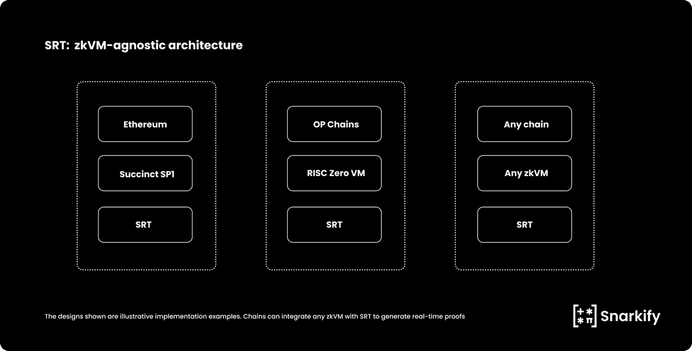
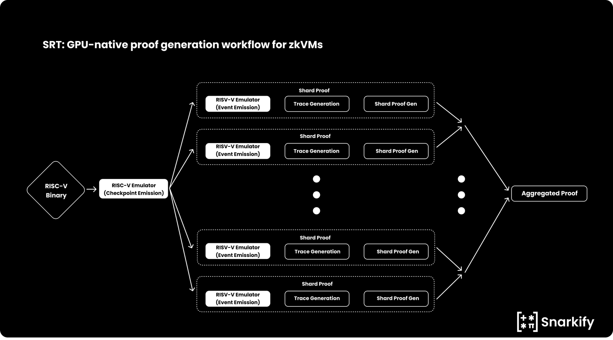

# Snarkify

* X: [https://x.com/Snarkify_ZKP/status/1923389986801430595](https://x.com/Snarkify_ZKP/status/1923389986801430595)

* blog: [https://blog.snarkify.io/introducing-srt/](https://blog.snarkify.io/introducing-srt/)

## SRT: Snarkify’s modular real-time proving engine for zkVMs

[SRT(Snarkify Real-Time)](https://x.com/Snarkify_ZKP/status/1923389986801430595) is a modular real-time proving engine designed to accelerate zkVMs. It is set to launch in June 2025 and will prove all Ethereum blocks within the 12-second slot time.

SRT improves verification speed and cost without changing the zkVM architecture or protocol logic. Designed as a backend component, SRT integrates directly into existing stacks, enabling real-time proving implementation without engineering overhead.

*Source: [Snarkify Blog](https://blog.snarkify.io/introducing-srt/)*

SRT is a performance layer that solves proof constraints limiting zkVMs. It is specially designed for zkVM execution and uses a GPU-native architecture to accelerate trace generation and proof construction. As a result, performance improves by 10 to 100 times depending on the specific zkVM design.

*Source: [Snarkify Blog](https://blog.snarkify.io/introducing-srt/)*

