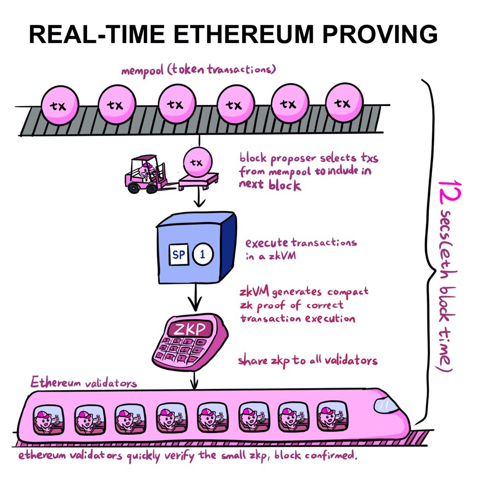
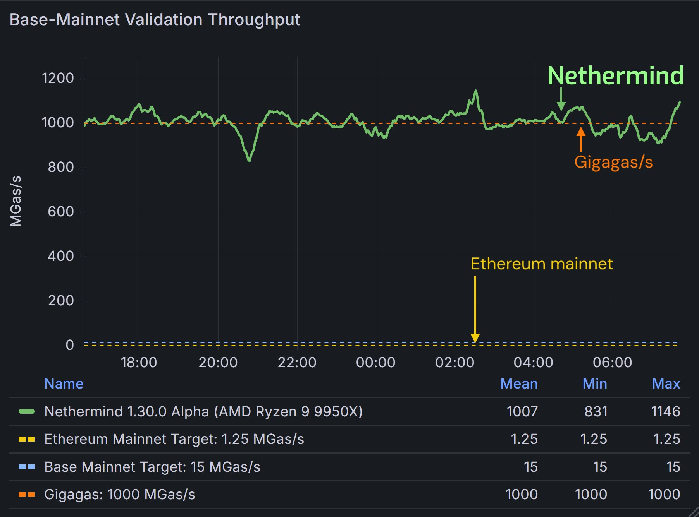

# Real-Time Proving

Real-time proving은 이더리움 블록 하나를 12초 내에 증명하는 것을 의미합니다.

예를 들어, Succinct의 SP1 Hypercube는 zkVM 내에서 실행되는 ZKP을 사용하여 다음 블록이 도착하기 직전인 12초 이내에 이더리움 블록을 검증할 수 있습니다. 이러한 과정을 Real-Time Proving이라고 부르는 이유는, 이더리움이 블록을 finalize하는 속도만큼 빠르게 증명이 완료되기 때문입니다.

*Source: [Twitter](https://x.com/0xJuann/status/1929335910912663856)*

먼저 블록 제안자(block proposer)는 mempool에서 확인되지 않은 트랜잭션을 수집합니다. 이러한 트랜잭션은 SuccinctLabs에서 구축한 zkVM으로 전송되고, zkVM은 SP1을 사용하여 트랜잭션을 실행합니다. 실행 후, SP1은 트랜잭션이 유효하고 올바르게 실행되었음을 증명하는 간결한 ZKP를 생성합니다. 이 증명은 모든 이더리움 검증자(validators)에게 브로드캐스트됩니다. ZKP는 매우 작고 가볍기 때문에 이더리움 검증자는 이를 매우 빠르게 검증하여 블록을 거의 즉시 확인할 수 있습니다.

## 왜 Real-Time Proving이 중요한가

이더리움 L1에서 ZKP를 도입하려면 블록 유효성 증명이 12초 슬롯 내에 완료되어야 하며, Real-Time Proving이 가능해지면 다음이 가능해집니다.

- **100-1000x gas limit**: 연산 크기와 상관없이 일정 시간 내 검증 가능해, 현재의 제한적인 가스 한도를 유지할 필요가 없게 됩니다.
- **Cross-rollup synchronous composability**: Real-time proving을 통해 롤업 간 원자적(atomic) 조합성이 가능해집니다.
- **More Secure light clients**: 현재 라이트 클라이언트는 검증자 서명만 확인할 뿐, EVM 상태 업데이트의 유효성은 실제로 확인하지 않습니다. Real-Time Proving이 가능해지면, validator들을 신뢰할 필요 없이 상태 업데이트의 무결성(integrity)을 직접 검증할 수 있습니다.

### 왜 속도만으로는 충분하지 않을까

블록 증명을 12초 안에 생성해야 ‘real-time’이라고 할 수 있지만, 그걸 할 수 있는 사람이 소수의 운영자라면 의미가 없습니다. 이더리움 L1에 ZK를 도입하려면 증명 생성이 블록 제안 과정에 꼭 필요해집니다. 만약 실시간 증명이 수백만 달러짜리 장비나 독점 스택을 요구한다면, 이더리움은 금방 중앙집중화될 것입니다. 따라서 속도만큼이나 접근성(accessibility)도 중요합니다.

## 의의

원래 이더리움 블록 전체와 같은 복잡한 계산에 대한 ZKP를 생성하는 것은 엄청난 리소스와 시간이 소모되어, 몇 분 또는 몇 시간이 소요되었습니다. 이 시간을 12초 미만으로 단축하면, 노드가 모든 트랜잭션을 다시 실행할 필요없이 ZKP를 검증하면 되어 계산량이 줄어듭니다. 또한, 더 빠른 증명 생성으로 확정성(finality)를 높이고, 사용자 경험을 개선할 수 있습니다.

즉, real time proving이 이뤄지면 이더리움은 현재의 탈중앙화를 유지하면서 확장성을 [**1 GigaGas(~10K TPS)**](https://x.com/drakefjustin/status/1924929057676001466)까지 높일 수 있게 됩니다.

하지만, 아직 real-time proving이 완성되었다고 보기는 어렵습니다. 이더리움의 완전한 ZK화를 위해서는 다음과 같은 작업들이 추가적으로 이뤄져야 합니다.

1. zkVM 코드들의 철저한 보안 감사 (formal verification)

2. 최악의 케이스에도 12초 내에 증명 생성이 가능하도록 증명 생성 속도 최적화 (현재 zkVM들은 '일반적인 케이스'에서 12초 정도의 증명 생성 속도를 보이고 있습니다.)

관련: 
* https://x.com/VitalikButerin/status/1925050155922862526

### What is Gigagas?
Ethereum client가 트랜잭션을 얼마나 빠르게 처리할 수 있는지를 측정하는 방법입니다. 이더리움 트랜잭션은 “Gas”를 소비하는데, gas는 연산을 실행하는데 필요한 연산량을 나타내는 단위입니다. 

[Gigagas(GPS)](https://docs.surge.wtf/docs/about/gigagas)는 클라이언트가 초당 수백만개의 가스 단위를 처리할 수 있는지를 측정합니다. 예를 들어, **1 Gigagas per second**를 처리하는 클라이언트는 1초에 100만 가스 단위를 소비하는 트랜잭션을 처리할 수 있습니다. 

Gigagas는 롤업 및 실행 클라이언트의 성능을 평가하는데 중요하며, Gigagas 성능이 높을수록 트랜잭션 처리 속도가 빨라지고, 확장성이 향상되며 사용자 비용이 줄어듭니다.

*Source: [Surge Documentation](https://docs.surge.wtf/docs/about/gigagas)*

관련:

* <figcaption>
<a href="https://x.com/drakefjustin/status/1920343548047569165">https://x.com/drakefjustin/status/1920343548047569165</a>
</figcaption>
* <figcaption>
<a href="https://www.paradigm.xyz/2024/04/reth-perf">https://www.paradigm.xyz/2024/04/reth-perf</a>
</figcaption>

