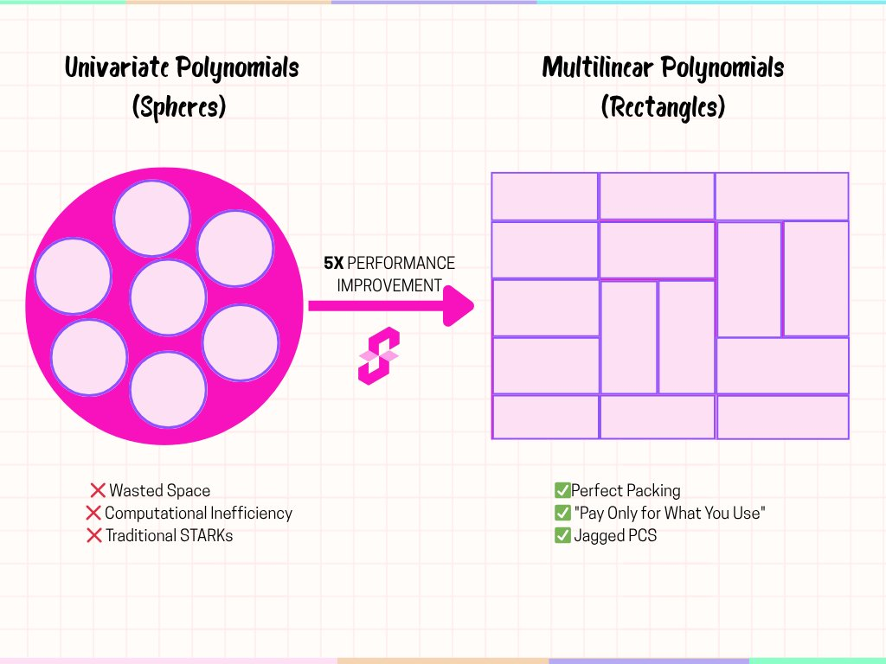
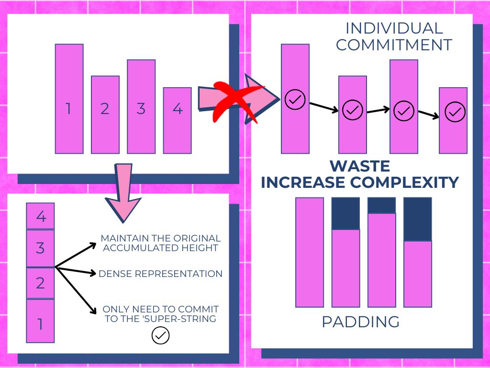
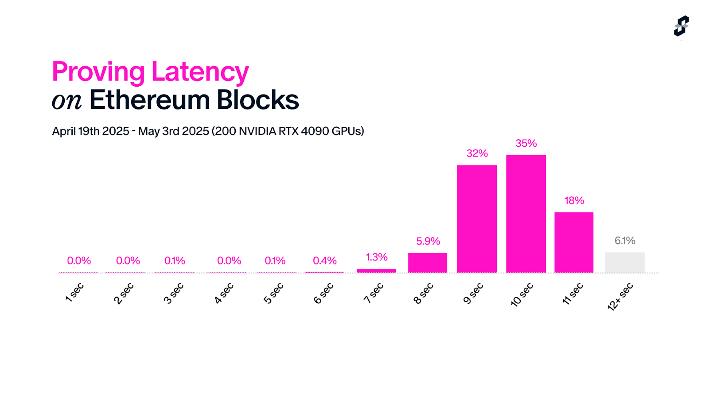
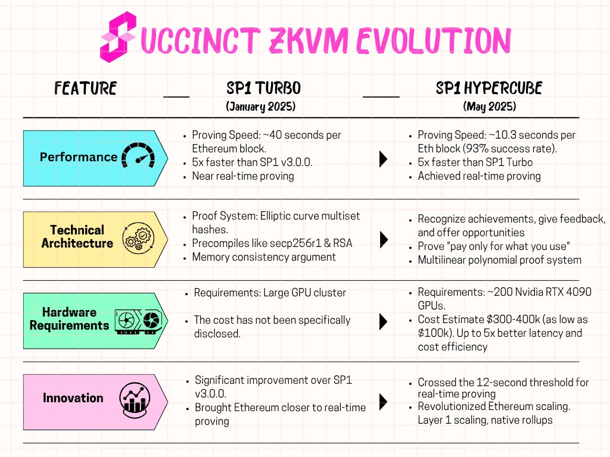

# SP1

## SP1 Hypercube

* X: [https://x.com/SuccinctLabs/status/1924845712921264562](https://x.com/SuccinctLabs/status/1924845712921264562)

* blog: [https://blog.succinct.xyz/sp1-hypercube/](https://blog.succinct.xyz/sp1-hypercube/)

SP1 Hypercube provides real-time proving for Ethereum and is built on a completely new proof system designed based on **Multilinear Polynomials**. It delivers cutting-edge results with latency and cost improvements of up to 5 times compared to SP1 Turbo, proving over 93% of Ethereum blocks within 12 seconds.

### Multilinear Polynomial Revolution

Previous versions of SP1, including **SP1 Turbo**, were built on a STARK-based architecture using Plonky3 and relied on univariate polynomials. Thinking of this geometrically, univariate polynomials are like spheres—elegant but inefficiently filled.

**SP1 Hypercube** is designed based on Multilinear Polynomials. Multilinear polynomials resemble rectangles, filling space without gaps, leaving no wasted area. This "packing efficiency" directly translates into faster verification performance and lower resource costs.

*Source: [Twitter](https://x.com/calicocat2025/status/1928674456022691974)*

### Jagged PCS – The Core Engine of SP1 Hypercube

In general-purpose programs, zkVM generates a Trace Table composed of columns with varying heights. In existing systems, these columns were padded to match the tallest column, making them all the same size. However, this requires proving the empty space as well, which increases proof size and becomes inefficient when proving recursively. Additionally, the method of committing separately to each individual polynomial incurs very high verification costs, especially in hash-based systems.

To solve these issues, a new structure called **Jagged PCS** is used, which can be thought of as a “Jagged” matrix where each column has a different height. This approach allows committing the entire trace as one polynomial, even if the columns have different heights. At the same time, the verifier can efficiently check only the necessary parts as if each individual column had been committed to.

*Source: [Twitter](https://x.com/Liu_xoke/status/1925602251294613906)*

With this Jagged PCS, a "pay only for what you use" architecture is implemented. This is combined with a highly optimized implementation of LogUp GKR, a multilinear-friendly sumcheck protocol, forming the basis for the performance improvements of SP1 Hypercube.

### Benchmarks

First, we define Real-Time Ethereum Proving as “proving over 90% of Ethereum mainnet blocks, including block and Merkle proof data for stateless execution, within 12 seconds given the conditions.” SP1 Hypercube surpasses this standard by proving 93% of blocks in under 12 seconds, with an average proving time of 10.3 seconds.

For the remaining 7% of blocks, it is expected that by adjusting Ethereum’s gas schedule to better reflect actual computational complexity, the mismatch between the prover’s real workload and complexity can be resolved, further improving performance.

- SP1 v3.0.0: ~200 seconds

- SP1 Turbo: ~40 seconds

- SP1 Hypercube: 10.3 seconds

*Source: [SP1 Hypercube Blog](https://blog.succinct.xyz/sp1-hypercube/)*

SP1 Hypercube introduces end-to-end optimizations across the entire prover stack. This includes efficient execution of individual RISC-V instructions and low-latency recursion. Thanks to these optimizations, SP1 Hypercube enables real-time proving on Ethereum while operating with significantly fewer GPUs—approximately a 2x reduction compared to SP1 Turbo.

A cluster capable of real-time proving over 90% of Ethereum mainnet blocks with SP1 Hypercube requires about 160 RTX 4090 GPUs, which can be built at a cost of approximately $300,000 to $400,000. Additionally, using more cost-efficient hardware could reduce the cluster build cost to around $100,000.

*Source: [Twitter](https://x.com/calicocat2025/status/1928674456022691974)*