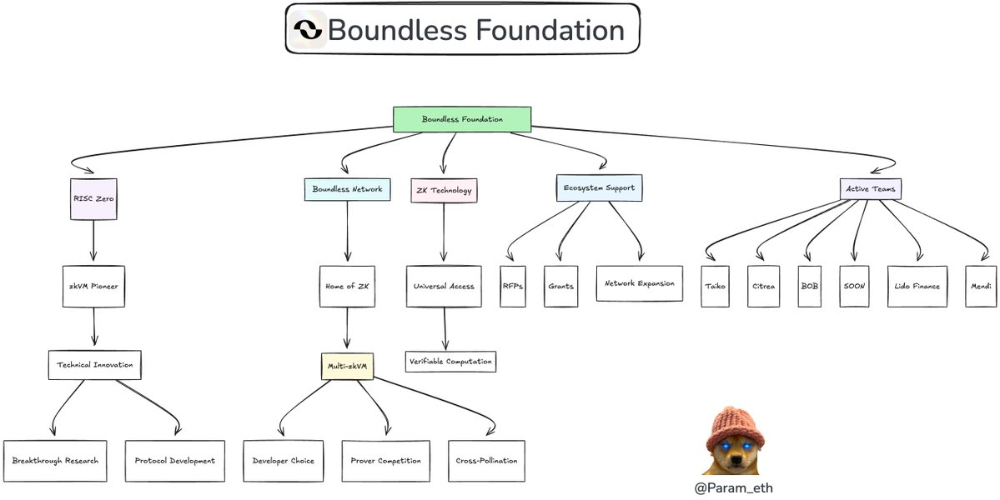
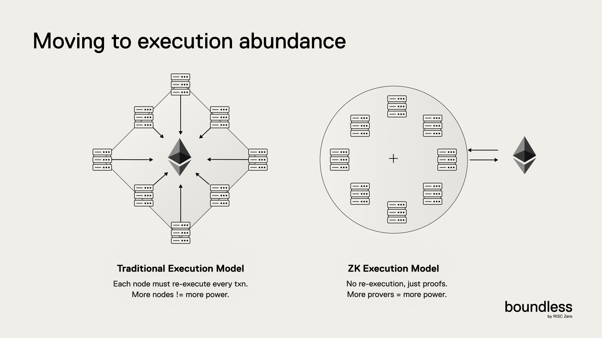
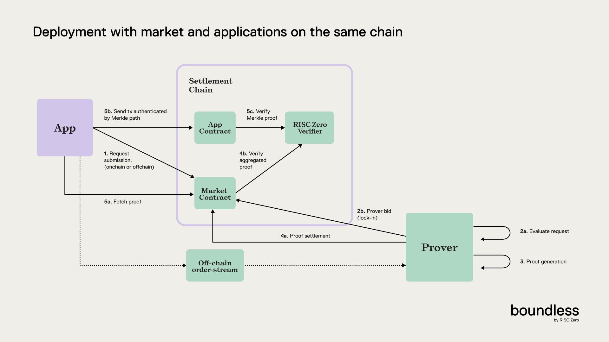
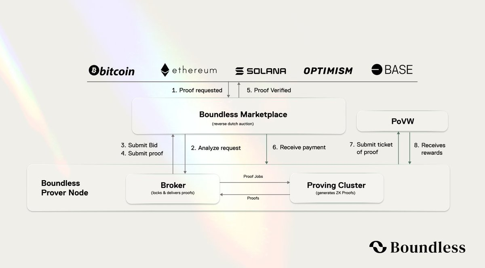
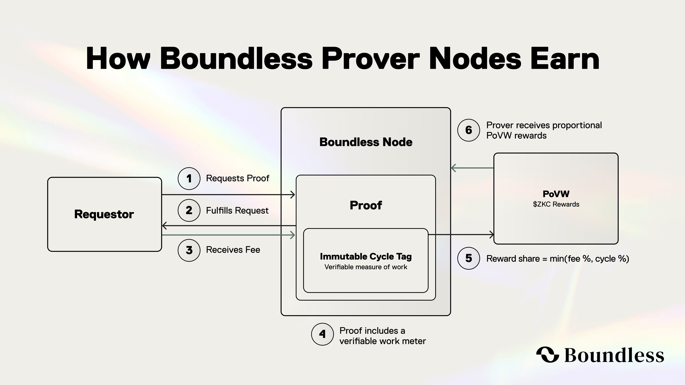
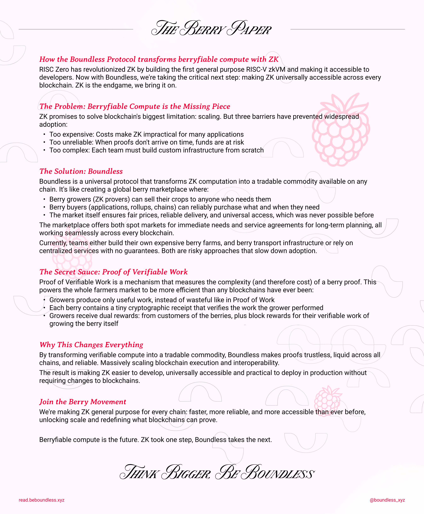

# Boundless

* X: [https://x.com/boundless_xyz/status/1939671665732198778](https://x.com/boundless_xyz/status/1939671665732198778)

* Docs: [https://docs.beboundless.xyz/developers/what](https://docs.beboundless.xyz/developers/what)

* Whitepaper: [https://read.beboundless.xyz/](https://read.beboundless.xyz/)

**Introducing the Boundless Foundation**

*https://x.com/Param_eth/status/1939728176089112599*

## The Universal ZK Protocol

Boundless is a universal zero-knowledge protocol that allows anyone to access rich and verifiable computing. Boundless provides an execution-only node network that generates ZKPs proving that work has been correctly performed and verified across all chains, offering this at an affordable and consistent cost. By separating execution and consensus, Boundless enables each chain to maintain its own security while avoiding gas limits and re-execution.

### Why Boundless?

Traditionally, blockchains rely on a "global re-execution" model, where every node redundantly processes all transactions to reach consensus on the network state. While this approach is secure and transparent, it has the limitation that the entire network’s speed is constrained by the slowest node. As a result, blockchains can only handle simple computations, and complex computations become too costly or hit gas limits, making them difficult to process.

*https://docs.beboundless.xyz/developers/why*

Boundless aims to solve this problem using ZKPs. Each node generates an execution proof that can be verified by all other blockchains without re-execution. By just looking at this proof, other blockchains can confirm the results are correct without recalculating. This allows existing networks to maintain security and consensus while eliminating redundant computations.

Boundless leverages a decentralized marketplace to handle complex computations efficiently. It generates succinct and reusable proofs to enhance efficiency. When new provers join the market, the total computational capacity increases; as new applications join, the efficiency gains grow larger. This creates a self-reinforcing system where the network strengthens and scales, improving computational power and efficiency.

### Boundless Market

*https://docs.beboundless.xyz/provers/proof-lifecycle*

When app developers write zkVM programs in Rust, the zkVM provides a zero-knowledge proof (ZKP) for the correct execution of the program. This proof includes the output value (journal) and the cryptographic proof (seal). The seal is typically in the form of a zk-STARK or SNARK. When Boundless aggregates multiple proofs into a single Aggregated Proof, it uses a Merkle inclusion proof as the seal to show that each individual proof is included within the Aggregated Proof.

Using the Boundless Market, anyone can request proofs without hardware constraints, and such users are called requestors. Boundless manages the connection between requestors and provers.

Access to Boundless begins via the Boundless Market Contract, which is deployed by default on all major chains. The Boundless Market acts as a permissionless clearinghouse that matches application proof requests with the computing capacity provided by Boundless Prover Nodes.

### How the Boundless Market Works

*https://x.com/boundless_xyz/status/1920862141944389695*

1. **Create & broadcast a proof request**

- Developers create a proof request specifying the following:

- The zkVM program (URL)

- Input – either inline or a URL

- Requirements on the proven execution output (e.g., an expected journal hash)

- Offered price and required stake – as auction parameters (min/max price, ramp-up time, time-outs, and slashing stake)

2. **Reverse-Dutch Auction**

At the specified time in the request, a reverse Dutch auction begins. The price starts from the minPrice and linearly increases during the ramp-up period, maintaining the maxPrice until expiration. Boundless Prover Nodes execute the program to estimate the expected cycles and determine whether the current price exceeds the proof cost. The first Prover node to accept the price and bid locks the request, thereby acquiring exclusive rights to fulfill it and receive the corresponding reward. In return, the Prover must stake funds, and if the locked request is not fulfilled, the stake becomes a bounty that other Provers can claim by submitting the proof. Provers may also execute any unlocked tasks immediately without bidding to receive the current auction price, in which case no stake is required.

3. **Proof Generation and Batching**

Provers can batch multiple requests for processing. Each execution receipt becomes a leaf of a Merkle Tree, and a single Groth16 proof attests to the Merkle root. Batching distributes the on-chain verification gas cost across multiple requests, improving efficiency.

4. **Settlement**

The Boundless Market contract verifies the Groth16 proof once, then checks each Merkle Inclusion Proof against its corresponding request. It pays the Prover from the locked funds (or the requestor’s deposit) and returns the staked amount. When the proof is submitted, an event is emitted and the proof is provided as calldata. Requestors can also receive a callback to their own contract.

### The Boundless Incentive Mechanism: Proof of Verifiable Work

Existing protocols provide rewards through PoW or PoS.

PoVW is the first mechanism that measures the complexity of each ZKP on-chain and rewards provers according to the exact amount of work they have performed.

*https://x.com/boundless_xyz/status/1920862141944389695*

**How it works**

1. **Immutable Cycle Tag**

    - Every Boundless Proof embeds an Immutable Tag that includes the number of cycles performed and a unique nonce to prevent reuse. This tag is part of the public claim of the proof, and neither the prover nor the requester can tamper with it.

2. **Epoch Tally**

    - At the end of each epoch, the PoVW contract sums all Cycle Tags of the proofs submitted and finalized during that period.

3. **Deterministic Payout**

    - A fixed amount of $ZKC (Boundless’ native token) is minted each epoch and distributed proportionally according to the total cycle share.

        - For example, if one prover processed 2% of the total cycles, they receive 2% of the minted $ZKC as a reward.

**Why PoVW Matters**

- **Accuracy over guesswork:** Rewards are paid in proportion to cryptographically verified work, eliminating the problem where a 10-cycle proof and a 10 million-cycle proof receive equal treatment.

- **Permissionless meritocracy**: Nodes that meet latency and staking requirements receive precise rewards corresponding to the amount of work they proved.

- **Transparent economics**: 
Because the meter operates on-chain without manipulation, anyone can audit rewards down to the last cycle.

*https://x.com/reka_eth/status/1915076064008900788*

