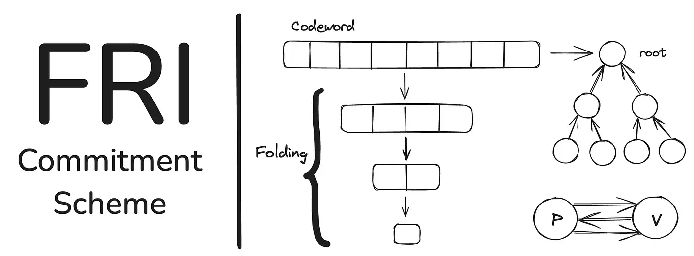
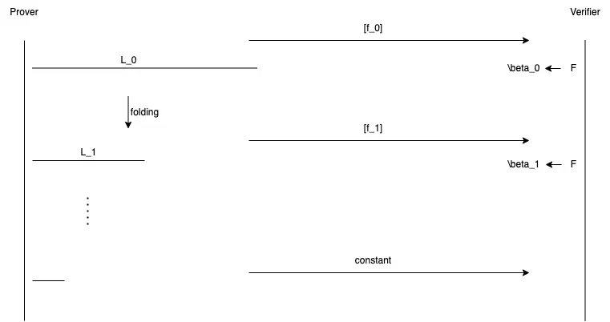
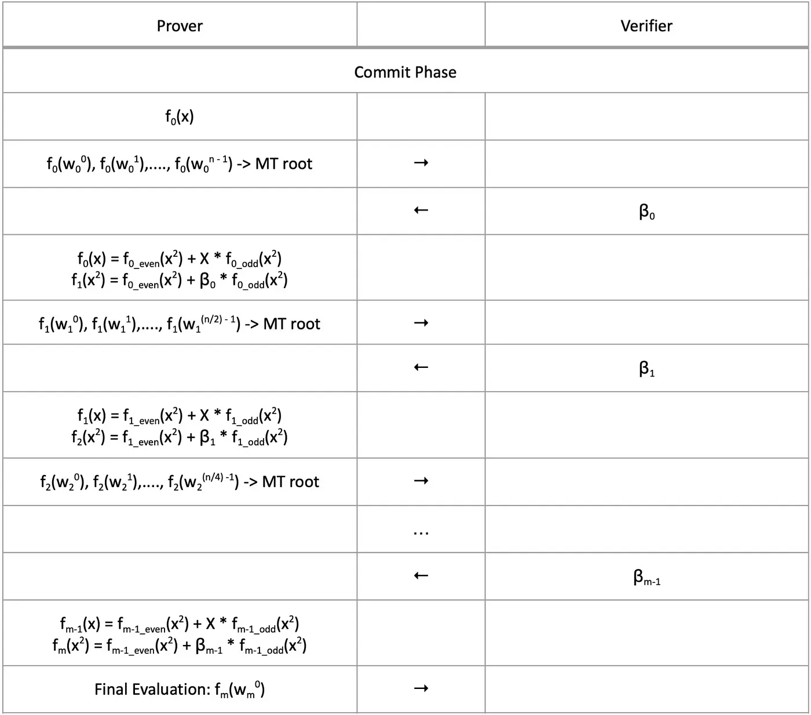
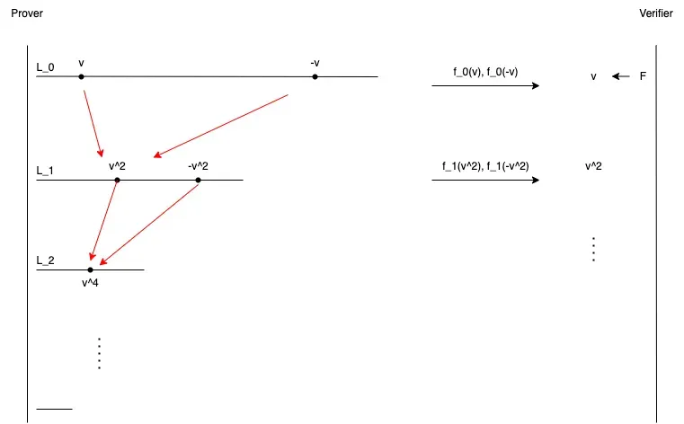
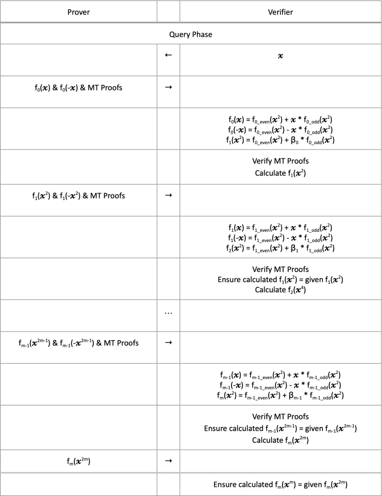

# FRI(Fast Reed-Solomon Interactive Oracle Proof of Proximity)

FRI는 Prover와 Verifier 간에 이루어지는 프로토콜로, 주어진 코드워드가 **저차수 다항식의 평가 결과**인지 증명합니다.

### 핵심 개념

#### 1. 저차수 다항식 (Low-Degree Polynomial)

차수가 $k - 1$인 다항식 $p(x)$는 다음과 같은 형태를 가집니다:

$$
p(x) = a_0 + a_1x + a_2x^2 + \dots + a_{k-1}x^{k-1}
$$

이러한 다항식을 정확히 보간하려면 **최소 $k$개의 서로 다른 평가점**이 필요합니다.

#### 2. Reed-Solomon Code

어떤 함수 $f: D \rightarrow \mathbb{F}$가 있을 때,  
Reed-Solomon code는 다음과 같이 정의됩니다:

$$
RS_k[\mathbb{F}, D_0] = \{p(x)|_{x \in D_0} : p(x) \in \mathbb{F}[X],\ \deg(p) \leq k-1\}
$$

즉, $k-1$ 이하의 다항식을 $D_0$ 위에서 평가한 값들의 집합입니다.

**예시:**
- $\mathbb{F}_7$에서 $D_0 = \{1,2,3,4,5\}, k = 3$
- 가능한 다항식은 $p(x) = a_0 + a_1x + a_2x^2$, 계수는 $\mathbb{F}_7$에서 선택
- 각 $p(x)$를 $D_0$에 대해 평가한 결과 $\{p(1), ..., p(5)\}$가 하나의 코드워드

#### 3. Blowup Factor (확장 배수)

Blowup Factor는 다음과 같이 정의됩니다:

$$
\text{Blowup Factor} = \frac{1}{\rho}, \quad \text{단, } |D_0| = \rho^{-1}k
$$

즉, 평가 도메인 크기가 다항식 차수의 몇 배인지를 나타냅니다.  
Blowup Factor가 클수록 보안은 높아지지만 연산 비용이 증가합니다.

#### 4. Roots of Unity (단위원)

$\omega \in \mathbb{F}_p$가 **$n$차 단위원**이라면 $\omega^n = 1$이고, $\omega^i$가 서로 다른 $n$개의 값을 만들어냅니다.

$$
\Omega = \{1, \omega, \omega^2, ..., \omega^{n-1}\}
$$

- $\Omega$는 $\mathbb{F}_p^\times$의 곱셈 부분군입니다.
- FRI는 일반적으로 $p - 1$이 $2^n$으로 나누어 떨어지는 소수 $p$ 위의 유한체에서 작동합니다.  
  (예: $p = 2^{64} + 2^{32} + 1$)

#### 5. 짝홀 분해와 Folding

FRI는 재귀적으로 다항식의 차수를 줄이는 과정에서 짝홀 분해를 사용합니다:

$$
p(x) = p_E(x^2) + x \cdot p_O(x^2)
$$

- 짝수 항: $p_E(x^2) = a_0 + a_2x^2 + a_4x^4 + \dots$
- 홀수 항: $p_O(x^2) = a_1 + a_3x^2 + a_5x^4 + \dots$

이를 대칭성을 활용해 다음과 같이 계산할 수 있습니다:

$$
p_E(x^2) = \frac{p(x) + p(-x)}{2}, \quad p_O(x^2) = \frac{p(x) - p(-x)}{2x}
$$

##### Folding 과정

Verifier가 무작위 필드 원소 $r$을 고르고, Prover는 다음과 같은 folding 다항식을 구성합니다:

$$
p_{\text{fold}}(Z) = p_E(Z) + r \cdot p_O(Z)
$$

→ 이 다항식의 차수는 $p(x)$의 절반이 됩니다.

## FRI 프로토콜 개요

FRI는 두 단계로 구성됩니다:

### 1. Commit Phase (커밋 단계)

Prover는 점차 차수를 줄여가며 각 단계의 다항식 평가값을 Merkle Tree로 커밋합니다.

- 초기 도메인 $L_0$ 위의 $f_0(X)$을:
$$
f_0(X) = f_{0,E}(X^2) + X \cdot f_{0,O}(X^2)
$$
- 무작위 $\beta_0$를 이용해 다음 레이어의 다항식 생성:
$$
f_1(Z) = f_{0,E}(Z) + \beta_0 \cdot f_{0,O}(Z)
$$

→ 차수는 절반으로, 도메인도 $L_1 = \{x^2 \mid x \in L_0\}$로 줄어듦  
→ 이를 $\log(L)$ 단계 반복

### 2. Query Phase (검증 단계)

Verifier는 무작위 점 $v, -v$를 선택해 다음을 확인합니다:

1. 짝홀 항 계산:
$$
f_{0,E}(v^2) = \frac{f_0(v) + f_0(-v)}{2}, \quad f_{0,O}(v^2) = \frac{f_0(v) - f_0(-v)}{2v}
$$

2. Folding 후 다음 계층 값 확인:
$$
f_1(v^2) = f_{0,E}(v^2) + \beta_0 \cdot f_{0,O}(v^2)
$$

3. 같은 방식으로 더 깊은 레이어까지 검증

→ 이 과정을 통해 Prover가 각 단계에서 정직하게 Folding을 수행했는지 확인

### FRI의 비용 분석

#### Prover Time

가장 큰 비용은 초기 도메인에서의 다항식 평가 (FFT 사용):

$$
O(|L_0| \log |L_0|) = O(\rho^{-1}k \log(\rho^{-1}k))
$$

Blowup Factor가 커질수록 연산량도 증가합니다.

#### Proof Length

- 쿼리 지점마다 Merkle 경로를 제공해야 하므로, 쿼리 수에 따라 증명 길이가 증가
- Merkle 경로 길이: $O(\log^2 |L_0|)$