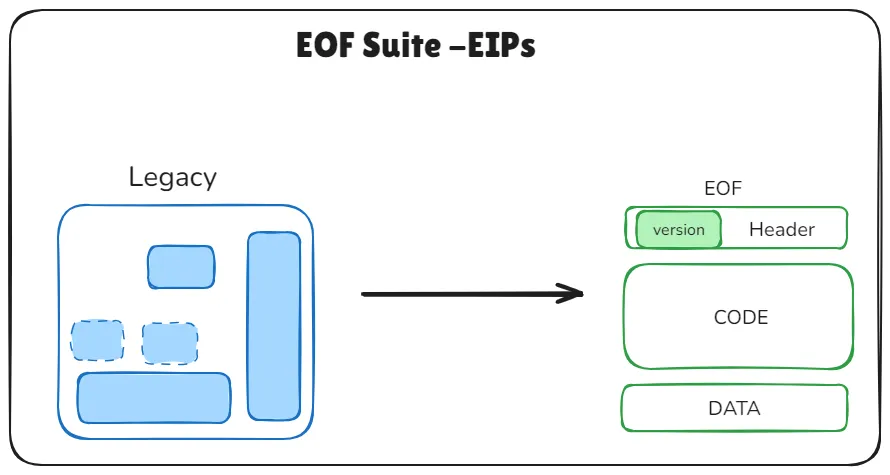
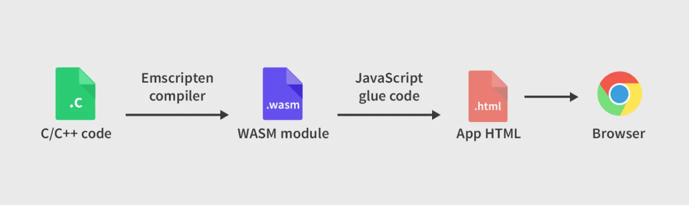
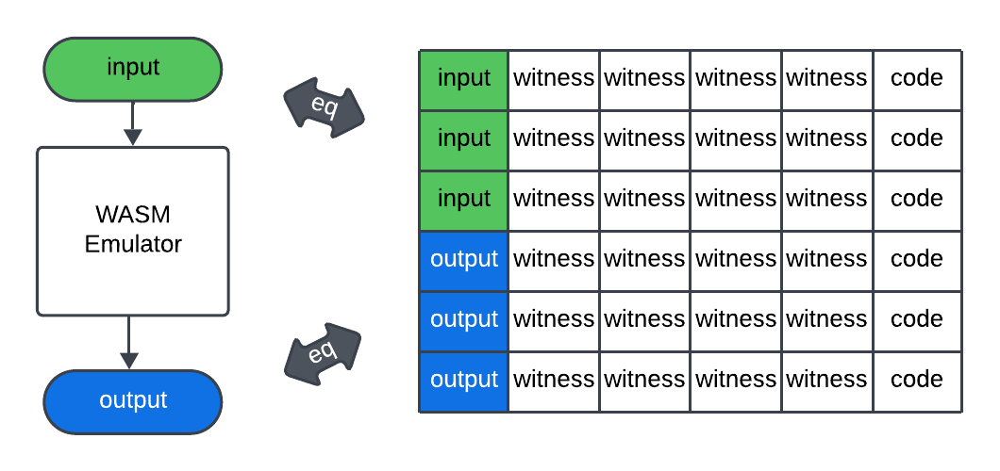

# Is RISC-V zkVM the Endgame?

[비탈릭](https://ethereum-magicians.org/t/long-term-l1-execution-layer-proposal-replace-the-evm-with-risc-v/23617)은 최근 이더리움 L1 확장성의 장기적인 주요 병목현상은 zkEVM 자체의 한계임을 언급하며, 이를 개선하기 위한 방향으로 RISC-V 기반 zkVM을 제시하였습니다. 

이더리움 확장성을 위해 단기적으로는 block-level access lists, delayed execution과 distributed history storage 및 EIP-4444와 같은 향후 EIP를 통해 확장성 병목 현상을 해결할 수 있다고 하였습니다. 중기적으로는 statelessness와 ZK-EVMs 관련된 문제를 해결하고자 하며, **장기적으로는 1. DAS(Data Availability Sampling)과 history storage protocols의 안정성(Stability), 2. 블록 생성의 경쟁성 유지, 3. ZK-EVM proving 성능 향상**이 중요하다고 했습니다. 이 중 2, 3의 병목현상은 ZK-EVM을 RISC-V로 대체하면 해결할 수 있습니다. 

즉, 현재 이더리움의 확장성을 위해 여러 EIP들이 나오고 있지만 이는 단기적인 해결책일 뿐이며, zkEVM을 RISC-V로 대체하면 장기적인 이더리움의 문제점을 해결할 수 있습니다. 이를 통해 이더리움 실행 계층의 효율성과 단순성을 향상시키고자 합니다. 

실제 이더리움에 RISC-V 도입과 관련해서는 1. 이더리움 두가지 VM을 모두 지원하는 방법(EVM, RISC-V), 2. 현재 있는 모든 EVM 컨트랙트를 RISC-V로 만들어진 EVM Interpreter를 통해서 모두 변환하는 방법이 있습니다. 비탈릭은 Virtual Machine Interpreter를 통해 EVM으로 만들어진 컨트랙트를 모두 RISC-V로 전환하는 2번째 방법을 더 적절한 방향으로 보고 있습니다. 즉, 명령어(opcode)를 해석하고 실행하는 부분(스마트 컨트랙트의 바이트코드)에 대해서 EVM을 RISC-V로 바꾸자는 것입니다. 이는 결국 이더리움의 실행환경을 범용 CPU 수준으로 일반화하고, ZKP 기술과의 결합의 최적화를 위함입니다.

### 이더리움이 RISC-V기반 zkVM을 채택한 것에 대한 반대의견?

[Wei Dai](https://x.com/_weidai/status/1914053842888769626?ref=nockchain.org) 등 일부 커뮤니티 인사들은 RISC-V 대신 WebAssembly(WASM) 기반 zkVM 도입을 주장합니다. 그 근거로 WASM이 이미 스마트컨트랙트에 적합한 여러 특성, 특히 정적 분석의 용이성(점프 명령어 부재 등)을 갖추고 있다는 점을 들고 있습니다. 실제로 WASM은 EOF(EVM Object Format)이 도입하려는 여러 속성을 이미 내장하고 있습니다. 과거 ewasm 프로젝트에서도 WASM을 활용한 zkEVM 시도가 있었습니다.

그러나 최근 이더리움 개발자 커뮤니티는 EOF 도입에 대해 [부정적인 입장](https://www.ainvest.com/news/ethereum-developers-reject-eof-upgrade-fusaka-fork-2504/)을 보이고 있습니다. EOF는 총 11개의 EIP와 19개의 새로운 opcode를 추가해야 하는 등 복잡성이 크고, 실제로 얻을 수 있는 이점에 비해 개발 및 운영 비용이 높다는 비판이 많았습니다. 이 때문에 Fusaka 업그레이드에서 EOF 도입이 제외되었고, 커뮤니티 내에서도 WASM 기반으로 전환해야 한다는 주장이 힘을 얻지 못하고 있습니다. 

또한, RISC-V 기반 zkVM은 이미 다양한 프로젝트에서 빠른 증명 생성, 개발 편의성, 고수준 언어(Rust, C 등) 지원 등 실질적 장점을 입증하고 있습니다. Vitalik Buterin 역시 RISC-V가 EVM의 구조적 한계를 극복하고, zk 증명 효율성을 획기적으로 높일 수 있다고 평가합니다. 실제로 RISC-V는 오픈소스 ISA로 확장성·표준화·성능 최적화가 용이하며, zkVM 생태계에서 빠르게 표준으로 자리잡고 있습니다.

## NOTE

### What is EOF(EVM Object Format)?

EOF는 EVM 바이트코드에 확장 가능하고 버전이 지정된 컨테이너 형식을 도입하며, 스마트 컨트랙트의 배포 시점에 코드를 한 번만 검증할 수 있도록 설계되었습니다. 이를 통해 코드와 데이터를 분리하고, 코드 검증을 강화하고, 전반적인 실행 효율성을 높이는 것을 목표로 합니다. 이러한 EOF는 일련의 EIP들로 구성되며, 이더리움의 실행 환경을 구조적으로 개선하고자 합니다.([EIP-7692](https://eips.ethereum.org/EIPS/eip-7692) 참고)

*Source: [Ethereum Object Format (EOF): A Comprehensive Guide](https://medium.com/@ankitacode11/ethereum-object-format-eof-a-comprehensive-guide-3431ae9a05de)*

특히 EOF는 컴파일러 및 정적 분석 단순화, 바이트코드 크기 감소 및 성능 개선, EVM 업그레이드 용이성, ZK 친화성 등의 이점을 얻을 수 있습니다.

하지만, EOF를 도입하려면 기존 EVM 바이트 코드를 처리하던 컴파일러, 디버거 등이 EOF 형식에 맞게 변경해야 하는 복잡성이 추가되며, 이러한 복잡성으로 인해 재진입 공격과 관련된 버그가 최근에 발견되어 수정한 적이 있습니다. 즉, 과도한 기능 결합으로 인해 거의 모든 라이브러리가 재작성 되어야 하며, 이때 높은 비용이 발생합니다. 따라서 복잡성 대비 이점이 크지 않다고 생각하는 분위기인 것 같습니다.

### What is WASM(WebAssembly)?

[WASM](https://webassembly.org/)은 stack 기반 VM을 위한 바이너리 명령어 형식입니다. 이는 프로그래밍 언어들을 위해 다양한 운영체제나 브라우저에서 별도의 수정 없이도 잘 작동하도록 설계되었으며, 웹 환경에서 클라이언트와 서버 애플리케이션을 배포할 수 있도록 해줍니다. 

- **Efficient and fast:** 바이너리 형식으로 인코딩되도록 설계되어 로딩 및 실행 속도가 빠르며, 다양한 하드웨어에서 네이티브 수준의 성능을 발휘할 수 있도록 하는 것을 목표로 합니다.
- **Safe**: ****WASM은 메모리 안정성과 샌드박스 환경에서의 실행을 보장합니다. 기존의 JavaScript 가상 머신 내부에 Wasm을 구현할 수도 있습니다.
- **Open and debuggable:** WASM은 디버깅, 테스트, 실험, 최적화, 학습, 교육 및 수기 프로그래밍 등을 위해 사람이 읽을 수 있는 텍스트 형식으로 변환(pretty-print)될 수 있도록 설계되었습니다.
- **Part of the open web platform:** WASM 모듈은 JavaScript 환경과 상호 운용이 가능하며, 브라우저에서 사용하는 Web API에 접근할 수 있습니다. 또한 WASM는 웹 외의 환경에서도 사용할 수 있는 임베딩을 지원합니다.

과정: C/C++ 프로그래밍 언어로 작성한 프로그램 → WASM으로 변환 → JavaScript엔진을 통해 브라우저에서 실행할 수 있음

하지만, WASM은 스택 기반 머신 구조로 인해 증명 회로에서 연산 처리에 필요한 제약식이 많아지고, 이는 레지스터 기반 구조보다 ZK 회로의 복잡성을 증가시킵니다. 또한, 명령어 수가 많아 zk-SNARK 등에서 모든 명령어의 안전한 실행을 검증해야 하므로 회로 설계와 검증 난이도가 높아집니다. 특히 부동소수점 연산의 경우 ZK에서 효율적으로 처리하기 어렵거나 별도 처리가 필요해 ZK 친화성이 낮다는 단점이 있습니다.

**eWASM( Ethereum-flavored WebAssembly)**

eWASM은 EVM을 대체하기 위해 설계된 Ethereum 전용 WebAssembly 실행 환경으로, 기존 WASM을 그대로 사용하는 것이 아니라 스마트 컨트랙트 실행에 필요한 제약과 확장을 추가한 특수한 프로파일입니다. 2017년 Devcon3에서 Ethereum 2.0 Phase 2 로드맵에 포함되었으며, 최근에는 zkWASM 프로젝트들에서도 활용되고 있습니다.

eWASM은 기존 EVM보다 빠른 실행 속도를 기대할 수 있으며, 개발자가 Rust, C++ 등 기존 언어로 스마트 컨트랙트를 작성하고 WASM으로 컴파일할 수 있게 해줍니다. 또한 다양한 언어로 만들어진 기존 라이브러리를 재사용할 수 있고, WASM 기반이기 때문에 활발한 글로벌 커뮤니티의 지원을 받을 수 있다는 장점이 있습니다.

하지만, eWASM이 이더리움 L1에서 채택되지 않은 이유는, 네트워크 전체를 바꿔야 하는 높은 복잡성과 생태계 전환 비용, 기존 EVM 대비 실질적인 성능 향상이나 이점이 확실하지 않았던 점, 그리고 개발 도구와 인프라를 모두 새로 구축해야 하는 부담 등이 복합적으로 작용했기 때문입니다. 또한, 이더리움은 더 시급한 확장성·보안성 과제에 집중하면서 eWASM 도입의 우선순위가 밀렸고, 기존 EVM의 안정성과 신뢰성이 이미 충분히 검증된 점도 중요한 이유가 되었습니다.

**ZK-WASM**

ZK-WASM은 Rust로 작성된 프로그램을 WebAssembly(WASM)로 컴파일한 뒤, 이를 영지식증명(ZKP) 시스템과 결합하여 실행 결과에 대한 ZKSNARK 증명을 생성하는 가상 머신입니다. JavaScript 브릿지를 통해 HTML 환경에서도 상호작용이 가능하며, 기존 프로그램을 별도로 수정하지 않고도 ZKSNARK 기반의 신뢰 가능한 계산을 수행할 수 있도록 설계되었습니다. 전통적으로 ZKP를 적용하려면 산술 회로 기반 언어나 특수 프레임워크(Pinocchio, TinyRAM, ZoKrates 등)를 활용해야 했지만, ZK-WASM은 이러한 장벽을 넘어서 바이트코드 수준에서 WASM 전체를 ZKSNARK 회로로 재현함으로써 기존 WASM 애플리케이션을 그대로 실행할 수 있습니다. 이를 통해 클라우드 서비스 제공자는 계산 결과의 정당성과 사용자 프라이버시 보호를 동시에 보장할 수 있는 환경을 제공할 수 있습니다.

*Source: [Delphinus ZK-WASM Documentation](https://zkwasmdoc.gitbook.io/delphinus-zkwasm/c3_circuits)*

일반적으로 ZKSNARK 시스템은 다항식 제약 조건을 갖는 산술 회로로 표현됩니다. 따라서 WASM 가상 머신의 전체 명령형 논리를 체계적으로 추상화하고 제약 조건을 갖는 산술 회로로 다시 작성해야 하며, 이 회로는 ZKSNARK에서 증명을 만들기 위해 사용됩니다. 즉, 회로에서 만든 ZKSNARK 증명이 존재한다면, 이는 "해당 WASM 프로그램이 진짜로 올바르게 실행되었다"는 것을 수학적으로 증명해주는 것입니다.

하지만, zkWASM은 zkEVM이나 RISC-V 기반 zkVM에 비해 증명 생성 속도나 효율성이 떨어질 수 있습니다. 현재 대부분의 zkWASM 구현은 Halo2 등 특정 증명 시스템에 의존하고 있는데, 이는 대규모 클라이언트 환경에서는 충분히 빠르지 않을 수 있습니다. 또한, WASM의 설계상 동적 메모리, 함수 호출 등 복잡한 구조가 zk회로화에 비해 최적화가 덜 되어 있습니다.
