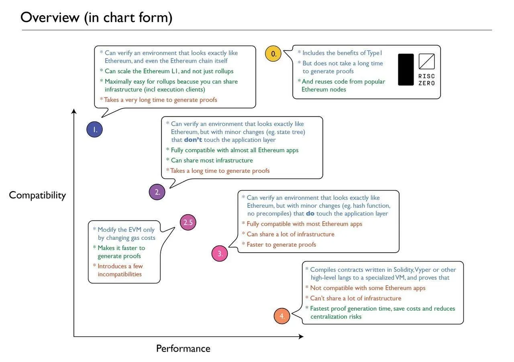
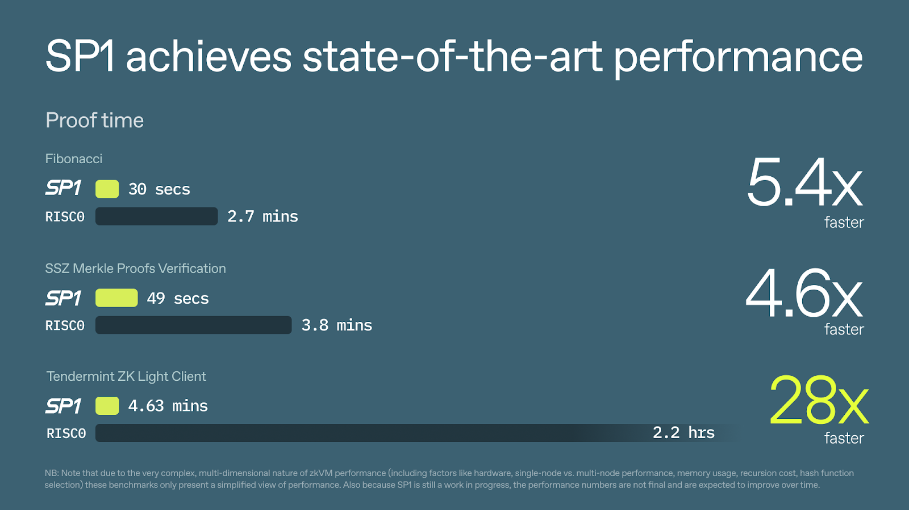

# Why Most zkVMs Are Adopting RISC-V

## What is RISC-V?
RISC-V는 오픈소스 범용 하드웨어 ISA로, 일반 CPU구조에 가까운 64비트 레지스터 기반 설계를 따릅니다. 이러한 구조로 메모리보다 약 100배 이상 빠르게 접근이 가능하며, 데이터를 직접 이 레지스터에 저장하고, 연산도 레지스터 사이에서 직접 수행하게 됩니다. 

**EVM 대비 장점**

이더리움에서는 실행 계층의 효율성(병목 현상 중 하나 해결)과 단순성 향상시키고자, EVM에서 사용하는 Opcode 명령어를 RISC-V ISA로 변경하고자 합니다. 이더리움에서 서명 검증이나 해시 함수 실행시, EVM은 수백~수천개의 명령어를 필요로 했다면(타원곡선 점 덧셈/곱셈, 모듈로 연산, 해시 함수 계산 등을 할 수 있게 하는 명령어들 필요), RISC-V에서는 이러한 복잡한 과정을 단일 명령어로 압축할 수 있습니다. 이렇게 기존 EVM은 256bit 스택 기반 구조로 인해 연산이 복잡하고 비효율적이지만, RISC-V는 명령어 수가 적고 구조가 단순하여 컴파일러 최적화 및 병렬처리에 적합합니다. 또한, EVM은 Solidity나 Vyper 위주의 한정된 개발 언어를 사용했던 반면, RISC-V의 경우 Rust, C, Go 등과 같은 언어로 개발한 코드를 바로 RISC-V 네이티브 코드로 컴파일하여 이더리움에서 실행할 수 있습니다. 

또한, EVM을 RISC-V로 대체하면 검증 가능성을 유지하면서도 L1의 가스 한도를 높일 수 있습니다. 이더리움에서 지연 실행(Delayed execution)은 가스 한도를 높이는 데 도움이 되는 업그레이드로, 주요 목표 중 하나는 이더리움 L1에서 zkVM 증명을 용이하게 하는 것인데요. zkVM을 사용하면 모든 연산은 오프체인에서 수행되고, 온체인에서는 해당 연산이 올바르게 수행되었음을 증명하는 간결한 증명(Proof)만 검증하면 되므로, 전체적인 처리 비용을 줄이고 확장성을 높일 수 있습니다.

## Why zkVMs are adopting RISC-V

### RISC Zero

특히, RISC Zero의 "[Continuation](https://risczero.com/blog/continuations)" 기능은 긴 프로그램 실행을 여러 개의 작은 세그먼트로 자동 분할해 각각 독립적으로 계산하고 증명할 수 있게 해줍니다. 이 기능 덕분에 기존에는 zkVM이 한 번에 처리할 수 있는 연산(사이클) 수에 제한이 있어 복잡하거나 큰 트랜잭션을 증명할 수 없었지만, 이제는 어떤 크기의 프로그램도 여러 세그먼트로 나눠 순차적 또는 병렬로 증명할 수 있습니다. 각 세그먼트는 서로 독립적으로 증명할 수 있어 전체 증명 시간(지연)이 단축되고, 메모리 사용량도 일정하게 유지되어 효율성과 확장성이 크게 향상됩니다.

이렇게 RISC Zero는 범용 RISC-V 아키텍처 기반의 zkVM을 개발하여, 개발자가 Rust나 C++ 같은 일반적인 언어로 코드를 작성하면 이를 자동으로 STARK 기반 증명으로 변환할 수 있도록 했습니다. 특히, RISC Zero는 Rust 기반 이더리움 클라이언트(Reth)를 zkVM에 그대로 컴파일해 실행하면서도 수정 없이 EVM을 증명할 수 있는 Type 0 zkEVM인 [Zeth](https://risczero.com/blog/designing-high-performance-zkVMs)를 만들었습니다. 이를 통해 zkVM이 검증 가능한 소프트웨어 애플리케이션 구축에 적합하며, RISC-V가 이를 위한 최적의 기반이라는 인식이 확산되었습니다.

*Source: [RISC Zero Zeth Release](https://risczero.com/blog/zeth-release)*

### SP1

또한, 2024년 2월, Succinct Labs가 [SP1](https://blog.succinct.xyz/introducing-sp1/)을 공개하면서 zkVM 전쟁은 성능 경쟁으로 진화했습니다. SP1은 RISC-V 기반이지만 처음부터 속도와 유연성 등 성능 최적화에 집중해 “최대 10–28배 빠른 Proving” 벤치마크를 내세웠습니다. 특히 SP1은 100% 오픈소스로 공개하며, LLVM 호환 언어(Rust 등)로 작성된 어떤 프로그램이라도 증명할 수 있게 설계되어 개발자 친화적입니다.

*Source: [Introducing SP1](https://blog.succinct.xyz/introducing-sp1/)*

이제 ZK 분야에서는 “zkEVM과 zkVM 중 어느 것이 맞냐”가 아니라, “우리 프로젝트에는 어떤 zkVM이 더 잘 맞을까”라는 질문이 중심이 되고 있습니다. 과거에는 zkEVM이 주목받았지만, 현재는 RISC Zero, SP1 같은 zkVM들이 실제 서비스에 활용되면서 더 많은 관심을 받고 있습니다. zkVM은 기존 코드를 그대로 사용하면서도 빠르게 증명을 만들 수 있어, 블록체인 확장성과 프라이버시를 구현하는 데 효과적인 방법으로 자리잡고 있습니다. 이 과정에서 ZK-친화적인 시스템 설계, 오픈소스 기반의 투명성, 개발자 경험의 중요성도 함께 강조되며, 앞으로 ZK 기술이 나아갈 방향을 보여주고 있습니다.

## Is RISC-V zkVM the Endgame?

[비탈릭](https://ethereum-magicians.org/t/long-term-l1-execution-layer-proposal-replace-the-evm-with-risc-v/23617)은 최근 이더리움 L1 확장성의 장기적인 주요 병목현상은 zkEVM 자체의 한계임을 언급하며, 이를 개선하기 위한 방향으로 RISC-V 기반 zkVM을 제시하였습니다. 

이더리움 확장성을 위해 단기적으로는 block-level access lists, delayed execution과 distributed history storage 및 EIP-4444와 같은 향후 EIP를 통해 확장성 병목 현상을 해결할 수 있다고 하였습니다. 중기적으로는 statelessness와 ZK-EVMs 관련된 문제를 해결하고자 하며, **장기적으로는 1. DAS(Data Availability Sampling)과 history storage protocols의 안정성(Stability), 2. 블록 생성의 경쟁성 유지, 3. ZK-EVM proving 성능 향상**이 중요하다고 했습니다. 이 중 2, 3의 병목현상은 ZK-EVM을 RISC-V로 대체하면 해결할 수 있습니다. 

즉, 현재 이더리움의 확장성을 위해 여러 EIP들이 나오고 있지만 이는 단기적인 해결책일 뿐이며, zkEVM을 RISC-V로 대체하면 장기적인 이더리움의 문제점을 해결할 수 있습니다. 이를 통해 이더리움 실행 계층의 효율성과 단순성을 향상시키고자 합니다. 

실제 이더리움에 RISC-V 도입과 관련해서는 1. 이더리움 두가지 VM을 모두 지원하는 방법(EVM, RISC-V), 2. 현재 있는 모든 EVM 컨트랙트를 RISC-V로 만들어진 EVM Interpreter를 통해서 모두 변환하는 방법이 있습니다. 비탈릭은 Virtual Machine Interpreter를 통해 EVM으로 만들어진 컨트랙트를 모두 RISC-V로 전환하는 2번째 방법을 더 적절한 방향으로 보고 있습니다. 즉, 명령어(opcode)를 해석하고 실행하는 부분(스마트 컨트랙트의 바이트코드)에 대해서 EVM을 RISC-V로 바꾸자는 것입니다. 이는 결국 이더리움의 실행환경을 범용 CPU 수준으로 일반화하고, ZKP 기술과의 결합의 최적화를 위함입니다.

### 이더리움이 RISC-V기반 zkVM을 채택한 것에 대한 반대의견?

[Wei Dai](https://x.com/_weidai/status/1914053842888769626?ref=nockchain.org) 등 일부 커뮤니티 인사들은 RISC-V 대신 WebAssembly(WASM) 기반 zkVM 도입을 주장합니다. 그 근거로 WASM이 이미 스마트컨트랙트에 적합한 여러 특성, 특히 정적 분석의 용이성(점프 명령어 부재 등)을 갖추고 있다는 점을 들고 있습니다. 실제로 WASM은 EOF(EVM Object Format)이 도입하려는 여러 속성을 이미 내장하고 있습니다. 과거 eWASM 프로젝트에서도 WASM을 활용한 zkEVM 시도가 있었습니다.

그러나 최근 이더리움 개발자 커뮤니티는 EOF 도입에 대해 [부정적인 입장](https://www.ainvest.com/news/ethereum-developers-reject-eof-upgrade-fusaka-fork-2504/)을 보이고 있습니다. EOF는 총 11개의 EIP와 19개의 새로운 opcode를 추가해야 하는 등 복잡성이 크고, 실제로 얻을 수 있는 이점에 비해 개발 및 운영 비용이 높다는 비판이 많았습니다. 이 때문에 Fusaka 업그레이드에서 EOF 도입이 제외되었고, 커뮤니티 내에서도 WASM 기반으로 전환해야 한다는 주장이 힘을 얻지 못하고 있습니다. 

또한, RISC-V 기반 zkVM은 이미 다양한 프로젝트에서 빠른 증명 생성, 개발 편의성, 고수준 언어(Rust, C 등) 지원 등 실질적 장점을 입증하고 있습니다. Vitalik Buterin 역시 RISC-V가 EVM의 구조적 한계를 극복하고, zk 증명 효율성을 획기적으로 높일 수 있다고 평가합니다. 실제로 RISC-V는 오픈소스 ISA로 확장성·표준화·성능 최적화가 용이하며, zkVM 생태계에서 빠르게 표준으로 자리잡고 있습니다.

:::note[**What is EOF(EVM Object Format)?**]

[EOF(EVM Object Format)](/docs/miscellaneous/EOF.md)

:::

:::note[**What is WASM(WebAssembly)?**]

[WASM(WebAssembly)](/docs/miscellaneous/WASM.md)

:::
