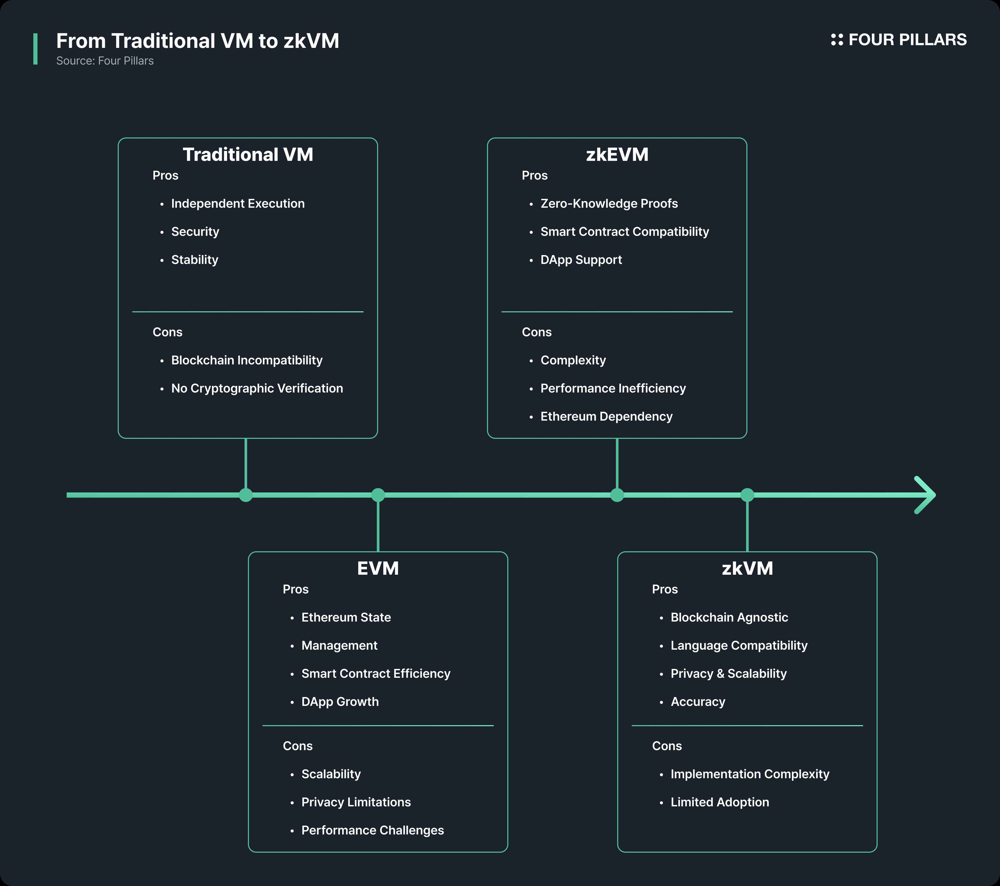
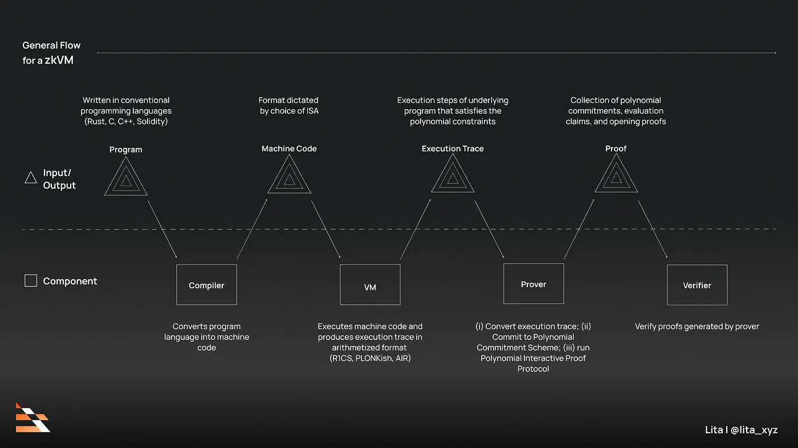

# Transition to zkVM

zkEVM은 이더리움과의 호환성을 유지해야 한다는 제약으로 인해, 복잡한 EVM 구조 전체를 증명 대상으로 포함해야 하며, 이로 인해 증명 생성의 효율성이 낮고 유지보수도 어렵다는 한계가 존재합니다. 이러한 한계가 뚜렷해지면서, 2023년을 기점으로 RISC Zero, Jolt, ZKM 등 다양한 프로젝트들이 RISC-V, MIPS 등 범용 명령어 집합 아키텍처(ISA)를 기반으로 한 zkVM(Zero-Knowledge Virtual Machine)을 제시하며 주목받기 시작했습니다. zkVM은 Rust, C++, Go 등 범용 프로그래밍 언어로 작성된 임의의 프로그램을 ZK 증명할 수 있으며, 특정 블록체인에 종속되지 않고 독립적인 연산 증명 엔진으로 다양한 환경에 적용할 수 있는 확장성을 가집니다.

*Source: [zkVM: New Paradigm for Web3 Computing](https://4pillars.io/en/issues/zkvm-new-paradigm-for-web3-computing#:~:text=2.1%20From%20Traditional%20VMs%20to%20zkVMs)*

## What is zkVM?
zkVM은 특정 블록체인에 종속되지 않고, ZKP 기술을 활용하여 프로그램 실행의 무결성(Integrity)과 프라이버시(Privacy)를 보장하는 가상 머신입니다.

zkVM(Zero-Knowledge Virtual Machine)은 특정 블록체인에 종속되지 않고, ZKP(Zero-Knowledge Proof) 기술을 이용해 임의의 프로그램 실행의 무결성(Integrity)과 경우에 따라 프라이버시(Privacy)를 보장하는 가상 머신입니다. 이는 zkEVM이 이더리움 바이트코드의 실행을 증명하는 데 최적화된 반면, zkVM은 범용 명령어 집합 아키텍처(예: RISC-V, MIPS 등)를 기반으로 설계되어, 다양한 컴퓨팅 환경에서 사용할 수 있는 범용 ZK 연산 증명 엔진으로 작동합니다.

증명자(Prover)가 “내가 이 코드를 정확히 실행했고 결과도 맞다”는 것을 ZK로 만들어 제시하면, 검증자(Verifier)는 “이 사람이 계산을 제대로 했구나”라고 해당 결과가 올바르다는 것을 확인할 수 있습니다. 이 과정에서 실제 계산된 값이나 내부 로직 같은 건 전혀 노출되지 않아, 민감한 정보도 안전하게 지킬 수 있습니다.

*Source: [Zero Knowledge Paradigm: zkVM](https://www.lita.foundation/blog/zero-knowledge-paradigm-zkvm#:~:text=An%20abstracted%2C%20generalized%20process%20flowchart%20of%20a%20zkVM%2C%20split%20and%20categorized%20between%20the%20format%20(inputs%20/%20outputs)%20of%20a%20program.)*

## zkVM의 작동 원리

개발자는 Rust, C++, Go 등 표준 프로그래밍 언어로 코드를 작성하고, 이를 LLVM 등의 컴파일러를 통해 특정 ISA(예: RISC-V)의 바이트코드로 컴파일합니다. zkVM은 이렇게 변환된 ISA 기반의 바이트코드를 실행하는 에뮬레이터의 실행 과정을 증명합니다. 
zkEVM이 EVM의 수백 개에 이르는 Opcode를 각각 증명 회로로 구현해야 하는 반면, zkVM은 일관되고 제한된 범용 ISA 명령어 세트의 실행 규칙만 회로로 모델링하면 됩니다. 이 방식은 회로 구조의 복잡도를 낮추고, 아키텍처 설계 및 유지보수를 보다 단순하게 만듭니다.

VM이 해당 ISA 바이트코드를 실행하는 과정에서 어떤 명령어가 언제 실행되었는지, 레지스터·메모리 값이 어떻게 변했는지 등 모든 상태 변화 내역을 Execution Trace로 기록합니다.
증명자는 이 Execution Trace를 수학적 구조(주로 다항식)로 변환하여, 해당 연산이 ISA 규칙에 따라 정확하게 실행되었음을 증명하는 ZKP를 생성합니다. 이 과정을 통해 "내가 이 코드를 정확히 실행했고 결과도 맞다"는 것을 수학적으로 입증할 수 있습니다.

검증자는 코드를 직접 실행하지 않고, 제출된 ZKP만으로 결과의 정당성을 확인합니다. 이때 입력, 출력, 중간 상태 등 민감한 데이터는 노출되지 않기 때문에, 프라이버시 보호를 전제로 한 무결성 검증이 가능합니다.

