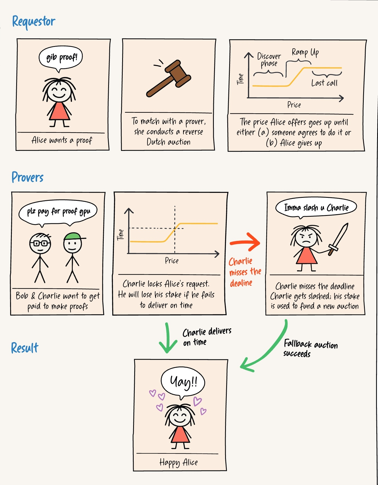

## Boundless

* X: [https://x.com/boundless_xyz/status/1939671665732198778](https://x.com/boundless_xyz/status/1939671665732198778)

* Docs: [https://docs.beboundless.xyz/developers/what](https://docs.beboundless.xyz/developers/what)

**Introducing the Boundless Foundation**

*https://x.com/Param_eth/status/1939728176089112599*

### The Universal ZK Protocol

Boundless는 누구나 풍부하고 검증 가능한 컴퓨팅에 접근할 수 있는 범용 zero-knowledge protocol입니다. Boundless는 실행 전용 노드 네트워크를 제공하여 작업이 올바르게 수행되었고 모든 체인에서 검증되었음을 나타내는 ZKP를 생성하며, 이를 저렴하고 일정한 비용으로 제공합니다. 실행(Execution)과 합의(Consensus)를 분리함으로써 Boundless는 모든 체인이 고유의 보안을 유지하면서도 가스 상한선과 재실행을 피할 수 있도록 합니다.

#### Why Boundless?

전통적으로 블록체인은 "Global re-execution" 모델에 의존하는데, 이는 모든 노드가 네트워크 상태에 대한 합의를 달성하기 위해 모든 트랜잭션을 중복적으로 처리하는 방식입니다. 이 방식은 안전하고 투명하지만, 가장 느린 노드 속도에 전체 네트워크가 맞춰야 하는 한계가 있습니다. 그 결과, 블록체인은 간단한 연산만 처리할 수 있고, 복잡한 연산은 비용이 너무 많이 들거나 가스 한도에 도달하여 처리하기 어렵습니다.

*https://docs.beboundless.xyz/developers/why*

이러한 문제를 Boundless는 ZKP를 사용하여 해결하고자 합니다. 각 노드가 모든 블록체인이 재실행 없이 검증할 수 있는 실행 증명(execution proof)을 생성함으로써, 다른 블록체인은 이 증명만을 보고 다시 계산하지 않아도 결과가 맞는지 확인할 수 있습니다. 이렇게 기존 네트워크는 보안과 합의를 그대로 유지하면서 중복된 연산을 제거할 수 있습니다.

Boundless는 분산형 시장을 활용하여 복잡한 연산을 효율적으로 처리합니다. 간결하고 재사용 가능한 증명을 생성하여 효율성을 높입니다. 새로운 검증자(Prover)가 시장에 들어오면 전체 계산 처리 용량이 늘어나고, 새로운 애플리케이션이 들어오면 효율성 이득이 커지면서 네트워크가 강화되고 확장되어 연산 능력과 효율성을 높이는 자체 강화 시스템을 구축합니다.

#### Boundless Market

*https://docs.beboundless.xyz/provers/proof-lifecycle*

앱 개발자가 Rust로 zkVM 프로그램을 작성하면, zkVM은 이 프로그램의 정확한 실행에 대한 ZKP를 제공합니다. 이 증명에는 출력값(journal)과 암호학적 증명(seal)을 포함됩니다. Seal은 보통 zk-STARK 또는 SNARK의 형태이며, Boundless가 여러 증명을 하나로 묶어 Aggregated Proof를 만들면 각 개별 증명이 Aggregated Proof 안에 포함되었음을 증명하는 Merkle inclusion proof를 seal로 사용합니다.
Boundless Market을 사용하면 누구나 하드웨어 제약 없이 증명을 요청할 수 있으며, 이러한 사용자를 requestor라고 합니다. Boundless는 requestor와 prover 간의 연결을 관리합니다.

앱 개발자(requestor)는 프로그램과 입력, 가격 정보를 담아 Boundless Market에 온체인 또는 오프체인으로 증명을 제출합니다.

- **온체인:** Market Contract에 트랜잭션을 보내 요청
- **오프체인:** Order-stream 서버를 통해 요청

증명 요청이 들어오면 Boundless는 역 더치 경매(가격이 점점 올라가는 경매)를 통해 Prover를 찾습니다. Prover는 적절한 가격, 연산량, 담보, 타임아웃 등을 고려해 참여 여부를 결정합니다. 이때 Prover는 요청을 lock-in하여 독점적으로 증명을 생성해 보상을 받거나, lock 없이 즉시 증명해 수수료를 받을 수 있습니다.

Prover가 보상(Reward)을 받으려면 제안서(offer)가 만료되기 전에 증명을 제출해야 하며, 여러 요청을 묶어서 하나의 Aggregated Proof로 제출해 가스 비용을 절약하고 효율을 높입니다. 이때 Aggregated Proof는 Merkle Tree 구조로 만들어지며, 각 leaf는 개별 요청에 대한 증명이고, root에는 전체 증명이 유효함을 증명하는 하나의 Groth16 proof가 포함됩니다. 모든 조건이 충족되면 Prover는 보상을 받고, 요청자는 증명을 받아 애플리케이션에서 사용할 수 있습니다.

**Reverse-Dutch Auction**

역 더치 경매는 가격이 점점 올라가는 경매로 증명자가 작업을 수락해 기한 내 제출하면 비용을 받고, 실패 시 담보는 현상금으로 전환되어 다른 증명자가 제출 시 이를 가져가도록 하는 구조입니다.

*https://x.com/iamdamilareeh/status/1937810727919644873*

요청 시각이 되면 역 더치 경매가 시작됩니다.

* 시작 시점에는 minPrice으로 시작
* ramp-up 기간 동안 선형으로 가격이 상승하여 maxPrice에 도달
* 이후 maxPrice가 만료 시까지 유지됨

Prover의 행동

* Boundless prover 노드들은 프로그램을 실행해 필요한 사이클 수(연산량)를 추정
* 현재 가격이 증명 생성 비용보다 높은지 판단하여 참여 여부를 결정
* Prover가 입찰을 제출하면 경매는 종료되며, 해당 prover가 요청을 “lock-in”:
    * 요청이 lock되면 해당 prover만이 증명을 제출하고 보상을 받을 수 있음
        * 다른 prover가 해당 요청을 가로채지 못하기 때문에 자원의 낭비 없이 안전하게 연산을 수행할 수 있음
    * 요청을 lock하려면 prover는 담보(stake)를 예치해야 하며, 기한 내에 증명을 제출하지 못하면 이 담보는 슬래시(slash)됨

입찰 없이 바로 처리도 가능

* 요청이 아직 lock되지 않았다면, Prover는 입찰 없이 바로 작업을 수행하고 증명을 생성하여 제출 가능
* 이 경우 stake(담보) 없이도 가능한 상태로, 제출 시점의 경매 가격에 따라 보상을 받음

실패 시 처리

* 만약 lock한 prover가 기한 내 증명을 제출하지 못하면:
    * 담보(stake)가 현상금(bounty)으로 전환됨
    * 다른 prover가 가장 먼저 증명을 제출하면 이 현상금을 받게 됨