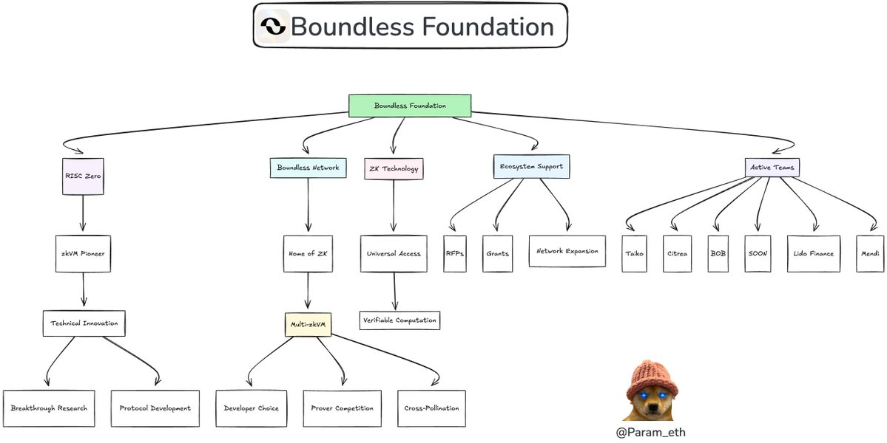
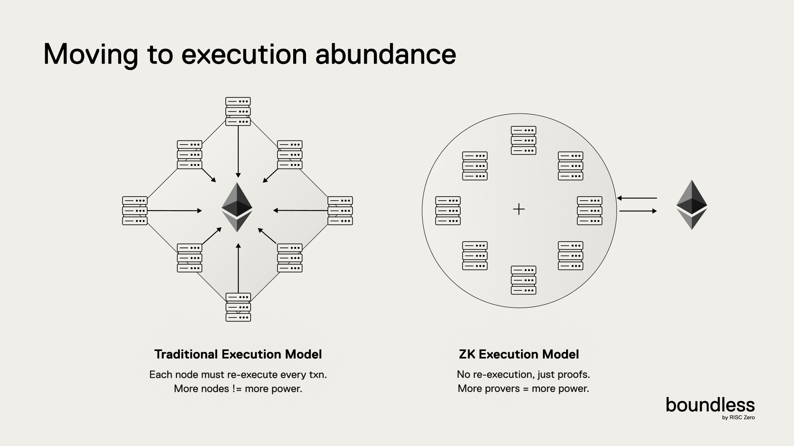
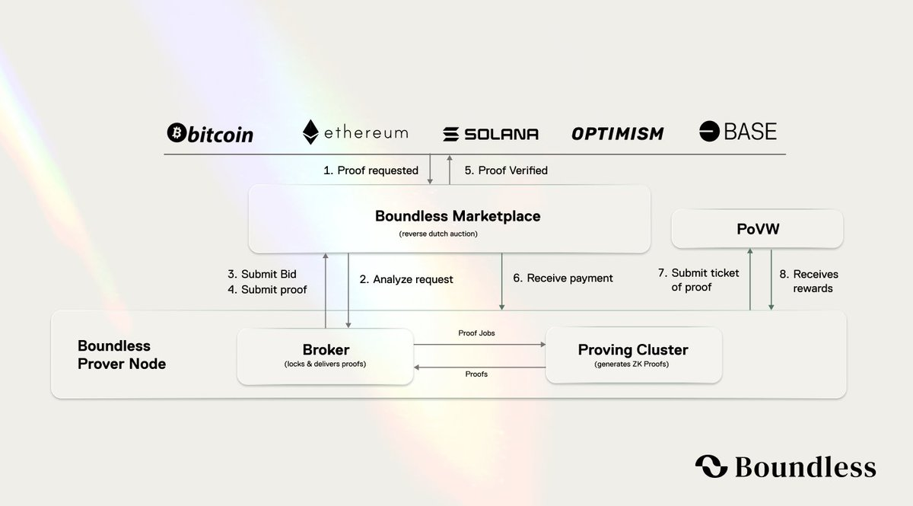
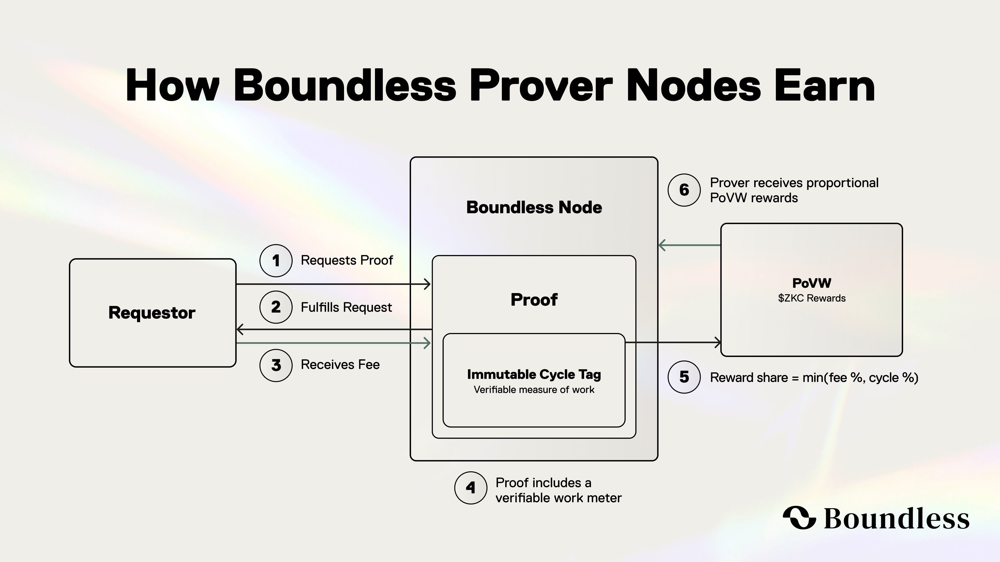
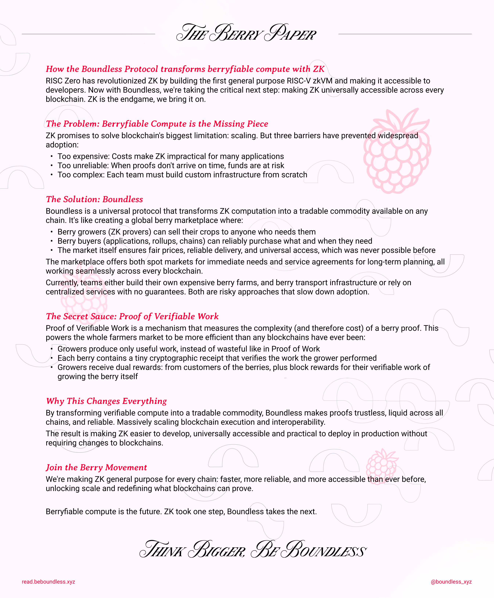

# Boundless

* X: [https://x.com/boundless_xyz/status/1939671665732198778](https://x.com/boundless_xyz/status/1939671665732198778)

* Docs: [https://docs.beboundless.xyz/developers/what](https://docs.beboundless.xyz/developers/what)

* Whitepaper: [https://read.beboundless.xyz/](https://read.beboundless.xyz/)

**Introducing the Boundless Foundation**

*https://x.com/Param_eth/status/1939728176089112599*

## The Universal ZK Protocol

Boundless는 누구나 풍부하고 검증 가능한 컴퓨팅에 접근할 수 있는 범용 Zero-Knowledge Protocol입니다. Boundless는 실행 전용 노드 네트워크를 제공하여 작업이 올바르게 수행되었고 모든 체인에서 검증되었음을 나타내는 ZKP를 생성하며, 이를 저렴하고 일정한 비용으로 제공합니다. 실행(Execution)과 합의(Consensus)를 분리함으로써 Boundless는 모든 체인이 고유의 보안을 유지하면서도 가스 상한선과 재실행을 피할 수 있도록 합니다.

### Why Boundless?

전통적으로 블록체인은 "Global re-execution" 모델에 의존하는데, 이는 모든 노드가 네트워크 상태에 대한 합의를 달성하기 위해 모든 트랜잭션을 중복적으로 처리하는 방식입니다. 이 방식은 안전하고 투명하지만, 가장 느린 노드 속도에 전체 네트워크가 맞춰야 하는 한계가 있습니다. 그 결과, 블록체인은 간단한 연산만 처리할 수 있고, 복잡한 연산은 비용이 너무 많이 들거나 가스 한도에 도달하여 처리하기 어렵습니다.

*https://docs.beboundless.xyz/developers/why*

이러한 문제를 Boundless는 ZKP를 사용하여 해결하고자 합니다. 각 노드가 모든 블록체인이 재실행 없이 검증할 수 있는 실행 증명(Execution Proof)을 생성함으로써, 다른 블록체인은 이 증명만을 보고 다시 계산하지 않아도 결과가 맞는지 확인할 수 있습니다. 이렇게 기존 네트워크는 보안과 합의를 그대로 유지하면서 중복된 연산을 제거할 수 있습니다.

Boundless는 분산형 시장을 활용하여 복잡한 연산을 효율적으로 처리합니다. 간결하고 재사용 가능한 증명을 생성하여 효율성을 높입니다. 새로운 검증자(Prover)가 시장에 들어오면 전체 계산 처리 용량이 늘어나고, 새로운 애플리케이션이 들어오면 효율성 이득이 커지면서 네트워크가 강화되고 확장되어 연산 능력과 효율성을 높이는 자체 강화 시스템을 구축합니다.

### Boundless Market

*https://docs.beboundless.xyz/provers/proof-lifecycle*

앱 개발자가 Rust로 zkVM 프로그램을 작성하면, zkVM은 이 프로그램의 정확한 실행에 대한 ZKP를 제공합니다. 이 증명에는 출력값(journal)과 암호학적 증명(seal)을 포함됩니다. Seal은 보통 zk-STARK 또는 SNARK의 형태이며, Boundless가 여러 증명을 하나로 묶어 Aggregated Proof를 만들면 각 개별 증명이 Aggregated Proof 안에 포함되었음을 증명하는 Merkle inclusion proof를 seal로 사용합니다.
Boundless Market을 사용하면 누구나 하드웨어 제약 없이 증명을 요청할 수 있으며, 이러한 사용자를 requestor라고 합니다. Boundless는 requestor와 prover 간의 연결을 관리합니다.

이렇게 Boundless에 대한 접근은 모든 주요 체인에 기본적으로 배포되는 Boundless Market Contract를 통해 시작됩니다. Boundless Market은 애플리케이션의 증명 요청을 Boundless Prover Node가 제공하는 컴퓨팅 용량과 매칭하는 허가 없는 청산 기관 역할을 합니다.

### How the Boundless Market Works

*https://x.com/boundless_xyz/status/1920862141944389695*

1. **Proof 요청 생성 및 브로드캐스트**

개발자는 다음 내용을 명시하여 Proof 요청을 생성합니다.

- The zkVM program (URL)
- Input - either inline or a URL
- Requirements on proven execution output (e.g. an expected journal hash)
- Offered price and required stake - as auction parameters (min/max price, ramp-up time, time-outs, and slashing stake)

2. **Reverse-Dutch Auction**

요청에 명시된 시간이 되면 역 더치 경매가 시작되며, 가격은 minPrice에서 시작하여 ramp-up 기간 동안 선형으로 상승하고, 만료 시까지 maxPrice에 유지됩니다. Boundless Prover Node들은 프로그램을 실행하여 예상 사이클을 추정하고, 현재 가격이 증명 비용을 초과하는지 판단합니다. 가격을 수락해 입찰(bid)한 첫 번째 Prover 노드가 요청을 lock하며, 이로써 해당 Prover는 fulfillment에 대한 독점적인 보상을 받을 권리를 획득합니다. 대가로 Prover는 stake를 예치해야 하며, lock된 요청을 Prover가 제출하지 못한 경우 stake는 bounty가 되어 다른 Prover가 Proof를 제출 시 가져갈 수 있습니다. Prover는 언제든지 lock되지 않은 작업을 입찰 없이 즉시 수행하여 현재 경매 가격을 받을 수 있으며, 이 경우 stake는 필요하지 않습니다.

3. **Proof 생성 및 배칭**

Prover는 여러 요청을 배치(batch)하여 처리할 수 있습니다. 각 실행 receipt는 Merkle Tree의 Leaf가 되며, 단일 Groth16 Proof가 Merkle root에 대해 증명을 수행합니다. 배칭은 온체인 검증 가스를 여러 요청에 걸쳐 분산시켜 효율을 높입니다.

4. **결제(Settlement)**

Boundless market contract는 Groth16 Proof를 한 번 검증한 후, 각 Merkle Inclusion Proof를 대응하는 요청과 대조해 확인합니다. 락된 자금(또는 요청자의 예치금)에서 Prover에게 비용 지급 및 스테이크 반환합니다. Proof가 제출되면 이벤트가 emit되고 Proof는 calldata로 제공되며, 요청자는 자신의 컨트랙트로 콜백을 받을 수도 있습니다.

### The Boundless Incentive Mechanism: Proof of Verifiable Work

기존 프로토콜은 PoW 또는 PoS을 통해 보상을 제공합니다.

PoVW는 각 ZKP의 복잡도를 온체인에서 측정하여 prover들이 수행한 정확한 작업량에 따라 보상하는 최초의 메커니즘입니다.

*https://x.com/boundless_xyz/status/1920862141944389695*

**작동 방식**

1. **Immutable Cycle Tag**

    - 모든 Boundless Proof는 수행된 사이클 수와 재사용 방지를 위한 고유 Nonce가 포함된 Immutable Tag를 내장합니다. 이 Tag는 Proof의 공개 Claim의 일부로 포함되어 있어 Prover와 요청자 모두 이를 변조할 수 없습니다.

2. **Epoch Tally**
    - 각 epoch 종료 시, PoVW 컨트랙트는 해당 기간 동안 제출되어 최종 확정된 Proof들의 Cycle Tag를 모두 합산합니다.

3. **Deterministic Payout**
    - 각 epoch마다 고정된 양의 $ZKC(Boundless’ native token)가 발행(mint)되며, 전체 Cycle 비율에 비례하여 분배됩니다.
        - 예: 한 Prover가 전체 Cycle의 2%를 처리했다면, 발행된 $ZKC의 2%를 보상으로 받게 됩니다.

**Why PoVW Matters**

- **Accuracy over guesswork:** 보상이 암호학적으로 검증된 작업량과 비례하여 지급되며, 10-cycle proof와 1천만-cycle proof가 동일하게 취급되는 문제가 사라집니다.

- **Permissionless meritocracy**: latency 및 스테이킹 요건을 충족하는 노드는 자신이 증명한 만큼의 정확한 보상을 획득할 수 있습니다.

- **Transparent economics**: 미터(계량기)가 온체인에서 조작 불가능하게 작동하기 때문에, 누구나 마지막 cycle까지 보상을 감사(audit) 가능합니다.

*https://x.com/reka_eth/status/1915076064008900788*

