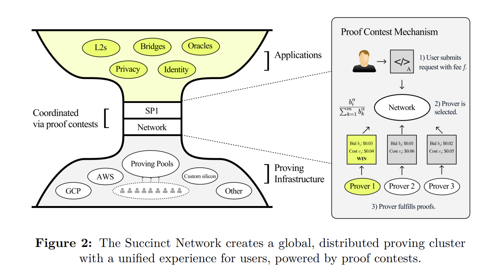
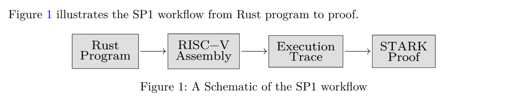
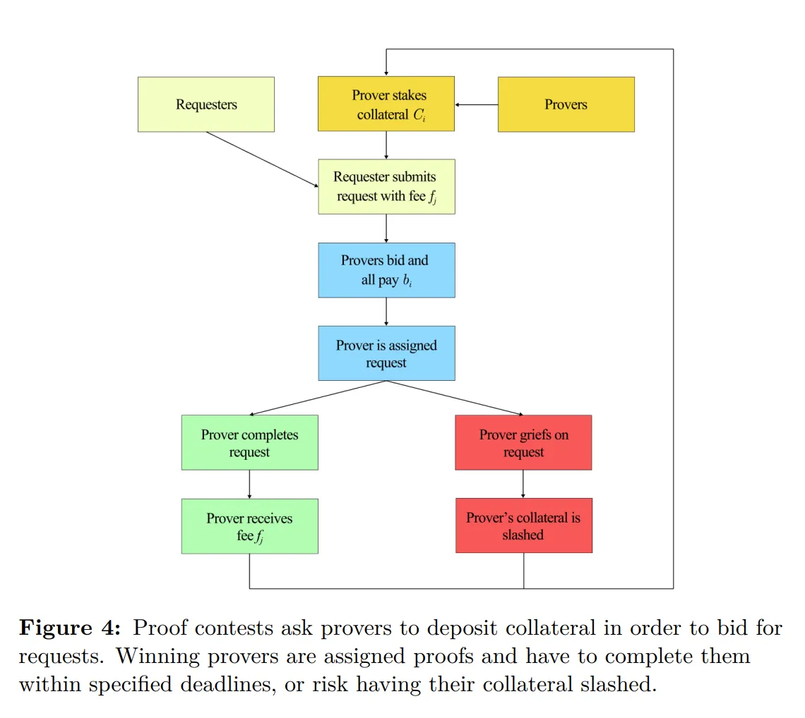
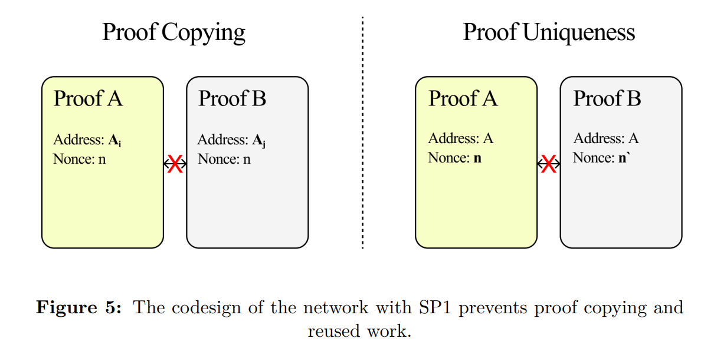
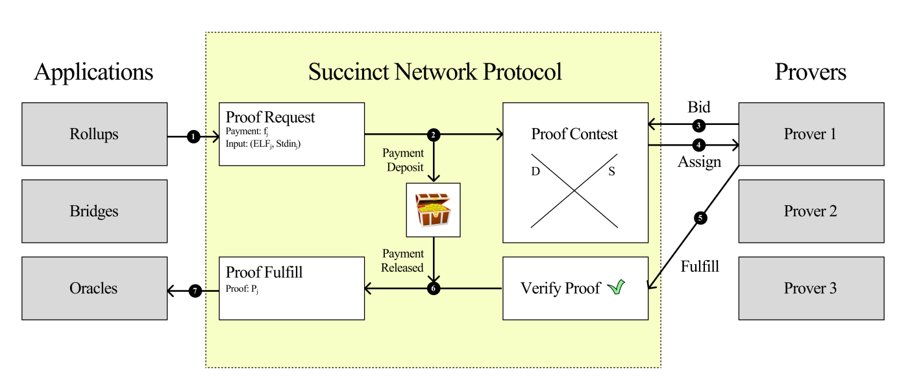

# Succinct Network

[Succinct Network paper](https://pdf.succinct.xyz/)

Succinct Network는 SP1과 함께 설계되어 전 세계 증명 생성 용량을 기하급수적으로 확장하며, "증명 경쟁(proof contests)"이라는 경쟁적 경매 메커니즘으로 구동되는 글로벌 분산 증명 클러스터 개념을 도입합니다.

1. **A global, distributed proving cluster:**
   * 네트워크는 사용자가 증명 요청을 제출하고 전 세계 누구나 증명 용량을 기여할 수 있는 통합 플랫폼을 제공합니다.
   * 증명자들은 노드 소프트웨어를 실행하기만 하면 무허가로 참여할 수 있습니다.
2. **Proof contests:**
   * "증명 경쟁" 메커니즘은 증명 비용과 탈중앙화의 균형을 맞추면서 자유 시장 경쟁을 주도하는 새로운 형태의 경매입니다.
   * 담보를 활용하는 전체 지불 경매(all-pay auction)입니다.

### SP1 (zkVM)

[SP1 기술 문서](https://drive.google.com/file/d/1aTCELr2b2Kc1NS-wZ0YYLKdw1Y2HcLTr/view)

* **SP1**은 **Succinct**가 개발하고 유지 관리하는 영지식 가상 머신(zkVM)입니다.
* **STARK** 증명을 사용하여 **RISC-V** 프로그램의 정확성을 증명하며, 주장된 출력이 주어진 입력에 대한 프로그램 실행과 실제로 일치하는지 보장합니다.

#### Architecture & Key Components

* **Multiple Chips (CPU, ALU, Memory, etc.)**
  * SP1의 가상 머신 설계는 모듈식입니다: 각 "칩"은 특정 기능을 처리합니다.
  * 이러한 칩들은 상호 연결되어 RISC-V 실행의 각 단계를 추적하고 검증합니다.
* **Based on Plonky3**
  * SP1은 칩 상호 연결을 설명하기 위해 Plonky3의 AIR(Algebraic Intermediate Representation)를 확장합니다.
  * **LogUp** 알고리즘을 사용하여 RISC-V CPU 기반 VM을 위한 완전한 제약 시스템을 구축합니다.
* **Memory Access Consistency**
  * 메모리 작업은 **순열 문제**로 변환되며 LogUp을 사용하여 해결됩니다.
  * 이를 통해 실행 추적 전반에 걸쳐 메모리 읽기/쓰기가 일관되게 유지됩니다.

## Proof Contest

언제든지 사용자들이 보낸 미처리 증명 요청 집합 $\{r_1, …, r_n\}$과 이를 증명할 수 있는 증명자 집합 $\{p_1,…,p_m\}$이 있습니다.

$$
r_j = (f_j, s_j, deadline, …)
$$

$r_j$ : j번째 증명 요청.\
$f_j$ : 사용자가 증명 요청에 첨부하는 수수료(지불금).\
$s_j$ : 증명을 생성하는 데 필요한 계산의 척도. (예: RISC-V 사이클 수)\
`Deadline` : 요청이 증명자에게 할당된 후 사용자가 기다릴 수 있는 최대 시간.

각 증명자는 자체 최대 사이클 용량과 사이클당 한계 비용 $c_j$를 가지고 있습니다.

### 1. Single proof All-pay Auction Mechanism

#### Concept

* 여러 증명자가 경쟁하는 **단일 증명 요청** $r_j$에 사용됩니다.
* 각 증명자는 증명 요청을 할당받고 수수료 $f_j$를 받기 위해 얼마나 지불할 의향이 있는지를 반영하는 입찰 $b_i$를 합니다.

#### Steps

1. **Collateral Deposit**
   * 각 증명자 $p_i$는 입찰 전에 담보를 예치해야 합니다. 담보는 입찰 금액 $b_i$만큼 감소하여 무의미한 입찰을 방지합니다.
2. **Bidding**
   * 증명자들은 요청 $(r_j,f_j)$를 관찰하고 입찰 $b_1,b_2,…,b_m$을 제출합니다.
   * 입찰 $b_i$는 다음과 같이 해석됩니다: "$f_j$를 벌기 위해 $b_i$를 지불할 의향이 있습니다."
3.  **Allocation (All-Pay Auction)**

    * 모든 입찰이 완료되면, 다음 확률로 단일 승자가 선택됩니다:

    $$
    Pr(\text{winner} = p_i) = \frac{b_i^\alpha}{\sum_{k=1}^{m} b_k^\alpha}
    $$

    * 여기서 $\alpha > 0$은 분산 정도를 결정하는 프로토콜이 설정한 매개변수입니다.
      * **If** $\alpha = 0$ **:** 모든 입찰자가 입찰과 관계없이 동일한 확률로 요청을 할당받습니다.
      * **If** $\alpha = 1$ **:** 할당 확률은 각 증명자의 입찰에 비례합니다.
      * **As** $\alpha \to \infty$ **:** 요청은 거의 독점적으로 최고 입찰자에게 할당됩니다.
    * 모든 증명자는 **실제로 입찰금을 지불**합니다 ("전체 지불" 특성). 이는 리베이트나 부분 환급을 위한 계약으로 들어갈 수 있습니다.
4. **Proof Submission and Payment**
   * 승리한 증명자는 `Deadline` 전에 유효한 증명을 생성합니다. 성공하면 $f_j$를 받습니다.
   * 제시간에 제출하지 못하면 요청이 만료되고 해당 증명자의 담보가 삭감될 수 있습니다.

### 2. Recurring (Slot-Based) Proof Mechanism

#### Concept

* **반복적이거나 지속적인 증명 요청**을 위해 설계되었습니다 (예: 빈번한 증명이 필요한 롤업).
* 각 요청에 대해 돈을 입찰하는 대신, 증명자들은 주어진 라운드에서 채울 수 있는 **슬롯** $b_i$의 수를 선언합니다.

#### Steps

1. **Slot Declaration**
   * 각 증명자 $p_i$는 라운드당 처리할 수 있는 요청 수인 $b_i$를 발표합니다.
2.  **Request Allocation**

    * 총 $\sum_{k=1}^m b_k$개의 슬롯이 제공됩니다. 증명자 $p_i$는 다음 비율을 할당받습니다:

    $$
    \frac{b_i}{\sum_{k=1}^m b_k}
    $$

    해당 라운드의 반복 요청 중 이 비율만큼을 할당받습니다.
3.  **Cost and Profit**

    * 각 요청이 수수료 $f_j$를 지불하고, 증명자의 증명당 한계 비용이 $c_is_j$라고 하면:
      * $c_i$ : 증명자 $p_i$의 사이클당 한계 비용.
      * $s_j$ : j번째 증명 요청에 필요한 계산의 척도 (예: 필요한 RISC-V 사이클 수).
    * 한 사이클 동안 증명자 $p_i$의 총 이익은 다음과 같을 수 있습니다:

    $$
    Total \ Profit_i = b_i \bigl(f_j \;-\; \sum_{k=1}^{m} b_k \;-\; c_i s_j \bigr)
    $$

    (수수료 모델에 따라 다름).

    * $\sum_{k=1}^m b_k$로 나누면 대략적인 증명당 이익을 얻습니다:

    $$
    \frac{b_i}{\sum_{k=1}^m b_k} \,(f_j - c_i s_j) \;-\; b_i
    $$
4. **Ongoing Operation**
   * 이 슬롯 기반 접근 방식은 각 사이클이나 라운드에서 반복됩니다. 증명자들은 다음 요청 배치의 다른 지분을 확보하기 위해 $b_i$를 조정할 수 있습니다.

### Mechanism Implementation

메커니즘의 실제 구현은 복사된 증명 및 재사용된 작업과 같은 여러 실패 모드를 방지해야 합니다.

증명 요청 $r_j$가 증명자 $p_i$에 의해 수행된다고 가정합니다. 네트워크에서 증명은 증명자 $p_i$의 온체인 주소 $a_i$와 증명이 요청된 시점에 생성된 고유 논스(nonce) $n$의 함수입니다.

이 의존성을 $proof(r_j, a_i, n)$로 간결하게 표현합니다.

#### Preventing Copying: Embedded prover addresses

모든 $a_k \not= a_i$에 대해, 프로토콜은 모든 $n, n'$에 대해 $proof(r_j, a_i, n)$와 $proof(r_j, a_k, n)$를 구별할 수 있어야 합니다.

#### Preventing reuse: unique nonce

모든 $a_i$와 모든 $n, n'$에 대해, $n = n'$가 아닌 한 프로토콜은 $proof(r_j, a_i, n)$와 $proof(r_j, a_i, n')$를 구별할 수 있습니다.

## Working Flow

### Users: Submitting Requests

1. **Prepare Request Data:**

사용자는 다음을 제공하여 증명 요청을 제출합니다:

* **Program:** 실행해야 하는 코드 (예: 컴파일된 Rust 코드에서 생성된 RISC-V 바이트코드).
* **Inputs (**$stdin$**):** 프로그램 실행에 필요한 데이터.
* **Max_cycles:** 증명 생성에 사용될 것으로 예상되는 최대 RISC-V 사이클 수. 이 매개변수는 계산 작업의 상한선을 설정합니다.
* **Maximum Fee (**$f_j$**):** 사용자가 증명 요청에 대해 지불할 의향이 있는 최고 금액. 이 수수료는 수동으로 설정하거나 이더리움과 유사한 가스 추정 기능을 사용하여 제안받을 수 있습니다.
* **Deadline:** 요청이 증명자에게 할당된 후 유효한 증명을 기다릴 수 있는 최대 시간.
* **Verification Key (**`vkey`**):** 초기 설정 단계에서 생성된 키로, 증명의 정확성을 검증하는 데 사용됩니다.
* **Proof ID:** 각 제출된 요청을 추적하기 위해 생성된 고유 식별자.

2. **Submit the Request:**
   * 위의 모든 매개변수를 포함한 증명 요청은 표준화된 RPC 엔드포인트를 통해 네트워크로 전송됩니다.
   * 제출되면 사용자의 수수료 $f_j$는 악의적인 행동(예: 방해 공격)을 방지하기 위해 에스크로에 보관됩니다.
   * 네트워크는 증명 요청 제출을 위한 높은 가용성의 경쟁적 인터페이스를 제공합니다.
3. **Receiving the Proof:**
   * 증명자가 `Deadline` 전에 유효한 증명을 성공적으로 생성하고 제출하면, 사용자는 네트워크를 통해 해당 증명을 대상 체인에 직접 중계할 수 있습니다.

### Provers: Bidding and Fulfilling Proofs

1. **Permissionless Entry:**
   * 증명자들은 하드웨어를 연결하고 노드 소프트웨어를 실행하여 네트워크에 참여합니다.
   * 사전 허가 없이 참여할 수 있지만, 각 증명자는 자신의 용량과 운영 비용에 대한 개인 정보를 가지고 있습니다 (네트워크에서 숨겨짐).
2. **Bidding Process:**
   * **Monitoring Requests:** 증명자들은 새로운 증명 요청을 지속적으로 모니터링합니다.
   * **Entering the Proof Contest:**
     * 요청이 온체인에 게시되면 증명자들은 증명 경쟁에 참여합니다.
     * 입찰 창은 블록체인의 짧은 블록 시간 덕분에 투명성과 효율성을 보장하기 위해 미리 정의된 짧은 기간 동안 열려 있습니다.
   * **Submitting a Bid:**
     * 각 증명자 $p_i$는 증명을 생성할 권리에 대한 입찰 $b_i$ (또는 반복 모델에서 사용 가능한 "슬롯" 선언)를 제출합니다.
     * 입찰 $b_i$는 수수료 $f_j$를 벌기 위해 증명자가 (담보에서) 지불할 의향이 있는 금액을 나타냅니다.
   * **Collateral Requirement:**
     * 입찰 전에 증명자들은 프로세스에 지분을 가지고 있음을 보장하기 위해 담보를 예치해야 하며, 이는 무책임하거나 악의적인 행동을 방지하는 데 도움이 됩니다.

* **Fulfilling Proofs:**
  *   **Proof Generation:**

      * 승리한 증명자는 영지식 가상 머신인 SP1을 사용하여 올바른 프로그램 실행 증명을 생성합니다.
      *   증명은 증명자의 온체인 주소 $a_i$와 고유 논스 n에 바인딩되며, 다음과 같이 표현됩니다:

          $$
          \text{proof}(r_j,\, a_i,\, n)
          $$

      이는 증명이 복사되거나 재사용될 수 없도록 보장합니다.
  * **Submission:**
    * 그런 다음 증명자는 증명 ID, 프로그램, 입력 데이터 및 증명 정보와 함께 증명을 애플리케이션별 블록체인에 제출합니다.
    * 요청과 함께 제출된 vkey는 온체인 검증자가 증명의 유효성을 확인하는 데 사용됩니다.
  * **Proof Types:**
    * SP1은 세 가지 유형의 증명을 지원합니다:
      * `CORE` **proofs:** 크기가 프로그램 실행에 비례합니다.
      * `COMPRESSED` **proofs:** 일정한 크기를 가지지만 더 높은 (증명) 생성 비용이 발생합니다.
      * `GROTH16/PLONK` **proofs:** 생성 비용이 가장 비싸지만 고도로 압축되어 있으며 온체인에서 검증할 수 있습니다.
    * `CORE` 증명이 너무 큰 경우, 사용자는 `COMPRESSED` 또는 `GROTH16/PLONK` 증명을 선택할 수 있습니다.
  * **Payment:**
    * 증명이 유효하고 `Deadline` 전에 제출되면, 수수료 $f_j$가 에스크로에서 증명자에게 해제됩니다.
    * 증명이 제시간에 제출되지 않으면 요청이 만료되고 증명자의 담보가 삭감될 수 있습니다.